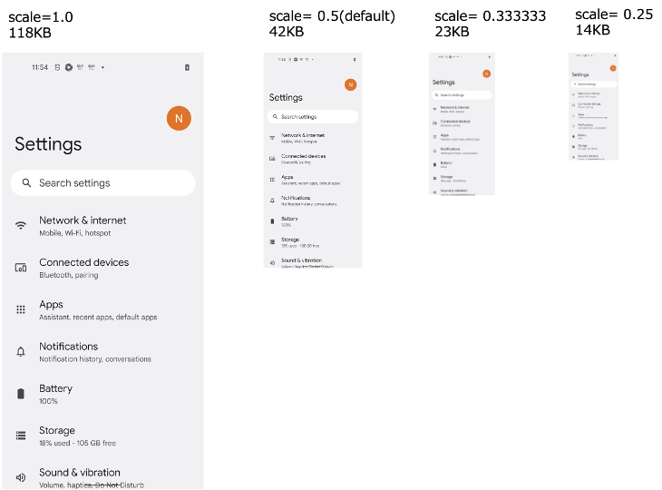

# Configuring screenshot

You can configure screenshot in testrun file.
See also [parameters](../../basic/parameter/parameters.md).

```
## Screenshot --------------------
#screenshotScale=0.333333
#autoScreenshot=false
#onChangedOnly=false
#onCondition=false
#onAction=false
#onExpectation=false
#onExecOperateCommand=false
#onCheckCommand=false
#onScrolling=false
#manualScreenshot=false
```

## Reducing file size

`screenshotScale` is 0.5 by default. If you want to reduce the size of screenshot file, set this parameter smaller.

```
screenshotScale=0.333333
```

### Screenshot file size example



### Screenshot clarity


<br>

## Reduction of triggers

If you don't want screenshots on condition and on action, you can suppress taking screenshots.

```
onCondition=false
onAction=false
```

<br>
If you don't want screenshots on scrolling, you can suppress taking screenshots.

```
onScrolling=false
```

### Link

- [Configuring log](configuring_log.md)
- [index](../../index.md)

