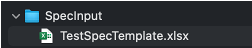

# Generating test code template

You can migrate your existing manual test specification to Shirates's test code.

Generating and using template code can reduce amount of typing.

1. Create `SpecInput` directory in Downloads directory.

2. Copy `src/main/resources/TestSpec.xlsx` to `SpecInput`, and rename it as desired.

   

3. Specify TestClassName.

4. Migrate your existing manual test to the format of Spec-Report.

   

5. Create `CodeGeneratorExecute.kt` and implement as follows.

### CodeGeneratorExecute.kt

```kotlin
import shirates.spec.code.model.CodeGenerationExecutor

fun main() {

    CodeGenerationExecutor().execute()
}
```

6. Right click on `CodeGeneratorExecute.kt`, and select `Run`.

7. Open the generated file found in `Downloads/CodeOutput` directory.

### template output

```kotlin
package generated

import org.junit.jupiter.api.DisplayName
import org.junit.jupiter.api.Test
import shirates.core.driver.commandextension.*
import shirates.core.testcode.NoLoadRun
import shirates.core.testcode.SheetName
import shirates.core.testcode.UITest

@SheetName("calculator test")
class CalculatorTestDemo : UITest() {

    @NoLoadRun
    @Test
    @DisplayName("calculate 123+456")
    fun S1010() {

        scenario {
            case(1) {
                condition {
                    it.macro("[Restart Calculator]")
                        .screenIs("[Calculator Main Screen]")
                }.action {
                    it.tap("[1]")
                        .tap("[2]")
                        .tap("[3]")
                }.expectation {
                    it.select("[formula]").textIs("123")
                }
            }
            case(2) {
                action {
                    it.tap("[+]")
                }.expectation {
                    it.select("[formula]").textIs("123+")
                }
            }
            case(3) {
                action {
                    it.tap("[4]")
                        .tap("[5]")
                        .tap("[6]")
                }.expectation {
                    it.select("[formula]").textIs("123+456")
                        .select("[result preview]").textIs("579")
                }
            }
            case(4) {
                action {
                    it.tap("[=]")
                }.expectation {
                    it.select("[result final]").textIs("579")
                }
            }
        }
    }

    @NoLoadRun
    @Test
    @DisplayName("calculate 1÷0")
    fun S1020() {

        scenario {
            case(1) {
                condition {
                    it.macro("[Restart Calculator]")
                        .screenIs("[Calculator Main Screen]")
                }.action {
                    it.tap("[1]")
                        .tap("[÷]")
                        .tap("[0]")
                        .tap("[=]")
                }.expectation {
                    it.select("[formula]").textIs("1÷0")
                        .select("[result preview]").textIs("Can't divide by 0")
                }
            }
        }
    }

}
```

You have to implement actual test code that works.

### implemented (Example)

```kotlin
package generated

import org.junit.jupiter.api.DisplayName
import org.junit.jupiter.api.Test
import shirates.core.configuration.Testrun
import shirates.core.driver.commandextension.*
import shirates.core.testcode.SheetName
import shirates.core.testcode.UITest

@Testrun("testConfig/android/calculator/testrun.properties")
@SheetName("calculator test")
class CalculatorTestDemo : UITest() {

    @Test
    @DisplayName("calculate 123+456")
    fun S1010() {

        scenario {
            case(1) {
                condition {
                    it.macro("[Restart Calculator]")
                        .screenIs("[Calculator Main Screen]")
                }.action {
                    it.tap("[1]")
                        .tap("[2]")
                        .tap("[3]")
                }.expectation {
                    it.select("[formula]").textIs("123")
                }
            }
            case(2) {
                action {
                    it.tap("[+]")
                }.expectation {
                    it.select("[formula]").textIs("123+")
                }
            }
            case(3) {
                action {
                    it.tap("[4]")
                        .tap("[5]")
                        .tap("[6]")
                }.expectation {
                    it.select("[formula]").textIs("123+456")
                        .select("[result preview]").textIs("579")
                }
            }
            case(4) {
                action {
                    it.tap("[=]")
                }.expectation {
                    it.select("[result final]").textIs("579")
                }
            }
        }
    }

    @Test
    @DisplayName("calculate 1÷0")
    fun S1020() {

        scenario {
            case(1) {
                condition {
                    it.macro("[Restart Calculator]")
                        .screenIs("[Calculator Main Screen]")
                }.action {
                    it.tap("[1]")
                        .tap("[÷]")
                        .tap("[0]")
                        .tap("[=]")
                }.expectation {
                    it.select("[formula]").textIs("1÷0")
                        .select("[result preview]").textIs("Can't divide by 0")
                }
            }
        }
    }

}
```

### Link

- [index](../../index.md)
