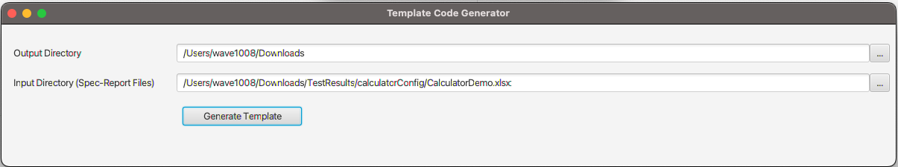
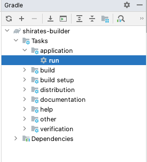
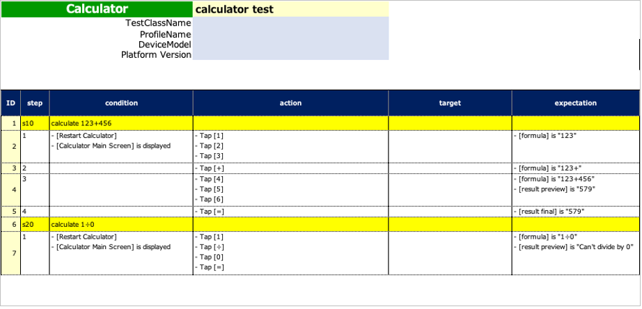
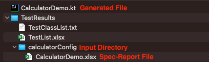

# Using Template Code Generator

You can make it easy to create template code file with **Template Code Generator**.



## Template Code Generator (Shirates Builder)

Get from GitHub repository.
https://github.com/ldi-github/shirates-builder

```
git clone https://github.com/ldi-github/shirates-builder.git
```

## Launching Template Code Generator

1. Open `shirates-builder` project with IntelliJ IDEA.
2. Run app.<br>
   <br><br>

## Generating Template Code


1. Set `Output Directory` field (Drag & Drop is available).<br>
2. Set `Input Directory` field (Drag & Drop is available). This directory includes **Spec-Report** file(s) that
   describes manual testing. <br><br>
   **Spec-Report Example (CalculatorDemo.xlsx)** <br>
   
3. Click [**Generate Template**] button.
4. You can see the file generated in `Output Directory`. <br>
   

## Generated Template Code (Sample)

```kotlin
package generated

import org.junit.jupiter.api.DisplayName
import org.junit.jupiter.api.Test
import shirates.core.configuration.Testrun
import shirates.core.driver.branchextension.*
import shirates.core.driver.commandextension.*
import shirates.core.driver.function.*
import shirates.core.testcode.*

@SheetName("calculator test")
class CalculatorDemo : UITest() {

    @Manual
    @Test
    @DisplayName("calculate 123+456")
    fun S1010() {
		
        scenario {
            case(1) {
                condition {
                    it.macro("[Restart Calculator]")
                        .screenIs("[Calculator Main Screen]")
                }.action {
                    it.tap("[1]")
                        .tap("[2]")
                        .tap("[3]")
                }.expectation {
                    it.select("[formula]").textIs("123")
                }
            }
            case(2) {
                action {
                    it.tap("[+]")
                }.expectation {
                    it.select("[formula]").textIs("123+")
                }
            }
            case(3) {
                action {
                    it.tap("[4]")
                        .tap("[5]")
                        .tap("[6]")
                }.expectation {
                    it.select("[formula]").textIs("123+456")
                        .select("[result preview]").textIs("579")
                }
            }
            case(4) {
                action {
                    it.tap("[=]")
                }.expectation {
                    it.select("[result final]").textIs("579")
                }
            }
        }
    }

    @Manual
    @Test
    @DisplayName("calculate 1÷0")
    fun S1020() {

        scenario {
            case(1) {
                condition {
                    it.macro("[Restart Calculator]")
                        .screenIs("[Calculator Main Screen]")
                }.action {
                    it.tap("[1]")
                        .tap("[÷]")
                        .tap("[0]")
                        .tap("[=]")
                }.expectation {
                    it.select("[formula]").textIs("1÷0")
                        .select("[result preview]").textIs("Can't divide by 0")
                }
            }
        }
    }

}
```

### Link

- [Generating test code template](generating_test_code_template.md)


- [index](../../index.md)
