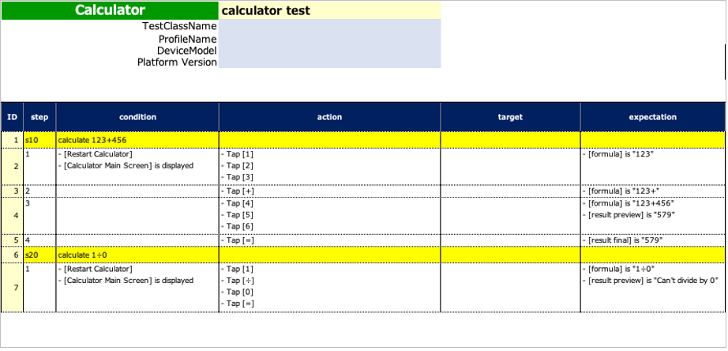

# Template Code Generatorを使用する

**Template Code Generatorr**を使用するとテンプレートコードファイルの作成が簡単になります。


## Template Code Generator (Shirates Builder)

GitHubリポジトリから入手してください。
https://github.com/ldi-github/shirates-builder

```
git clone https://github.com/ldi-github/shirates-builder.git
```

## Template Code Generatorを起動する

1. `shirates-builder` プロジェクトをIntelliJ IDEAで開きます。
2. `run`をダブルクリックして実行します。<br>
   <br><br>

## テンプレートコードを生成する


1. `Output Directory` を入力します(ドラッグ&ドロップ利用可能)。<br>
2. `Input Directory` を入力します(ドラッグ&ドロップ利用可能)。 このディレクトリは手動テストを記述した **Spec-Report**
   ファイルを含みます。<br><br>
   **Spec-Report の例 (CalculatorDemo.xlsx)** <br>
   
3. [**Generate Template**]ボタンをクリックします。
4. `Output Directory`にファイルが出力されます。 <br>
   

## 生成されたテンプレートコード (サンプル)

```kotlin
package generated

import org.junit.jupiter.api.DisplayName
import org.junit.jupiter.api.Test
import shirates.core.configuration.Testrun
import shirates.core.driver.branchextension.*
import shirates.core.driver.commandextension.*
import shirates.core.driver.function.*
import shirates.core.testcode.*

@SheetName("calculator test")
class CalculatorDemo : UITest() {

    @NoLoadRun
    @Test
    @DisplayName("calculate 123+456")
    fun S1010() {
		
        scenario {
            case(1) {
                condition {
                    it.macro("[Restart Calculator]")
                        .screenIs("[Calculator Main Screen]")
                }.action {
                    it.tap("[1]")
                        .tap("[2]")
                        .tap("[3]")
                }.expectation {
                    it.select("[formula]").textIs("123")
                }
            }
            case(2) {
                action {
                    it.tap("[+]")
                }.expectation {
                    it.select("[formula]").textIs("123+")
                }
            }
            case(3) {
                action {
                    it.tap("[4]")
                        .tap("[5]")
                        .tap("[6]")
                }.expectation {
                    it.select("[formula]").textIs("123+456")
                        .select("[result preview]").textIs("579")
                }
            }
            case(4) {
                action {
                    it.tap("[=]")
                }.expectation {
                    it.select("[result final]").textIs("579")
                }
            }
        }
    }

    @NoLoadRun
    @Test
    @DisplayName("calculate 1÷0")
    fun S1020() {

        scenario {
            case(1) {
                condition {
                    it.macro("[Restart Calculator]")
                        .screenIs("[Calculator Main Screen]")
                }.action {
                    it.tap("[1]")
                        .tap("[÷]")
                        .tap("[0]")
                        .tap("[=]")
                }.expectation {
                    it.select("[formula]").textIs("1÷0")
                        .select("[result preview]").textIs("Can't divide by 0")
                }
            }
        }
    }

}
```

### Link

- [テストコードのテンプレートを生成する](generating_test_code_template_ja.md)


- [index](../../index_ja.md)
