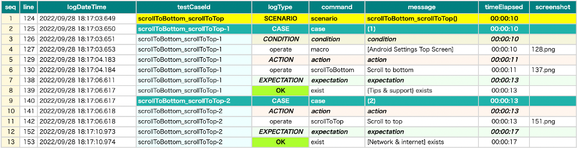

# Optimizing end of scroll

When calling commands with scroll (e.g. scrollToEnd, selectWithScrollDown, canSelectWithScrollDown), Shirates detects
end of scroll automatically. Moreover, giving additional information may improve the execution time.

## end-elements

You can specify the element(s) at the end of scroll in the screen nickname file.

Scrolling commands use these additional information to detect the end of scroll.

### [Android Settings Top Screen].json

```
...
    "[Tips & support]": "",
    "{Tips & support}": "[Tips & support]:label",
    "[Tips & support Icon]": "[Tips & support]:leftImage"
  },

  "scroll": {
    "start-elements": "",
    "end-elements": "[Tips & support]"
  }
}
```

**Note:** Multiple nicknames can be specified using comma.

```
    "end-elements": "[Tips & support],[About phone]"
```

### ScrollToEdge1.kt

(`kotlin/tutorial/inaction/ScrollToEdge1.kt`)

```kotlin
@Order(10)
@Test
fun scrollToBottom_scrollToTop() {

    scenario {
        case(1) {
            condition {
                it.macro("[Android Settings Top Screen]")
            }.action {
                it.scrollToBottom()
            }.expectation {
                it.exist("{Tips & support}")
            }
        }
        case(2) {
            action {
                it.scrollToTop()
            }.expectation {
                it.exist("[Network & internet]")
            }
        }
    }
}
```

## Comparison

### end-elements unspecified


### end-elements specified



- unspecified: 20 sec
- specified: 17 sec

### Link

- [index](../../index.md)
