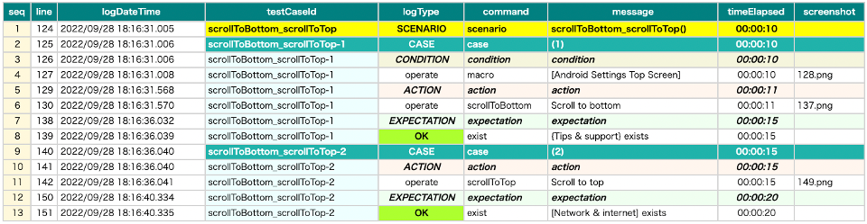

# スクロール終端位置の検出の最適化

スクロールを伴うコマンド(scrollToEnd, selectWithScrollDown, canSelectWithScrollDownなど)を呼び出した場合
Shiratesはスクロールの終了位置を自動で検出します。追加の情報を与えると実行時間の短縮につながります。

## end-elements

画面ニックネームファイルにおいてスクロールの終了時に存在する要素を記述することができます。

スクロールを伴うコマンドはこれらの追加情報を使用してスクロールの終端位置を検出します。

### [Android Settings Top Screen].json

```
...
    "[Tips & support]": "",
    "{Tips & support}": "[Tips & support]:label",
    "[Tips & support Icon]": "[Tips & support]:leftImage"
  },

  "scroll": {
    "start-elements": "",
    "end-elements": "[Tips & support]"
  }
}
```

**注意:** カンマを使用して複数のニックネームを指定できます。

```
    "end-elements": "[Tips & support],[About phone]"
```

### ScrollToEdge1.kt

(`kotlin/tutorial/inaction/ScrollToEdge1.kt`)

```kotlin
@Order(10)
@Test
fun scrollToBottom_scrollToTop() {

    scenario {
        case(1) {
            condition {
                it.macro("[Android Settings Top Screen]")
            }.action {
                it.scrollToBottom()
            }.expectation {
                it.exist("{Tips & support}")
            }
        }
        case(2) {
            action {
                it.scrollToTop()
            }.expectation {
                it.exist("[Network & internet]")
            }
        }
    }
}
```

## 比較

### end-elementsを指定しない場合



### end-elementsを指定した場合


- 指定しない場合: 20 sec
- 指定した場合: 17 sec

### Link

- [index](../../index_ja.md)
