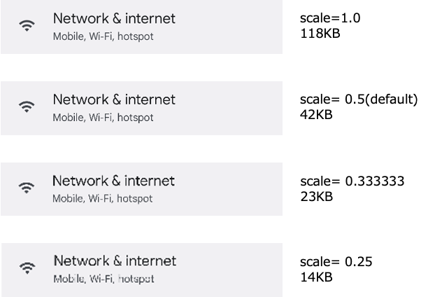

# Screenshot scale

Screenshot size can be reduced by specifying **screenshotScale** parameter.

See [Parameter](../../basic/parameter/parameters.md).

## Example

```
screenshotScale=0.333333
```

## Comparison (Size)


## Comparison (Image clarity)



### Link

- [index](../../index.md)

