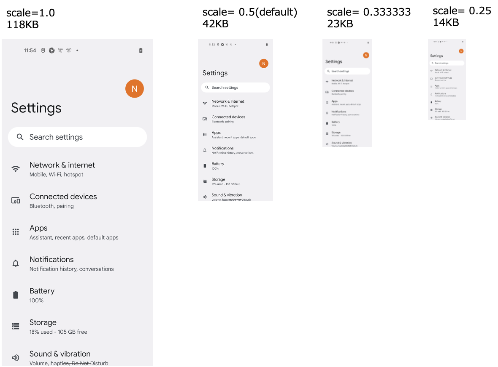

# スクリーンショットの縮小率

**screenshotScale**を使用するとスクリーンショットのサイズを縮小することができます。

参照 [パラメーター](../../basic/parameter/parameters_ja.md).

## 例

```
screenshotScale=0.333333
```

## 比較 (サイズ)



## 比較 (画像の明瞭さ)


### Link

- [index](../../index_ja.md)

