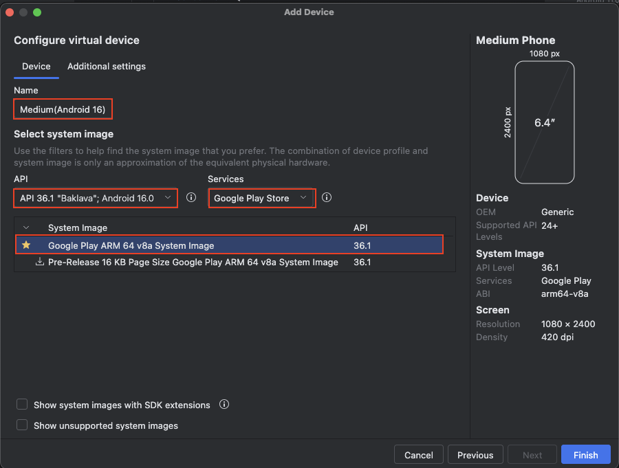
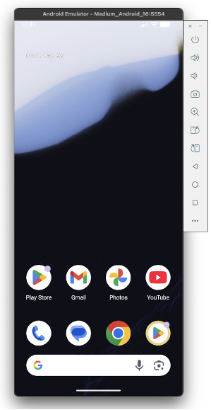

# Quick Start (Shirates/Vision) for macOS

## Environment

See [Tested Environments](environments.md) before installation.

**Note:** AI-Vision feature is for only macOS currently.

## Installation

Install following prerequisite tools.

**Note:** Do not use OS account with username contains non-ASCII characters or white spaces. Some of following tools
don't work well.


<br>

### IntelliJ IDEA

If you have not installed, download Ultimate or COMMUNITY and install it.
(COMMUNITY is opensource product)

https://www.jetbrains.com/idea/

<br>

### Android Studio

If you have not installed, download Android Studio and install it.

https://developer.android.com/studio

<br>

### Xcode (Mac only)

If you have not installed, search Xcode in App Store and install it.

<br>

### Command Line Tools for Xcode (Mac only)

If you have not installed, open terminal window and run this command.

```
xcode-select --install
```

<br>

### Homebrew (Mac only)

If you have not installed, go to https://brew.sh/ and install it.

<br>

### Java Development Kit (JDK)

If you have not installed, search installation guide and install it.

<br>

### node & npm

If you have not installed, install it.

#### (for Mac)

You can install NPM with brew. Open terminal window and type these.

```
brew install node
node -v
npm -v
```

**Note:** Use newer version to avoid troubles of installing appium.

<br>

### Appium

**New install**

```
npm install -g appium
appium -v
```

If you are already using appium, update to the latest version.

**Update install**

```
appium -v
npm uninstall -g appium
npm install -g appium
appium -v
```

See [Tested Environments](environments.md) to get tested version.

<br>

### UIAutomator2 driver

**New install**

```
appium driver install uiautomator2
```

**Update install**

```
appium driver list
appium driver uninstall uiautomator2
appium driver install uiautomator2
appium driver list
```

See [Tested Environments](environments.md) to get tested version.

<br>

### XCUITest driver(Mac only)

Install XCUITest driver.

**New install**

```
appium driver install xcuitest
```

**Update install**

```
appium driver list
appium driver uninstall xcuitest
appium driver install xcuitest
appium driver list
```

See [Tested Environments](environments.md) to get tested version.

<br>

### Setting Environment Variables (Mac only)

Set environment variables in initializing script (.zshrc or others).

#### Example

```
export ANDROID_SDK_ROOT=/Users/$USER/Library/Android/sdk
export PATH=$ANDROID_SDK_ROOT/emulator:$ANDROID_SDK_ROOT/tools:$ANDROID_SDK_ROOT/platform-tools:$PATH
```

**Note:** Execute log out/log in to take effect above settings.

#### Example

```
export ANDROID_SDK_ROOT=/home/$USER/Android/Sdk
export PATH=$ANDROID_SDK_ROOT/emulator:$ANDROID_SDK_ROOT/tools:$ANDROID_SDK_ROOT/platform-tools:$PATH
```

## Setting up AVD (Android Virtual Device)

### Create AVD for demo

1. Open **Android Studio**.
2. Select menu `Tools > Device Manager`.
3. Click `[+]` and select `Create Virtual Device`. <br>
   
4. Select `Pixcel 8` and click `Next`.<br>
   
5. Set fields.<br>**Name** `Pixel 8(Android 14)`<br>**API** `API 34 "UpsideDownCake", Android 14.0`<br>**Services**
   `Google Play Store`<br>**System Image** (Select the item)
   
6. Click `Additional settings`. <br>Set **Device skin** `[None]`. <br>Click `Finish`.<br>
   
7. Now you can use the emulator.<br>
   Click the play button to launch the emulator.
   
   

## Setting up shirates-vision-server

1. Get shirates-vision-server from [shirates-vision-server](https://github.com/ldi-github/shirates-vision-server).
2. Open the project (open `Package.swift` with Xcode). Wait a while for the background process to finish.
3. Select `Product > Destination > My Mac`.<br>
4. Select `Product > Run`. You can see `[ NOTICE ] Server started on http://127.0.0.1:8081`.<br>
   

## Demonstration

Let's see demonstration.

### Getting shirates-core-vision-samples

1. Get **shirates-core-vision-samples_en**
   from [shirates-core-vision-samples_en](https://github.com/ldi-github/shirates-core-vision-samples_en).

### Opening Project

1. Open **shirates-core-vision-samples_en** project directory in Finder.
2. Right click `build.gradle.kts` and open with `IntelliJ IDEA`. <br>
   

### Enable right-click test running

1. `IntelliJ IDEA > Settings` (or `File > Settings`)
1. `Build, Execution, Deployment > Build Tools > Gradle`
1. Set `Run tests using` to `IntelliJ IDEA`


<br>

### Run AndroidSettingsVisionDemo

1. Open `shirates-core-vision-samples_en` project in `IntelliJ IDEA`, <br>
   right click on `kotlin/demo/vision/AndroidSettingsVisionDemo` <br> and select
   **Debug 'AndroidSettingsVisionDemo'** <br> 
2. You'll see logs in the console like this. 
3. Click the link to open the log directory. <br> 
4. Open **_Report(simple).html**. <br>  <br><br>
5. Open **AndroidSettingsVisionDemo@a.xlsx**. <br> 

<br>

### Run iOSSettingsVisionDemo

1. Open `shirates-core-vision-samples_en` project in IntelliJ, <br>
   right click on `src/test/Kotlin/demo/vision/iOSSettingsVisionDemo` <br>
   and select **Debug 'iOSSettingsVisionDemo'**
2. You'll see logs in the console like this. 
3. Click the link to open the log directory.
4. Open **_Report(simple).html
   **. <br>  <br>  <br><br>
5. Open **iOSSettingsVisionDemo@i.xlsx**. <br> 

### Link

- [index](index.md)
