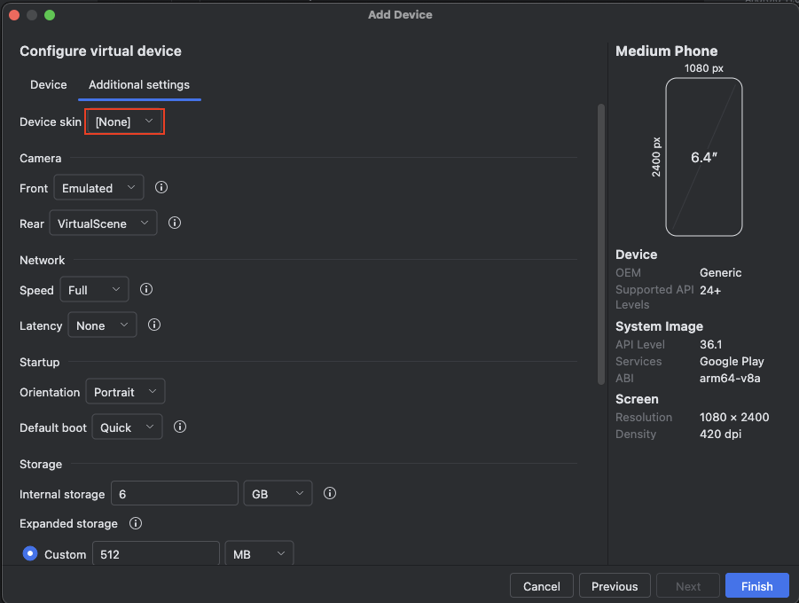
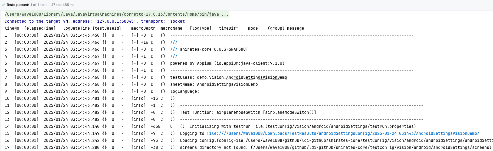
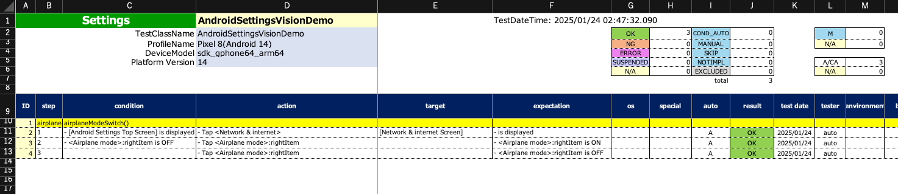
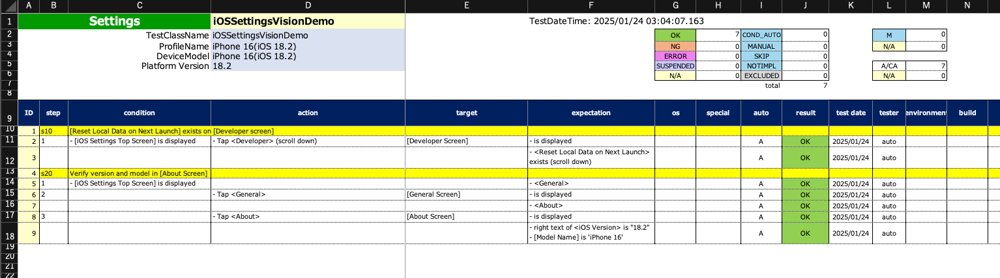

# クイックスタート (Shirates/Vision) for macOS

## Environment

インストールの前に [Tested Environments](environments.md) を確認してください。

**注意:** AI-Vision機能は現時点でmacOSでのみ利用できます。

## インストール

以下の前提となるツールをインストールしてください。

**注意:** ユーザー名に非ASCII文字や空白を含むOSのアカウントを使用しないでください。以下のツールのいくつかは動作しない場合があります。


<br>

### IntelliJ IDEA

インストールしていない場合はUltimate または COMMUNITYをダウンロードしてインストールしてください。
(COMMUNITYはオープンソース製品です)

https://www.jetbrains.com/idea/

<br>

### Android Studio

インストールしていない場合はダウンロードしてインストールしてください。

https://developer.android.com/studio

<br>

### Xcode (Mac only)

インストールしていない場合はApp StoreでXcodeを検索してインストールしてください。

<br>

### Command Line Tools for Xcode (Mac only)

インストールしていない場合はターミナルウィンドウを開いて以下のコマンドを実行してください。

```
xcode-select --install
```

<br>

### Homebrew (Macのみ)

インストールしていない場合は https://brew.sh/ を参考にしてインストールしてください。


<br>

### Java Development Kit (JDK)

インストールしていない場合はインストールガイドを検索してインストールしてください。

<br>

### node & npm

インストールしていない場合はインストールしてください。

#### (Macの場合)

NPMをbrewでインストールすることができます。ターミナルウィンドウを開いて以下を実行してください。

```
brew install node
node -v
npm -v
```

**注意:** appiumのインストールのトラブルを避けるために比較的新しいバージョンを使用してください。

<br>

### Appium

**新規インストール**

```
npm install -g appium
appium -v
```

すでにappiumを使用中の場合は最新バージョンへアップデートしてください。

**アップデートインストール**

```
appium -v
npm uninstall -g appium
npm install -g appium
appium -v
```

テスト済みの環境を [Tested Environments](environments.md) で確認してください。


<br>

### UIAutomator2 driver

**新規インストール**

```
appium driver install uiautomator2
```

**アップデートインストール**

```
appium driver list
appium driver uninstall uiautomator2
appium driver install uiautomator2
appium driver list
```

テスト済みの環境を [Tested Environments](environments.md) で確認してください。

<br>

### XCUITest driver(Macのみ)

**新規インストール**

```
appium driver install xcuitest
```

**アップデートインストール**

```
appium driver list
appium driver uninstall xcuitest
appium driver install xcuitest
appium driver list
```

テスト済みの環境を [Tested Environments](environments.md) で確認してください。

<br>

### 環境変数の設定 (Macのみ)

初期化スクリプト(.zshrc など)で環境変数を設定してください。

#### 例

```
export ANDROID_SDK_ROOT=/Users/$USER/Library/Android/sdk
export PATH=$ANDROID_SDK_ROOT/emulator:$ANDROID_SDK_ROOT/tools:$ANDROID_SDK_ROOT/platform-tools:$PATH
```

**注意:** 上記セッティングを有効にするためにログアウト/ログインを実行してください。

#### 例

```
export ANDROID_SDK_ROOT=/home/$USER/Android/Sdk
export PATH=$ANDROID_SDK_ROOT/emulator:$ANDROID_SDK_ROOT/tools:$ANDROID_SDK_ROOT/platform-tools:$PATH
```

## AVD(Android Virtual Device)の設定

### AVD作成のデモ

1. **Android Studio**を開きます。
2. メニューから`Tools > Device Manager`を選択します。
3. `[+]`をクリックして`Create Virtual Device`を選択します。<br>
   
4. `Pixcel 8`を選択し`Next`をクリックします。<br>
   
5. 項目を設定します。<br>**Name** `Pixel 8(Android 14)`<br>**API** `API 34 "UpsideDownCake", Android 14.0`<br>**Services
   **
   `Google Play Store`<br>**System Image** (アイテムを選択します)
   
6. `Additional settings`をクリックします。 <br>**Device skin** を`[None]`に設定します。 <br>`Finish`をクリックします。<br>
   
7. これでエミュレーターが使用できるようになりました。<br>
   `Start`ボタンをクリックしてエミュレーターを起動してください。
   
   

## shirates-vision-server のセットアップ

1. **shirates-vision-server** を[shirates-vision-server](https://github.com/ldi-github/shirates-vision-server)
   から入手します。
2. プロジェクトを開きます(`Package.swift`をXcodeで開きます)。バックグラウンド処理が完了するのを待ちます。
3. `Product > Destination > My Mac`を選択します。<br>
4. `Product > Run`を選択します。 `[ NOTICE ] Server started on http://127.0.0.1:8081`がログ出力されます。<br>
   

## デモンストレーション

デモンストレーションをやってみましょう。

### shirates-core-vision-samples を入手する

1. **shirates-core-vision-samples_ja**
   を[shirates-core-vision-samples_ja](https://github.com/ldi-github/shirates-core-vision-samples_ja)から入手します。

### プロジェクトを開く

1. **shirates-core-vision-samples_ja** プロジェクトのディレクトリを Finder で開きます。
2. `build.gradle.kts` を右クリックして`IntelliJ IDEA`で開きます。 <br>
   

### 右クリックによるテスト実行を有効にする

1. `IntelliJ IDEA > Settings`
1. `Build, Execution, Deployment > Build Tools > Gradle`
1. `Run tests using` を `IntelliJ IDEA` に設定します


<br>

### AndroidSettingsVisionDemo を実行する

1. `shirates-core-vision-samples_ja` プロジェクトを`IntelliJ IDEA`で開き、 <br>
   `kotlin/demo/vision/AndroidSettingsVisionDemo`を右クリックして <br>
   **Debug 'AndroidSettingsVisionDemo'** 選択します<br> 
2. コンソールにこのようなログが出力されます。 
3. リンクをクリックしてディレクトリを開きます。<br> 
4. **_Report(simple).html**
   を開きます。 <br>  <br><br>
5. **AndroidSettingsVisionDemo@a.xlsx**を開きます。<br> 

<br>

### iOSSettingsVisionDemo を実行する

1. `shirates-core-vision-samples_en`プロジェクトを`IntelliJ IDEA`で開き、 <br>
   `src/test/Kotlin/demo/vision/iOSSettingsVisionDemo`を右クリックして <br>
   **Debug 'iOSSettingsVisionDemo'** を選択します。
2. コンソールにこのようなログが出力されます。 
3. リンクをクリックしてログディレクトリを開きます。<br> 
4. **_Report(simple).html**を開きます。 <br>  <br><br>
5. **iOSSettingsVisionDemo@i.xlsx** を開きます。<br> 

### Link

- [index](index_ja.md)
