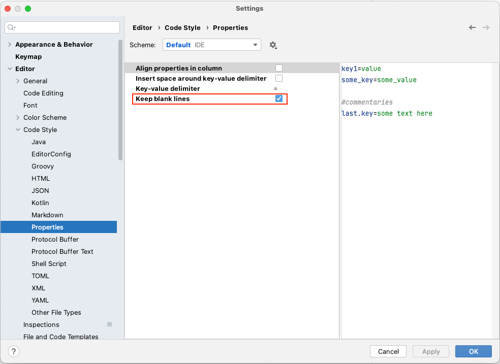

# Actions on Save (IntelliJ IDEA)

Apply code format on saving file.

### Settings recommended

1. `IntelliJ IDEA > Settings` (or `File > Settings`)
2. `Tools > Actions on Save`
    - Check these items on.
        - Reformat code
        - Optimize imports
           
4. `Editor > Code Style > JSON`
    - Set the item.
        - Keep maximum blank lines in code: `1`
           
6. `Editor > Code Style > properties`
    - Check these items on.
        - Keep blank lines
           
6. Click `OK` .

### Link

- [index](../index.md)

