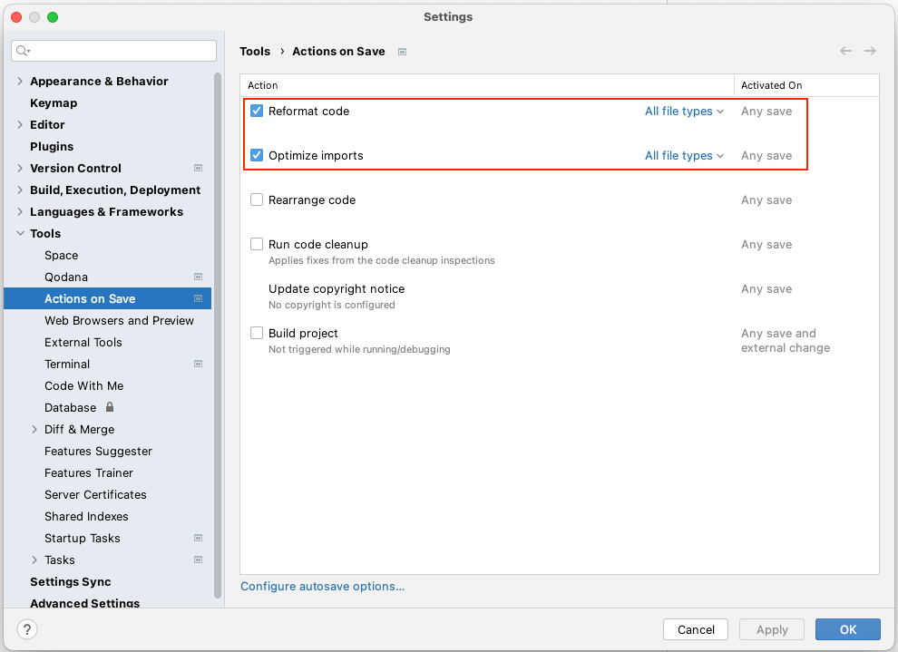
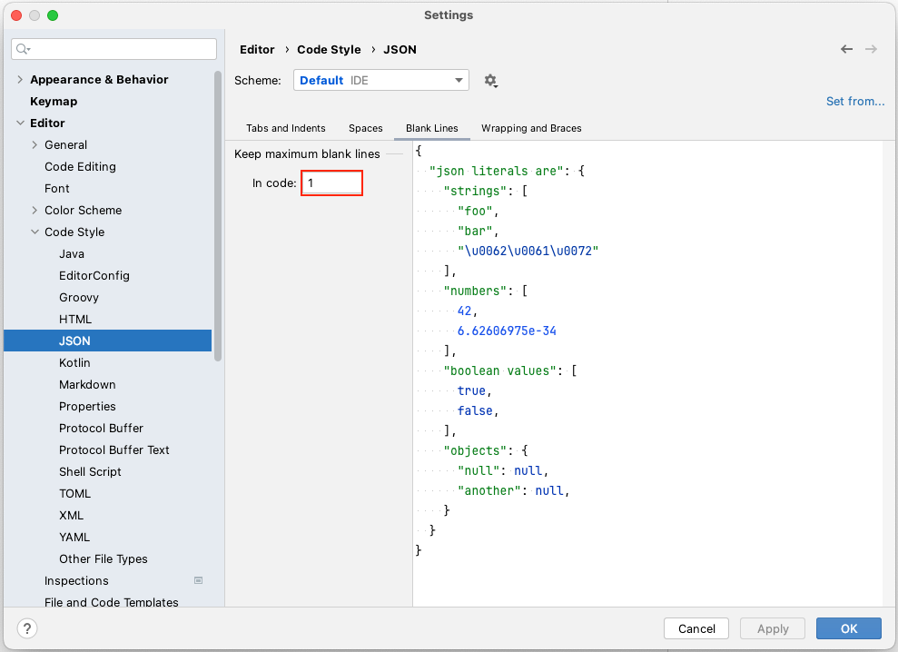
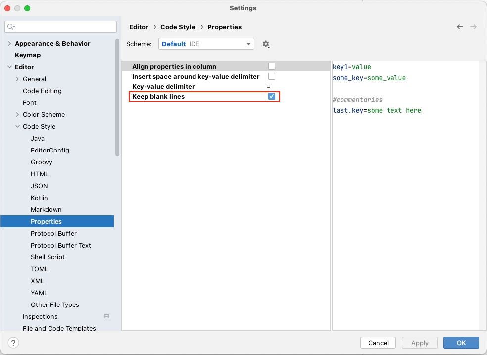

# Actions on Save (IntelliJ IDEA)

ファイルを保存したときにコードフォーマットを適用します。

### 推奨設定

1. `IntelliJ IDEA > Settings` (または `File > Settings`)
2. `Tools > Actions on Save`
    - 下記アイテムのチェックをONにする
        - Reformat code
        - Optimize imports
           
4. `Editor > Code Style > JSON`
    - 下記アイテムの値を設定する
        - Keep maximum blank lines in code: `1`
           
5. `Editor > Code Style > properties`
    - 下記アイテムのチェックをONにする
        - Keep blank lines
           
6. `OK`をクリックする

### Link

- [index](../index_ja.md)

