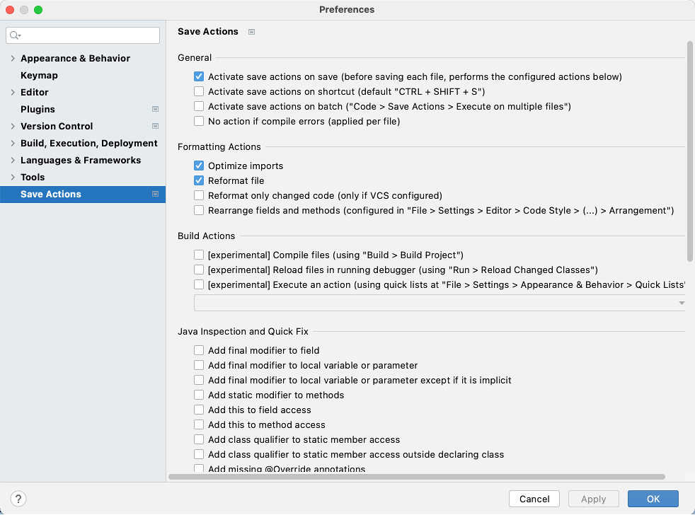
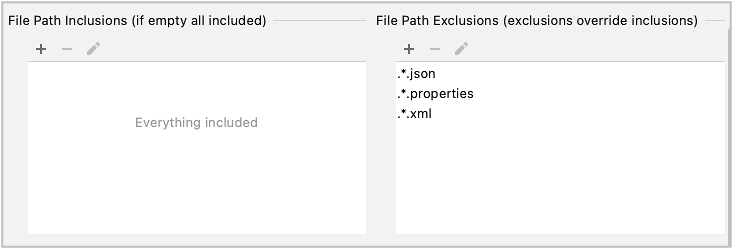

# IntelliJ IDEA Plugin settings

## Save Actions Plugin (Obsolete)

**Save Actions Plugin** is a great, productive plugin, but it's time to use IntelliJ IDEA'
s [Actions on Save](actions_on_save.md) feature.

This procedure is obsolete. (to be deleted)

### Installation

1. Open Preferences window(or Settings window)
    - (Mac) IntelliJ IDEA > Preferences
    - (Windows) File > Settings
1. Click `Plugins`.
1. Click search box, input `"save actions"`, and press enter.
1. Install **Save Actions**.

### Settings recommended

1. In Preference window (or Settings window), tap **Save Actions** at the end of left pane.
1. Check these items on.
    - Activate save actions on save
    - Optimize imports
    - Reformat file
       

1. Set File Path Exclusions
    - `.*.json`
    - `.*.properties`
    - `.*.xml`
       

1. Click `OK` .

### Link

- [index](../index.md)

