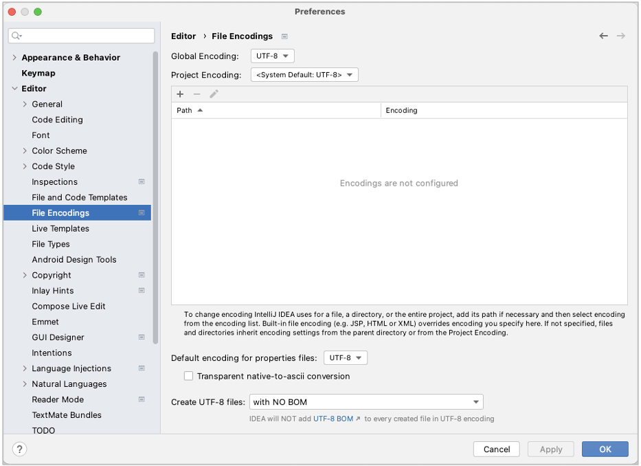

# propertiesファイルのエンコーディング設定

propertiesファイルはデフォルトではISO-8859-1のエンコーディングであるため、日本語で使用するには不便です。
shirates-codeのpropertiesファイルはUTF-8に対応しているので、IntelliJ IDEAの設定を変更して使用することをお勧めします。

### 推奨設定

1. `IntelliJ IDEA > Preferences` (or `File > Settings`)
2. `Editor > File Encodings`
3. `Default encoding for properties file:`を **UTF-8** に設定する
4. Click `OK` .

### Link

- [index](../index_ja.md)

