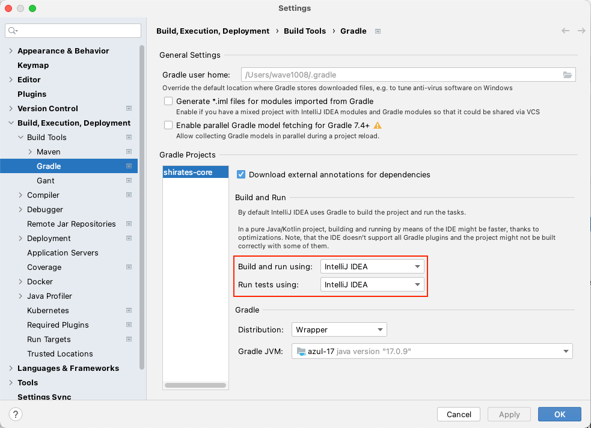

# Enable right-click test running

### Enable right-click test running

1. `IntelliJ IDEA > Preferences` (or `File > Settings`)
1. `Build, Execution, Deployment > Build Tools > Gradle`
1. Set `Run tests using` to `IntelliJ IDEA`

### Link

- [index](../index.md)
