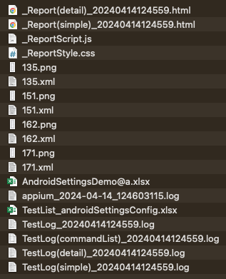

# Watching Appium Server log

1. Open log directory (click on hyperlink in IntelliJ IDEA console).
1. Open `appium_YYYY-MM-DD_HHmmss.log`.

## for Mac

You can open Appium Server log file with Console app and monitor in realtime.

## Example

### Log directory



### Appium Server log

```
2022-06-18 08:08:34:958 [Appium] Welcome to Appium v2.0.0-beta.35 (REV 30e3d8883cde265cbc16ff94b49a3ac14137590e)
2022-06-18 08:08:34:959 [Appium] Non-default server args:
2022-06-18 08:08:34:960 [Appium] { port: 4720, relaxedSecurityEnabled: true, sessionOverride: true }
2022-06-18 08:08:34:961 [Appium] Attempting to load driver uiautomator2...
2022-06-18 08:08:34:961 [Appium] Requiring driver at /Users/wave1008/.appium/node_modules/appium-uiautomator2-driver
2022-06-18 08:08:35:444 [Appium] Attempting to load driver xcuitest...
2022-06-18 08:08:35:444 [Appium] Requiring driver at /Users/wave1008/.appium/node_modules/appium-xcuitest-driver
2022-06-18 08:08:35:982 [Appium] Appium REST http interface listener started on 0.0.0.0:4720
2022-06-18 08:08:35:982 [Appium] Available drivers:
2022-06-18 08:08:35:982 [Appium]   - uiautomator2@2.1.0 (automationName 'UiAutomator2')
2022-06-18 08:08:35:983 [Appium]   - xcuitest@4.4.6 (automationName 'XCUITest')
2022-06-18 08:08:35:983 [Appium] No plugins have been installed. Use the "appium plugin" command to install the one(s) you want to use.
2022-06-18 08:08:36:625 [HTTP] Request idempotency key: f94e9a95-faac-49f0-b307-9d434a416974
2022-06-18 08:08:36:632 [HTTP] --> POST /session
2022-06-18 08:08:36:633 [HTTP] {"capabilities":{"firstMatch":[{}],"alwaysMatch":{"appium:appActivity":"com.android.settings.Settings","appium:appPackage":"com.android.settings","appium:automationName":"UiAutomator2","appium:language":"en","appium:locale":"US","appium:newCommandTimeout":300,"appium:platformName":"Android","appium:platformVersion":"12","platformName":"android"}}}
2022-06-18 08:08:36:633 [AppiumDriver@f5bf] Calling AppiumDriver.createSession() with args: [null,null,{"firstMatch":[{}],"alwaysMatch":{"appium:appActivity":"com.android.settings.Settings","appium:appPackage":"com.android.settings","appium:automationName":"UiAutomator2","appium:language":"en","appium:locale":"US","appium:newCommandTimeout":300,"appium:platformName":"Android","appium:platformVersion":"12","platformName":"android"}}]
2022-06-18 08:08:36:634 [AppiumDriver@f5bf] Event 'newSessionRequested' logged at 1655539716634 (17:08:36 GMT+0900 (Japan Standard Time))
2022-06-18 08:08:36:635 [BaseDriver] Ignoring capability 'appium:platformName=Android' and using capability 'platformName=android'
2022-06-18 08:08:36:635 [BaseDriver] The capabilities ["platformName"] are standard capabilities and do not require "appium:" prefix
2022-06-18 08:08:36:636 [Appium] Attempting to find matching driver for automationName 'UiAutomator2' and platformName 'android'
2022-06-18 08:08:36:636 [Appium] The 'uiautomator2' driver was installed and matched caps.
2022-06-18 08:08:36:636 [Appium] Will require it at /Users/wave1008/.appium/node_modules/appium-uiautomator2-driver
2022-06-18 08:08:36:636 [Appium] Requiring driver at /Users/wave1008/.appium/node_modules/appium-uiautomator2-driver
2022-06-18 08:08:36:636 [AppiumDriver@f5bf] Appium v2.0.0-beta.35 creating new AndroidUiautomator2Driver (v2.1.0) session
2022-06-18 08:08:36:636 [AppiumDriver@f5bf] Checking BaseDriver versions for Appium and AndroidUiautomator2Driver
2022-06-18 08:08:36:636 [AppiumDriver@f5bf] Appium's BaseDriver version is 8.5.3
2022-06-18 08:08:36:636 [AppiumDriver@f5bf] AndroidUiautomator2Driver's BaseDriver version is 8.5.2
2022-06-18 08:08:36:636 [AppiumDriver@f5bf] There are no active sessions for cleanup
2022-06-18 08:08:36:638 [AppiumDriver@f5bf] Applying relaxed security to 'AndroidUiautomator2Driver' as per server command line argument. All insecure features will be enabled unless explicitly disabled by --deny-insecure
2022-06-18 08:08:36:639 [AndroidUiautomator2Driver@5dd2] Creating session with W3C capabilities: {
2022-06-18 08:08:36:639 [AndroidUiautomator2Driver@5dd2]   "alwaysMatch": {
2022-06-18 08:08:36:639 [AndroidUiautomator2Driver@5dd2]     "platformName": "android",
2022-06-18 08:08:36:639 [AndroidUiautomator2Driver@5dd2]     "appium:appActivity": "com.android.settings.Settings",
2022-06-18 08:08:36:639 [AndroidUiautomator2Driver@5dd2]     "appium:appPackage": "com.android.settings",
2022-06-18 08:08:36:639 [AndroidUiautomator2Driver@5dd2]     "appium:automationName": "UiAutomator2",
2022-06-18 08:08:36:639 [AndroidUiautomator2Driver@5dd2]     "appium:language": "en",
2022-06-18 08:08:36:639 [AndroidUiautomator2Driver@5dd2]     "appium:locale": "US",
2022-06-18 08:08:36:639 [AndroidUiautomator2Driver@5dd2]     "appium:newCommandTimeout": 300,
2022-06-18 08:08:36:639 [AndroidUiautomator2Driver@5dd2]     "appium:platformVersion": "12"
2022-06-18 08:08:36:639 [AndroidUiautomator2Driver@5dd2]   },
2022-06-18 08:08:36:639 [AndroidUiautomator2Driver@5dd2]   "firstMatch": [
2022-06-18 08:08:36:639 [AndroidUiautomator2Driver@5dd2]     {}
2022-06-18 08:08:36:639 [AndroidUiautomator2Driver@5dd2]   ]
2022-06-18 08:08:36:639 [AndroidUiautomator2Driver@5dd2] }
2022-06-18 08:08:36:643 [AndroidUiautomator2Driver@5dd2 (734205bb)] Session created with session id: 734205bb-2866-4370-bab8-94982aa18f7a
2022-06-18 08:08:36:643 [AndroidUiautomator2Driver@5dd2 (734205bb)] Starting 'com.android.settings' directly on the device
...
```

### Link

- [Troubleshooting](../troubleshooting.md)
