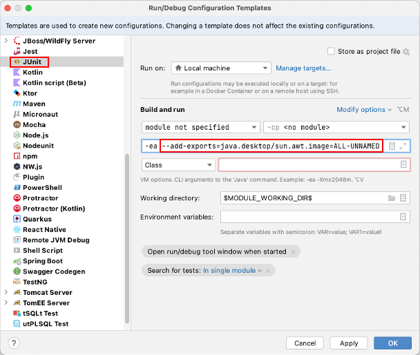
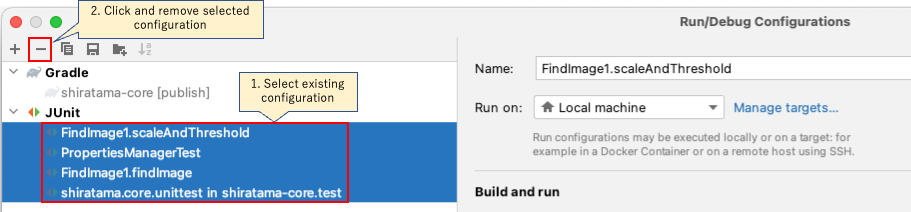

# Due to JRE encapsulation, low level data structures needed for fast conversion of BufferedImages are no longer accessible.

## Message

`Due to JRE encapsulation, low level data structures needed for fast conversion of BufferedImages are no longer accessible. You can work around this by adding the following to your java command: --add-exports=java.desktop/sun.awt.image=ALL-UNNAMED`

## Cause

Dependent computer vision library `BoofCV` uses hidden API to improve performance.

See [An illegal reflective access operation has occurred #175](https://github.com/lessthanoptimal/BoofCV/issues/175)

## Solution

Set `--add-exports` to JVM args as follows.

### IntelliJ (JUnit)

1. Run > Edit Configurations > Edit configuration templates
2. Select **JUnit**
3. Add `--add-exports=java.desktop/sun.awt.image=ALL-UNNAMED` to JVM args.
   <br>
   
4. Remove existing run/debug configuration.
   <br>
   

Now you can apply `--add-exports` option to every JUnit run/debug configuration by default.

### Gradle

Add `jvmArgs` as follows.

#### build.gradle.kts

```
tasks.test {
    useJUnitPlatform()
    jvmArgs = listOf(
        "--add-exports", "java.desktop/sun.awt.image=ALL-UNNAMED"
    )
}
```

## Note

See
also [WARNING: An illegal reflective access operation has occurred](../warnings/anIllegalRefrectiveAccessOperationHasOccured.md)

### Link

- [Error messages / Warning messages](../error_warning_messages.md)

