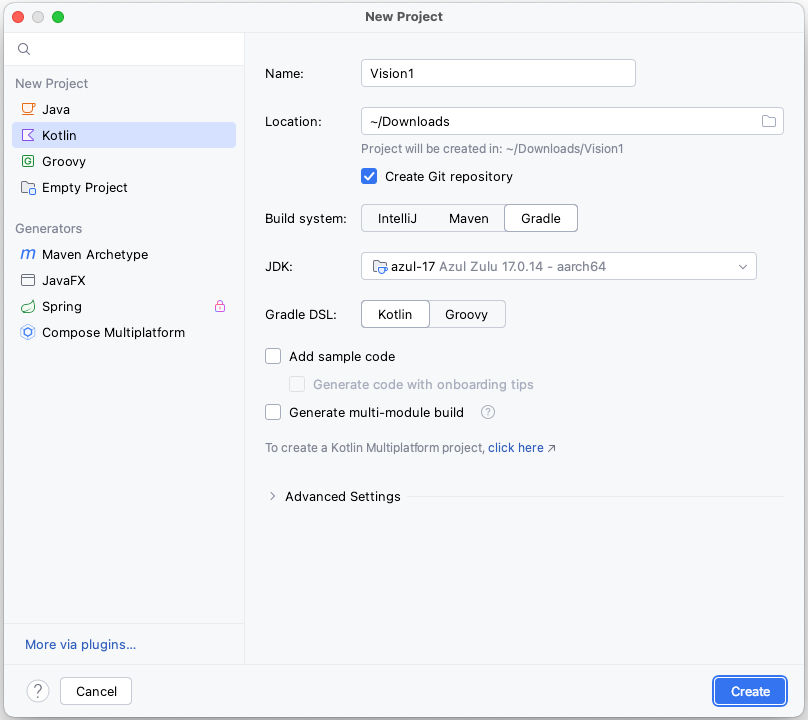
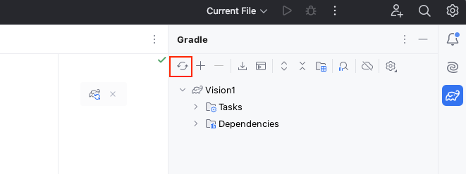

# プロジェクトを作成する (Vision)

## 新規プロジェクトの作成

1. IntelliJ IDEAを開き、`File > New > Project`を選択します。
1. New Projectウィンドウで`Kotlin`タブを選択します。
1. 以下の内容で項目に入力します。
    - `Name: Vision1`
    - `Location: (選択してください)`
    - `Build system: Gradle`
    - `JDK: (選択してください)`
    - `Gradle DSL: Kotlin`
    - `Add sample code: OFF`
    - `Generate multi-module build`: OFF
      <br>
1. `Create`をクリックします。
1. バックグラウンドタスクが完了するまで待ちます。これには数分かかる場合があります。
1. `build.gradle.kts`を下記のように編集します。

### build.gradle.kts (example)

```kotlin
plugins {
    kotlin("jvm") version "2.1.0"
}

group = "org.example"
version = "1.0-SNAPSHOT"

val shiratesCoreVersion = "8.0.10"
val appiumClientVersion = "9.4.0"

repositories {
    mavenCentral()
}

dependencies {
    // JUnit 5
    testImplementation("org.junit.jupiter:junit-jupiter-api:5.10.1")
    testRuntimeOnly("org.junit.jupiter:junit-jupiter-engine:5.10.1")

    // Appium
    testImplementation("io.appium:java-client:$appiumClientVersion")

    // shirates-core
    testImplementation("io.github.ldi-github:shirates-core:$shiratesCoreVersion")
}

tasks.test {
    useJUnitPlatform()
}
kotlin {
    jvmToolchain(17)
}
```

Gradleペインの `reload` をクリックしてロードします。



### Link

- [index](../../../index_ja.md)

