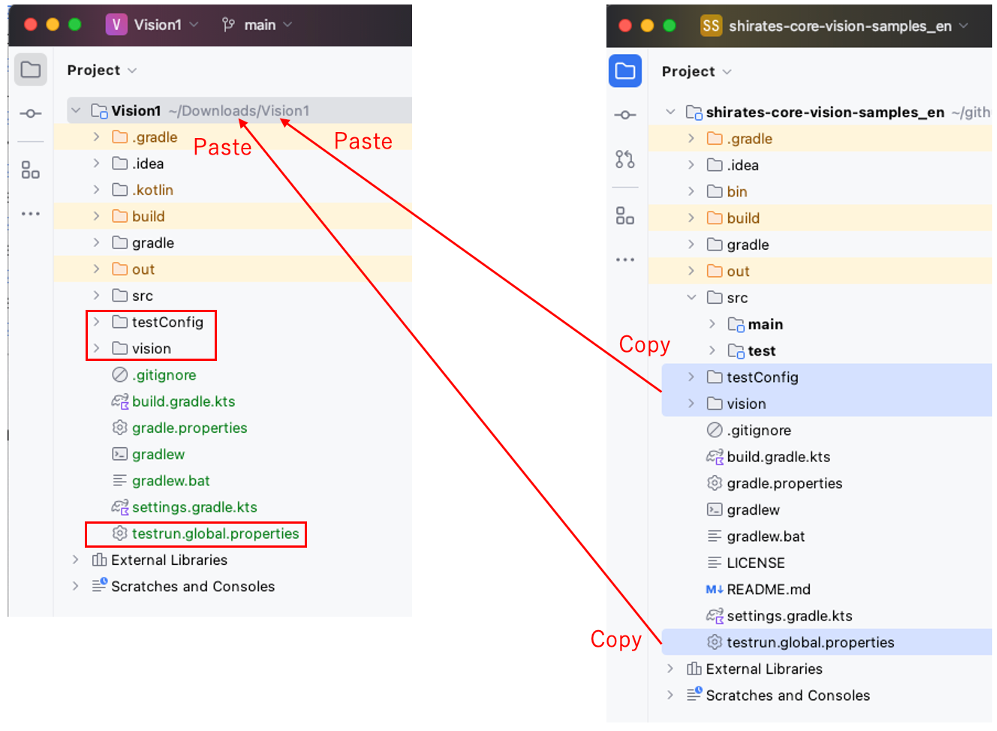

# Test configuration template (Vision)

Test configuration files are required to initialize test session.

### Sample code

[Getting samples](../../getting_samples.md)

## Copying configuration files

You can copy configuration files in the sample project into you project.

1. Select the following items.
    - `testConfig`
    - `vision`
    - `testrun.global.properties`.
2. Copy these items and paste to you project root.

### Link

- [index](../../../index.md)

