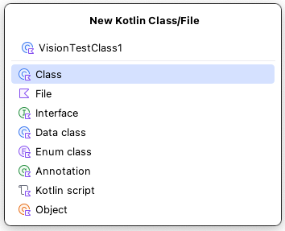

# Creating TestClass (Shirates/Vision)

## UITest class

1. Create a package directory `src/test/kotlin/exercise`.

   <br><br>
   


2. Create a kotlin class file `TestClass1`.

   

   

   


3. Type `" : VisionTest()"` after class name, move mouse cursor to it, then click `import` on context menu. <br>Shortcut
   is
   useful. (Mac: option+Enter, Windows: Alt+Enter)

   

```kotlin
package exercise

import shirates.core.configuration.Testrun
import shirates.core.vision.testcode.VisionTest

@Testrun("testConfig/android/androidSettings/testrun.properties")
class VisionTestClass1: VisionTest() {
}
```

## @Testrun annotation

**Testrun file** that describes test configuration information is required to initialize test session.
Put **@Testrun** annotation on the class to indicate which **testrun file** to be applied.

See also [Test Configuration template](../creating_project/test_configuration_template.md)

```kotlin
package exercise

import shirates.core.configuration.Testrun
import shirates.core.vision.testcode.VisionTest

@Testrun("testConfig/android/androidSettings/testrun.properties")
class TestClass1 : VisionTest() {
}
```

You can put `testrun.properties` file under `testConfig` directory, and this file is recognize as default.
You can omit putting `@Testrun` annotation on each Test class.


## @Test annotation

Create a function (`testFunc1`).

```kotlin
@Testrun("testConfig/android/androidSettings/testrun.properties")
class TestClass1 : VisionTest() {

    fun testFunc1() {

    }
}
```

Put **@Test** annotation of **JUnit 5** (**org.junit.jupiter.api.Test**)


```kotlin
package exercise

import org.junit.jupiter.api.Test
import shirates.core.configuration.Testrun
import shirates.core.vision.testcode.VisionTest

@Testrun("testConfig/android/androidSettings/testrun.properties")
class VisionTestClass1: VisionTest() {

    @Test
    fun testFunc1() {

    }
}
```

## Running test

At this point, you can run `testFunc1`.

1. Set profile in `testrun.global.properties` file.<br>

```properties
# Specifying the AVD Name of emulator
android.profile=Pixel 8(Android 14)
``` 

2. Set IntelliJ IDEA Settings.
    - See [Enable right-click test running](../../../tool_settings/right_click_test_running.md)
3. Right-click in testFunc1 and select `Debug`.

### Console

```
lineNo	[elapsedTime]	logDateTime	{testCaseId}	macroDepth	macroName	[logType]	timeDiff	mode	(group)	message
1	[00:00:00]	2025/01/03 03:29:35.856	{}	0	-	[-]	+0	C	()	----------------------------------------------------------------------------------------------------
2	[00:00:00]	2025/01/03 03:29:35.873	{}	0	-	[-]	+17	C	()	///
3	[00:00:00]	2025/01/03 03:29:35.873	{}	0	-	[-]	+0	C	()	/// shirates-core 8.0.0
4	[00:00:00]	2025/01/03 03:29:35.873	{}	0	-	[-]	+0	C	()	///
5	[00:00:00]	2025/01/03 03:29:35.874	{}	0	-	[-]	+1	C	()	powered by Appium (io.appium:java-client:9.1.0)
6	[00:00:00]	2025/01/03 03:29:35.875	{}	0	-	[-]	+1	C	()	----------------------------------------------------------------------------------------------------
7	[00:00:00]	2025/01/03 03:29:35.875	{}	0	-	[-]	+0	C	()	testClass: exercise.VisionTestClass1
8	[00:00:00]	2025/01/03 03:29:35.875	{}	0	-	[-]	+0	C	()	sheetName: VisionTestClass1
9	[00:00:00]	2025/01/03 03:29:35.875	{}	0	-	[-]	+0	C	()	logLanguage: 
10	[00:00:00]	2025/01/03 03:29:35.885	{}	0	-	[info]	+10	C	()	
11	[00:00:00]	2025/01/03 03:29:35.886	{}	0	-	[info]	+1	C	()	----------------------------------------------------------------------------------------------------
12	[00:00:00]	2025/01/03 03:29:35.886	{}	0	-	[info]	+0	C	()	Test function: testFunc1 [testFunc1()]
13	[00:00:00]	2025/01/03 03:29:35.886	{}	0	-	[info]	+0	C	()	----------------------------------------------------------------------------------------------------
14	[00:00:00]	2025/01/03 03:29:36.550	{}	0	-	[info]	+664	C	()	Initializing with testrun file.(testConfig/android/androidSettings/testrun.properties)
15	[00:00:00]	2025/01/03 03:29:36.568	{}	0	-	[info]	+18	C	()	Logging to file:////Users/wave1008/Downloads/TestResults/androidSettingsConfig/2025-01-03_032935/VisionTestClass1/
16	[00:00:01]	2025/01/03 03:29:36.664	{}	0	-	[info]	+96	C	()	Loading config.(configFile=/Users/wave1008/Downloads/Vision1/testConfig/android/androidSettings/androidSettingsConfig.json, profileName=Pixel 8(Android 14))
17	[00:00:01]	2025/01/03 03:29:36.702	{}	0	-	[WARN]	+38	C	()	screens directory not found. (/Users/wave1008/Downloads/Vision1/testConfig/android/androidSettings/screens)
18	[00:00:01]	2025/01/03 03:29:36.710	{}	0	-	[info]	+8	C	()	Scanning macro under '/Users/wave1008/Downloads/Vision1/src/test/kotlin'
19	[00:00:01]	2025/01/03 03:29:36.733	{}	0	-	[info]	+23	C	()	Classifier files loaded.(RadioButtonStateClassifier, 2 labels, directory=/Users/wave1008/Downloads/Vision1/vision/mlmodels/widget/RadioButtonStateClassifier)
20	[00:00:01]	2025/01/03 03:29:36.739	{}	0	-	[info]	+6	C	()	Classifier files loaded.(SwitchStateClassifier, 2 labels, directory=/Users/wave1008/Downloads/Vision1/vision/mlmodels/widget/SwitchStateClassifier)
21	[00:00:01]	2025/01/03 03:29:36.747	{}	0	-	[info]	+8	C	()	Initializing TestDriver.(profileName=Pixel 8(Android 14))
22	[00:00:01]	2025/01/03 03:29:36.748	{}	0	-	[info]	+1	C	()	noLoadRun: false
23	[00:00:01]	2025/01/03 03:29:36.749	{}	0	-	[info]	+1	C	()	boundsToRectRatio: 1
24	[00:00:01]	2025/01/03 03:29:36.751	{}	0	-	[info]	+2	C	()	reuseDriver: true
25	[00:00:01]	2025/01/03 03:29:36.752	{}	0	-	[info]	+1	C	()	autoScreenshot: true
26	[00:00:01]	2025/01/03 03:29:36.752	{}	0	-	[info]	+0	C	()	onChangedOnly: true
27	[00:00:01]	2025/01/03 03:29:36.754	{}	0	-	[info]	+2	C	()	onCondition: true
28	[00:00:01]	2025/01/03 03:29:36.755	{}	0	-	[info]	+1	C	()	onAction: true
29	[00:00:01]	2025/01/03 03:29:36.756	{}	0	-	[info]	+1	C	()	onExpectation: true
30	[00:00:01]	2025/01/03 03:29:36.764	{}	0	-	[info]	+8	C	()	onExecOperateCommand: true
31	[00:00:01]	2025/01/03 03:29:36.764	{}	0	-	[info]	+0	C	()	onCheckCommand: true
32	[00:00:01]	2025/01/03 03:29:36.765	{}	0	-	[info]	+1	C	()	onScrolling: true
33	[00:00:01]	2025/01/03 03:29:36.765	{}	0	-	[info]	+0	C	()	manualScreenshot: true
34	[00:00:01]	2025/01/03 03:29:36.769	{}	0	-	[info]	+4	C	()	retryMaxCount: 2
35	[00:00:01]	2025/01/03 03:29:36.770	{}	0	-	[info]	+1	C	()	retryIntervalSeconds: 2.0
36	[00:00:01]	2025/01/03 03:29:36.770	{}	0	-	[info]	+0	C	()	shortWaitSeconds: 1.5
37	[00:00:01]	2025/01/03 03:29:36.771	{}	0	-	[info]	+1	C	()	waitSecondsOnIsScreen: 15.0
38	[00:00:01]	2025/01/03 03:29:36.771	{}	0	-	[info]	+0	C	()	waitSecondsForLaunchAppComplete: 15.0
39	[00:00:01]	2025/01/03 03:29:36.772	{}	0	-	[info]	+1	C	()	waitSecondsForAnimationComplete: 0.5
40	[00:00:01]	2025/01/03 03:29:36.772	{}	0	-	[info]	+0	C	()	waitSecondsForConnectionEnabled: 8.0
41	[00:00:01]	2025/01/03 03:29:36.773	{}	0	-	[info]	+1	C	()	swipeDurationSeconds: 3.0
42	[00:00:01]	2025/01/03 03:29:36.782	{}	0	-	[info]	+9	C	()	flickDurationSeconds: 0.3
43	[00:00:01]	2025/01/03 03:29:36.783	{}	0	-	[info]	+1	C	()	swipeMarginRatio: 0.0
44	[00:00:01]	2025/01/03 03:29:36.784	{}	0	-	[info]	+1	C	()	scrollVerticalStartMarginRatio: 0.15
45	[00:00:01]	2025/01/03 03:29:36.784	{}	0	-	[info]	+0	C	()	scrollVerticalEndMarginRatio: 0.1
46	[00:00:01]	2025/01/03 03:29:36.785	{}	0	-	[info]	+1	C	()	scrollHorizontalStartMarginRatio: 0.2
47	[00:00:01]	2025/01/03 03:29:36.786	{}	0	-	[info]	+1	C	()	scrollHorizontalEndMarginRatio: 0.1
48	[00:00:01]	2025/01/03 03:29:36.786	{}	0	-	[info]	+0	C	()	tapHoldSeconds: 0.0
49	[00:00:01]	2025/01/03 03:29:36.786	{}	0	-	[info]	+0	C	()	tapAppIconMethod: auto
50	[00:00:01]	2025/01/03 03:29:36.787	{}	0	-	[info]	+1	C	()	tapAppIconMacro: 
51	[00:00:01]	2025/01/03 03:29:36.787	{}	0	-	[info]	+0	C	()	enableCache: true
52	[00:00:01]	2025/01/03 03:29:36.788	{}	0	-	[info]	+1	C	()	syncWaitSeconds: 1.8
53	[00:00:01]	2025/01/03 03:29:37.312	{}	0	-	[info]	+524	C	()	Running device found. (udid=emulator-5556, avd=Pixel_8_Android_14_)
54	[00:00:01]	2025/01/03 03:29:37.315	{}	0	-	[info]	+3	C	()	Connected device found. (Pixel_8_Android_14_:5556, Android 14, emulator-5556)
55	[00:00:01]	2025/01/03 03:29:37.463	{}	0	-	[info]	+148	C	()	Terminating Appium Server. (pid=38901, port=4720)
56	[00:00:01]	2025/01/03 03:29:37.477	{}	0	-	[info]	+14	C	()	Starting Appium Server.
57	[00:00:01]	2025/01/03 03:29:37.481	{}	0	-	[info]	+4	C	()	appium --session-override --relaxed-security --log /Users/wave1008/Downloads/TestResults/androidSettingsConfig/2025-01-03_032935/VisionTestClass1/appium_2025-01-03_032937317.log --port 4720
58	[00:00:08]	2025/01/03 03:29:44.202	{}	0	-	[info]	+6721	C	()	Appium Server started. (pid=39115, port=4720)
59	[00:00:09]	2025/01/03 03:29:45.217	{}	0	-	[info]	+1015	C	()	Connecting to Appium Server.(http://127.0.0.1:4720/)
60	[00:00:13]	2025/01/03 03:29:49.045	{}	0	-	[info]	+3828	C	()	implicitlyWaitSeconds: 5.0
61	[00:00:13]	2025/01/03 03:29:49.164	{}	0	-	[info]	+119	C	()	(settings) always_finish_activities: 0
62	[00:00:13]	2025/01/03 03:29:49.214	{}	0	-	[info]	+50	C	(syncCache)	Syncing (1)
63	[00:00:14]	2025/01/03 03:29:50.177	{}	0	-	[info]	+963	C	(syncCache)	imageProfile: @a_1080x2268
64	[00:00:14]	2025/01/03 03:29:50.178	{}	0	-	[info]	+1	C	(syncCache)	Synced. (elapsed=0.964)
65	[00:00:14]	2025/01/03 03:29:50.179	{}	0	-	[info]	+1	C	()	[syncCache] in 0.969 sec
66	[00:00:15]	2025/01/03 03:29:51.374	{}	0	-	[info]	+1195	C	()	[syncScreenshot] in 0.691 sec
67	[00:00:16]	2025/01/03 03:29:51.719	{}	0	-	[screenshot]	+345	C	()	screenshot: 67.png
68	[00:00:16]	2025/01/03 03:29:51.830	{}	0	-	[info]	+111	C	()	AppiumDriver initialized.
69	[00:00:16]	2025/01/03 03:29:51.830	{}	0	-	[-]	+0	C	()	testrun: testConfig/android/androidSettings/testrun.properties
70	[00:00:16]	2025/01/03 03:29:51.831	{}	0	-	[-]	+1	C	()	testConfigName: androidSettingsConfig(/Users/wave1008/Downloads/Vision1/testConfig/android/androidSettings/androidSettingsConfig.json)
71	[00:00:16]	2025/01/03 03:29:51.831	{}	0	-	[-]	+0	C	()	profileName: Pixel 8(Android 14)
72	[00:00:16]	2025/01/03 03:29:51.832	{}	0	-	[-]	+1	C	()	appIconName: Settings
73	[00:00:16]	2025/01/03 03:29:51.832	{}	0	-	[-]	+0	C	()	(capabilities)
74	[00:00:16]	2025/01/03 03:29:51.833	{}	0	-	[-]	+1	C	()	appium:newCommandTimeout: 300
75	[00:00:16]	2025/01/03 03:29:51.833	{}	0	-	[-]	+0	C	()	appium:takesScreenshot: true
76	[00:00:16]	2025/01/03 03:29:51.834	{}	0	-	[-]	+1	C	()	appium:warnings: {}
77	[00:00:16]	2025/01/03 03:29:51.835	{}	0	-	[-]	+1	C	()	appium:deviceApiLevel: 34
78	[00:00:16]	2025/01/03 03:29:51.835	{}	0	-	[-]	+0	C	()	appium:automationName: UiAutomator2
79	[00:00:16]	2025/01/03 03:29:51.836	{}	0	-	[-]	+1	C	()	appium:locationContextEnabled: false
80	[00:00:16]	2025/01/03 03:29:51.836	{}	0	-	[-]	+0	C	()	appium:deviceScreenSize: 1080x2400
81	[00:00:16]	2025/01/03 03:29:51.836	{}	0	-	[-]	+0	C	()	appium:deviceManufacturer: Google
82	[00:00:16]	2025/01/03 03:29:51.837	{}	0	-	[-]	+1	C	()	appium:enforceXPath1: true
83	[00:00:16]	2025/01/03 03:29:51.837	{}	0	-	[-]	+0	C	()	appium:udid: emulator-5556
84	[00:00:16]	2025/01/03 03:29:51.838	{}	0	-	[-]	+1	C	()	appium:pixelRatio: 2.625
85	[00:00:16]	2025/01/03 03:29:51.840	{}	0	-	[-]	+2	C	()	platformName: ANDROID
86	[00:00:16]	2025/01/03 03:29:51.841	{}	0	-	[-]	+1	C	()	appium:networkConnectionEnabled: true
87	[00:00:16]	2025/01/03 03:29:51.841	{}	0	-	[-]	+0	C	()	appium:locale: US
88	[00:00:16]	2025/01/03 03:29:51.841	{}	0	-	[-]	+0	C	()	appium:deviceScreenDensity: 420
89	[00:00:16]	2025/01/03 03:29:51.845	{}	0	-	[-]	+4	C	()	appium:viewportRect: {left=0, top=132, width=1080, height=2268}
90	[00:00:16]	2025/01/03 03:29:51.845	{}	0	-	[-]	+0	C	()	appium:language: en
91	[00:00:16]	2025/01/03 03:29:51.846	{}	0	-	[-]	+1	C	()	appium:avd: Pixel_8_Android_14_
92	[00:00:16]	2025/01/03 03:29:51.847	{}	0	-	[-]	+1	C	()	appium:deviceModel: sdk_gphone64_arm64
93	[00:00:16]	2025/01/03 03:29:51.847	{}	0	-	[-]	+0	C	()	appium:platformVersion: 14
94	[00:00:16]	2025/01/03 03:29:51.851	{}	0	-	[-]	+4	C	()	appium:databaseEnabled: false
95	[00:00:16]	2025/01/03 03:29:51.852	{}	0	-	[-]	+1	C	()	appium:deviceUDID: emulator-5556
96	[00:00:16]	2025/01/03 03:29:51.853	{}	0	-	[-]	+1	C	()	appium:statBarHeight: 132
97	[00:00:16]	2025/01/03 03:29:51.853	{}	0	-	[-]	+0	C	()	appium:webStorageEnabled: false
98	[00:00:16]	2025/01/03 03:29:51.854	{}	0	-	[-]	+1	C	()	appium:appActivity: com.android.settings.Settings
99	[00:00:16]	2025/01/03 03:29:51.854	{}	0	-	[-]	+0	C	()	appium:deviceName: emulator-5556
100	[00:00:16]	2025/01/03 03:29:51.855	{}	0	-	[-]	+1	C	()	appium:javascriptEnabled: true
101	[00:00:16]	2025/01/03 03:29:51.855	{}	0	-	[-]	+0	C	()	appium:appPackage: com.android.settings
102	[00:00:16]	2025/01/03 03:29:51.856	{}	0	-	[-]	+1	C	()	settings
103	[00:00:16]	2025/01/03 03:29:51.981	{}	0	-	[-]	+125	C	()	always_finish_activities: 0
104	[00:00:16]	2025/01/03 03:29:51.982	{}	0	-	[-]	+1	C	()	(others)
105	[00:00:16]	2025/01/03 03:29:51.983	{}	0	-	[-]	+1	C	()	isEmulator: true
106	[00:00:16]	2025/01/03 03:29:51.984	{}	0	-	[-]	+1	C	()	hasOsaifuKeitai: false
107	[00:00:16]	2025/01/03 03:29:52.524	{}	0	-	[info]	+540	C	()	[ImageFeaturePrintConfigurator/setupImageFeaturePrintConfig] in 0.539 sec
108	[00:00:16]	2025/01/03 03:29:52.533	{}	0	-	[info]	+9	C	()	disableCache
109	[00:00:16]	2025/01/03 03:29:52.539	{}	0	-	[info]	+6	!	()	Setup executed. (duration: 16.0 sec)
110	[00:00:16]	2025/01/03 03:29:52.559	{}	0	-	[info]	+20	C	()	Test function executed. (duration: 16.7 sec)
111	[00:00:16]	2025/01/03 03:29:52.561	{}	0	-	[info]	+2	C	()	End of Test function: testFunc1 [testFunc1()]
112	[00:00:16]	2025/01/03 03:29:52.562	{}	0	-	[WARN]	+1	C	()	scenario not implemented.

org.opentest4j.TestAbortedException: scenario not implemented.


	at shirates.core.testcode.UITestCallbackExtension.afterEach(UITestCallbackExtension.kt:321)
	at java.base/java.util.ArrayList.forEach(ArrayList.java:1597)
	at java.base/java.util.ArrayList.forEach(ArrayList.java:1597)

113	[00:00:17]	2025/01/03 03:29:53.574	{}	0	-	[info]	+1012	C	()	Logging to file:////Users/wave1008/Downloads/TestResults/androidSettingsConfig/2025-01-03_032935/VisionTestClass1/
Copying jar content _ReportScript.js to /Users/wave1008/Downloads/TestResults/androidSettingsConfig/2025-01-03_032935/VisionTestClass1
Copying jar content _ReportStyle.css to /Users/wave1008/Downloads/TestResults/androidSettingsConfig/2025-01-03_032935/VisionTestClass1
No scenario found. Outputting Spec-Report skipped.
114	[00:00:18]	2025/01/03 03:29:53.956	{}	0	-	[info]	+382	C	()	Quitting TestDriver.
115	[00:00:18]	2025/01/03 03:29:54.142	{}	0	-	[info]	+186	C	()	Test class executed. (duration: 18.5 sec)
Disconnected from the target VM, address: '127.0.0.1:58223', transport: 'socket'

Process finished with exit code 255
```

You will find this line because scenario has not been implemented yet.

```
org.opentest4j.TestAbortedException: scenario not implemented.
```

If you encounter another error see [Error messages](../../../troubleshooting/error_warning_messages.md).

## @Order annotation

You can use **@Order** annotation of JUnit 5 to indicate execution order you want.

## @DisplayName annotation

You can use **@DisplayName** annotation of JUnit 5 to describe test scenario.

### Example

```kotlin
package exercise

import org.junit.jupiter.api.DisplayName
import org.junit.jupiter.api.Order
import org.junit.jupiter.api.Test
import shirates.core.configuration.Testrun
import shirates.core.vision.testcode.VisionTest

@Testrun("testConfig/android/androidSettings/testrun.properties")
class VisionTestClass1: VisionTest() {

    @Order(1)
    @DisplayName("Test scenario C")
    @Test
    fun testScenarioC() {

    }

    @Order(2)
    @DisplayName("Test scenario B")
    @Test
    fun testScenarioB() {

    }

    @Order(3)
    @DisplayName("Test scenario A")
    @Test
    fun testScenarioA() {

    }
}
```


## @Nested support?

No. Do not use @Nested annotation of JUnit 5. This limitation is of software design of shirates-core.

### Link

- [index](../../index.md)

