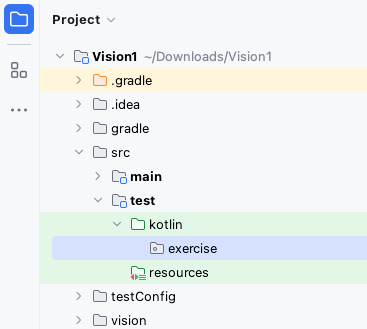
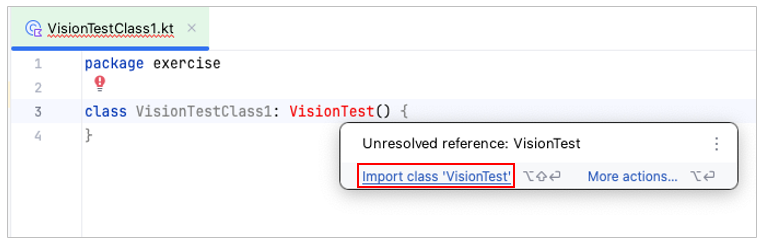
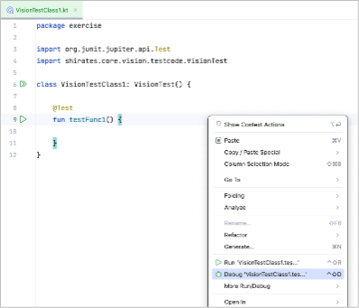
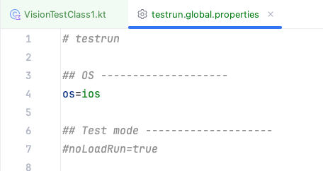

# Creating TestClass (Vision)

## UITest class

1. Create a package directory `src/test/kotlin/exercise`.

   <br><br>
   


2. Create a kotlin class file `VisionTestClass1`.

   

   

   


3. Type `" : VisionTest()"` after class name, move mouse cursor to it, then click `import` on context menu. <br>Shortcut
   is
   useful. (Mac: option+Enter, Windows: Alt+Enter)

   

```kotlin
package exercise

import shirates.core.vision.testcode.VisionTest

class VisionTestClass1: VisionTest() {

}
```

## @Test annotation

Create a function (`testFunc1`) and put `@Test` annotation of **JUnit 5** (**org.junit.jupiter.api.Test**).

```kotlin
package exercise

import org.junit.jupiter.api.Test
import shirates.core.vision.testcode.VisionTest

class VisionTestClass1: VisionTest() {

    @Test
    fun testFunc1() {

    }
}
```

## Running test (as Android)

Now you can run `testFunc1()`. Default os is Android.<br>
Right-click on `testFunc1()` and select `Debug`. <br>


Console output

```
lineNo	[elapsedTime]	logDateTime	{testCaseId}	macroDepth	macroName	[logType]	timeDiff	mode	(group)	message
1	[00:00:00]	2025/01/24 12:11:09.361	{}	0	-	[-]	+0	C	()	----------------------------------------------------------------------------------------------------
2	[00:00:00]	2025/01/24 12:11:09.378	{}	0	-	[-]	+17	C	()	///
3	[00:00:00]	2025/01/24 12:11:09.378	{}	0	-	[-]	+0	C	()	/// shirates-core 8.0.3
4	[00:00:00]	2025/01/24 12:11:09.378	{}	0	-	[-]	+0	C	()	///
5	[00:00:00]	2025/01/24 12:11:09.379	{}	0	-	[-]	+1	C	()	powered by Appium (io.appium:java-client:9.1.0)
6	[00:00:00]	2025/01/24 12:11:09.380	{}	0	-	[-]	+1	C	()	----------------------------------------------------------------------------------------------------
7	[00:00:00]	2025/01/24 12:11:09.380	{}	0	-	[-]	+0	C	()	testClass: exercise.VisionTestClass1
8	[00:00:00]	2025/01/24 12:11:09.380	{}	0	-	[-]	+0	C	()	sheetName: VisionTestClass1
9	[00:00:00]	2025/01/24 12:11:09.381	{}	0	-	[-]	+1	C	()	logLanguage: 
10	[00:00:00]	2025/01/24 12:11:09.390	{}	0	-	[info]	+9	C	()	
11	[00:00:00]	2025/01/24 12:11:09.391	{}	0	-	[info]	+1	C	()	----------------------------------------------------------------------------------------------------
12	[00:00:00]	2025/01/24 12:11:09.391	{}	0	-	[info]	+0	C	()	Test function: testFunc1 [testFunc1()]
13	[00:00:00]	2025/01/24 12:11:09.391	{}	0	-	[info]	+0	C	()	----------------------------------------------------------------------------------------------------
14	[00:00:00]	2025/01/24 12:11:10.086	{}	0	-	[info]	+695	C	()	Logging to file:////Users/wave1008/Downloads/TestResults/testConfig/2025-01-24_121109/VisionTestClass1/
15	[00:00:01]	2025/01/24 12:11:10.206	{}	0	-	[info]	+120	C	()	Loading config.(configFile=/Users/wave1008/Downloads/Vision1/testConfig/android/testConfig.json, profileName=Pixel 8(Android 14))
16	[00:00:01]	2025/01/24 12:11:10.267	{}	0	-	[info]	+61	C	()	screens directory not found. (/Users/wave1008/Downloads/Vision1/testConfig/android/screens)
17	[00:00:01]	2025/01/24 12:11:10.281	{}	0	-	[info]	+14	C	()	Scanning macro under '/Users/wave1008/Downloads/Vision1/src/test/kotlin'
Copying jar content createml/MLImageClassifier.swift to /Users/wave1008/Downloads/TestResults/testConfig/2025-01-24_121109/VisionTestClass1
Copying jar content createml/MLImageClassifier.swift to /Users/wave1008/Downloads/TestResults/testConfig/2025-01-24_121109/VisionTestClass1
18	[00:00:02]	2025/01/24 12:11:11.352	{}	0	-	[info]	+1071	C	()	Starting leaning. [CheckStateClassifier]
19	[00:00:05]	2025/01/24 12:11:14.166	{}	0	-	[info]	+2814	C	()	Learning completed. (in 2.807 sec)
["/Users/wave1008/Downloads/Vision1/build/vision/classifiers/CheckStateClassifier/MLImageClassifier.swift", "/Users/wave1008/Downloads/Vision1/build/vision/classifiers/CheckStateClassifier", "-noise", "-blur"]
----------------------------------
dataSourceName: CheckStateClassifier
dataSourcePath: file:///Users/wave1008/Downloads/Vision1/build/vision/classifiers/CheckStateClassifier/
options: ["-noise", "-blur"]
featureExtractor: Image Feature Print V2
----------------------------------
Number of examples: 16
Number of classes: 2
Accuracy: 100.00%

******CONFUSION MATRIX******
----------------------------------
True\Pred [OFF] [ON]  
[OFF]     8     0     
[ON]      0     8     

******PRECISION RECALL******
----------------------------------
Class Precision(%) Recall(%)
[OFF] 100.00          100.00         
[ON]  100.00          100.00         


Model saved to /Users/wave1008/Downloads/Vision1/build/vision/classifiers/CheckStateClassifier/CheckStateClassifier.mlmodel
20	[00:00:05]	2025/01/24 12:11:14.187	{}	0	-	[info]	+21	C	()	[learning [CheckStateClassifier]] in 2.835 sec
21	[00:00:05]	2025/01/24 12:11:14.188	{}	0	-	[info]	+1	C	()	Starting leaning. [DefaultClassifier]
22	[00:00:07]	2025/01/24 12:11:17.083	{}	0	-	[info]	+2895	C	()	Learning completed. (in 2.894 sec)
["/Users/wave1008/Downloads/Vision1/build/vision/classifiers/DefaultClassifier/MLImageClassifier.swift", "/Users/wave1008/Downloads/Vision1/build/vision/classifiers/DefaultClassifier", "-noise", "-blur"]
----------------------------------
dataSourceName: DefaultClassifier
dataSourcePath: file:///Users/wave1008/Downloads/Vision1/build/vision/classifiers/DefaultClassifier/
options: ["-noise", "-blur"]
featureExtractor: Image Feature Print V2
----------------------------------
Number of examples: 29
Number of classes: 28
Accuracy: 100.00%

******CONFUSION MATRIX******
**** (upperleft 20-by-20) ****
----------------------------------
True\Pred                                                                      @a[Android Files App][Images Button]                                           @a[Android Files App][This week Button]                                        @a[Android Settings App][Android Settings Top Screen][Apps Icon]               @a[Android Settings App][Android Settings Top Screen][Battery Icon]            @a[Android Settings App][Android Settings Top Screen][Connected devices Icon]  @a[Android Settings App][Android Settings Top Screen][Display Icon]            @a[Android Settings App][Android Settings Top Screen][Location Icon]           @a[Android Settings App][Android Settings Top Screen][Network & internet Icon] @a[Android Settings App][Android Settings Top Screen][Sound & vibration Icon]  @a[Android Settings App][Android Settings Top Screen][Storage Icon]            @a[Android Settings App][Android Settings Top Screen][System Icon]             @a[Android Settings App][Network & internet Screen][Airplane mode Icon]        @a[Android Settings App][Network & internet Screen][Calls & SMS Icon]          @a[Android Settings App][Network & internet Screen][Data Saver Icon]           @a[Android Settings App][Network & internet Screen][Hotspot & tethering Icon]  @a[Android Settings App][Network & internet Screen][Internet Icon]             @a[Android Settings App][Network & internet Screen][SIMs Icon]                 @a[Android Settings App][Network & internet Screen][VPN Icon]                  @amisc[RadioButton(OFF)]                                                       @amisc[RadioButton(ON)]                                                        
@a[Android Files App][Images Button]                                           1                                                                              0                                                                              0                                                                              0                                                                              0                                                                              0                                                                              0                                                                              0                                                                              0                                                                              0                                                                              0                                                                              0                                                                              0                                                                              0                                                                              0                                                                              0                                                                              0                                                                              0                                                                              0                                                                              0                                                                              
@a[Android Files App][This week Button]                                        0                                                                              1                                                                              0                                                                              0                                                                              0                                                                              0                                                                              0                                                                              0                                                                              0                                                                              0                                                                              0                                                                              0                                                                              0                                                                              0                                                                              0                                                                              0                                                                              0                                                                              0                                                                              0                                                                              0                                                                              
@a[Android Settings App][Android Settings Top Screen][Apps Icon]               0                                                                              0                                                                              1                                                                              0                                                                              0                                                                              0                                                                              0                                                                              0                                                                              0                                                                              0                                                                              0                                                                              0                                                                              0                                                                              0                                                                              0                                                                              0                                                                              0                                                                              0                                                                              0                                                                              0                                                                              
@a[Android Settings App][Android Settings Top Screen][Battery Icon]            0                                                                              0                                                                              0                                                                              1                                                                              0                                                                              0                                                                              0                                                                              0                                                                              0                                                                              0                                                                              0                                                                              0                                                                              0                                                                              0                                                                              0                                                                              0                                                                              0                                                                              0                                                                              0                                                                              0                                                                              
@a[Android Settings App][Android Settings Top Screen][Connected devices Icon]  0                                                                              0                                                                              0                                                                              0                                                                              1                                                                              0                                                                              0                                                                              0                                                                              0                                                                              0                                                                              0                                                                              0                                                                              0                                                                              0                                                                              0                                                                              0                                                                              0                                                                              0                                                                              0                                                                              0                                                                              
@a[Android Settings App][Android Settings Top Screen][Display Icon]            0                                                                              0                                                                              0                                                                              0                                                                              0                                                                              1                                                                              0                                                                              0                                                                              0                                                                              0                                                                              0                                                                              0                                                                              0                                                                              0                                                                              0                                                                              0                                                                              0                                                                              0                                                                              0                                                                              0                                                                              
@a[Android Settings App][Android Settings Top Screen][Location Icon]           0                                                                              0                                                                              0                                                                              0                                                                              0                                                                              0                                                                              1                                                                              0                                                                              0                                                                              0                                                                              0                                                                              0                                                                              0                                                                              0                                                                              0                                                                              0                                                                              0                                                                              0                                                                              0                                                                              0                                                                              
@a[Android Settings App][Android Settings Top Screen][Network & internet Icon] 0                                                                              0                                                                              0                                                                              0                                                                              0                                                                              0                                                                              0                                                                              1                                                                              0                                                                              0                                                                              0                                                                              0                                                                              0                                                                              0                                                                              0                                                                              0                                                                              0                                                                              0                                                                              0                                                                              0                                                                              
@a[Android Settings App][Android Settings Top Screen][Sound & vibration Icon]  0                                                                              0                                                                              0                                                                              0                                                                              0                                                                              0                                                                              0                                                                              0                                                                              1                                                                              0                                                                              0                                                                              0                                                                              0                                                                              0                                                                              0                                                                              0                                                                              0                                                                              0                                                                              0                                                                              0                                                                              
@a[Android Settings App][Android Settings Top Screen][Storage Icon]            0                                                                              0                                                                              0                                                                              0                                                                              0                                                                              0                                                                              0                                                                              0                                                                              0                                                                              1                                                                              0                                                                              0                                                                              0                                                                              0                                                                              0                                                                              0                                                                              0                                                                              0                                                                              0                                                                              0                                                                              
@a[Android Settings App][Android Settings Top Screen][System Icon]             0                                                                              0                                                                              0                                                                              0                                                                              0                                                                              0                                                                              0                                                                              0                                                                              0                                                                              0                                                                              1                                                                              0                                                                              0                                                                              0                                                                              0                                                                              0                                                                              0                                                                              0                                                                              0                                                                              0                                                                              
@a[Android Settings App][Network & internet Screen][Airplane mode Icon]        0                                                                              0                                                                              0                                                                              0                                                                              0                                                                              0                                                                              0                                                                              0                                                                              0                                                                              0                                                                              0                                                                              1                                                                              0                                                                              0                                                                              0                                                                              0                                                                              0                                                                              0                                                                              0                                                                              0                                                                              
@a[Android Settings App][Network & internet Screen][Calls & SMS Icon]          0                                                                              0                                                                              0                                                                              0                                                                              0                                                                              0                                                                              0                                                                              0                                                                              0                                                                              0                                                                              0                                                                              0                                                                              1                                                                              0                                                                              0                                                                              0                                                                              0                                                                              0                                                                              0                                                                              0                                                                              
@a[Android Settings App][Network & internet Screen][Data Saver Icon]           0                                                                              0                                                                              0                                                                              0                                                                              0                                                                              0                                                                              0                                                                              0                                                                              0                                                                              0                                                                              0                                                                              0                                                                              0                                                                              1                                                                              0                                                                              0                                                                              0                                                                              0                                                                              0                                                                              0                                                                              
@a[Android Settings App][Network & internet Screen][Hotspot & tethering Icon]  0                                                                              0                                                                              0                                                                              0                                                                              0                                                                              0                                                                              0                                                                              0                                                                              0                                                                              0                                                                              0                                                                              0                                                                              0                                                                              0                                                                              1                                                                              0                                                                              0                                                                              0                                                                              0                                                                              0                                                                              
@a[Android Settings App][Network & internet Screen][Internet Icon]             0                                                                              0                                                                              0                                                                              0                                                                              0                                                                              0                                                                              0                                                                              0                                                                              0                                                                              0                                                                              0                                                                              0                                                                              0                                                                              0                                                                              0                                                                              1                                                                              0                                                                              0                                                                              0                                                                              0                                                                              
@a[Android Settings App][Network & internet Screen][SIMs Icon]                 0                                                                              0                                                                              0                                                                              0                                                                              0                                                                              0                                                                              0                                                                              0                                                                              0                                                                              0                                                                              0                                                                              0                                                                              0                                                                              0                                                                              0                                                                              0                                                                              1                                                                              0                                                                              0                                                                              0                                                                              
@a[Android Settings App][Network & internet Screen][VPN Icon]                  0                                                                              0                                                                              0                                                                              0                                                                              0                                                                              0                                                                              0                                                                              0                                                                              0                                                                              0                                                                              0                                                                              0                                                                              0                                                                              0                                                                              0                                                                              0                                                                              0                                                                              1                                                                              0                                                                              0                                                                              
@amisc[RadioButton(OFF)]                                                       0                                                                              0                                                                              0                                                                              0                                                                              0                                                                              0                                                                              0                                                                              0                                                                              0                                                                              0                                                                              0                                                                              0                                                                              0                                                                              0                                                                              0                                                                              0                                                                              0                                                                              0                                                                              1                                                                              0                                                                              
@amisc[RadioButton(ON)]                                                        0                                                                              0                                                                              0                                                                              0                                                                              0                                                                              0                                                                              0                                                                              0                                                                              0                                                                              0                                                                              0                                                                              0                                                                              0                                                                              0                                                                              0                                                                              0                                                                              0                                                                              0                                                                              0                                                                              1                                                                              

******PRECISION RECALL******
----------------------------------
Class                                                                          Precision(%) Recall(%)
@a[Android Files App][Images Button]                                           100.00          100.00         
@a[Android Files App][This week Button]                                        100.00          100.00         
@a[Android Settings App][Android Settings Top Screen][Apps Icon]               100.00          100.00         
@a[Android Settings App][Android Settings Top Screen][Battery Icon]            100.00          100.00         
@a[Android Settings App][Android Settings Top Screen][Connected devices Icon]  100.00          100.00         
@a[Android Settings App][Android Settings Top Screen][Display Icon]            100.00          100.00         
@a[Android Settings App][Android Settings Top Screen][Location Icon]           100.00          100.00         
@a[Android Settings App][Android Settings Top Screen][Network & internet Icon] 100.00          100.00         
@a[Android Settings App][Android Settings Top Screen][Sound & vibration Icon]  100.00          100.00         
@a[Android Settings App][Android Settings Top Screen][Storage Icon]            100.00          100.00         
@a[Android Settings App][Android Settings Top Screen][System Icon]             100.00          100.00         
@a[Android Settings App][Network & internet Screen][Airplane mode Icon]        100.00          100.00         
@a[Android Settings App][Network & internet Screen][Calls & SMS Icon]          100.00          100.00         
@a[Android Settings App][Network & internet Screen][Data Saver Icon]           100.00          100.00         
@a[Android Settings App][Network & internet Screen][Hotspot & tethering Icon]  100.00          100.00         
@a[Android Settings App][Network & internet Screen][Internet Icon]             100.00          100.00         
@a[Android Settings App][Network & internet Screen][SIMs Icon]                 100.00          100.00         
@a[Android Settings App][Network & internet Screen][VPN Icon]                  100.00          100.00         
@amisc[RadioButton(OFF)]                                                       100.00          100.00         
@amisc[RadioButton(ON)]                                                        100.00          100.00         
@amisc[←]                                                                      100.00          100.00         
@i[iOS Settings App][Accessibility Icon]                                       100.00          100.00         
@i[iOS Settings App][Action Button Icon]                                       100.00          100.00         
@i[iOS Settings App][Apple Intelligence & Siri Icon]                           100.00          100.00         
@i[iOS Settings App][Camera Icon]                                              100.00          100.00         
@i[iOS Settings App][Developer Icon]                                           100.00          100.00         
@i[iOS Settings App][General Icon]                                             100.00          100.00         
@i[iOS Settings App][Screen Time Icon]                                         100.00          100.00         


Model saved to /Users/wave1008/Downloads/Vision1/build/vision/classifiers/DefaultClassifier/DefaultClassifier.mlmodel
23	[00:00:07]	2025/01/24 12:11:17.096	{}	0	-	[info]	+13	C	()	[learning [DefaultClassifier]] in 2.908 sec
24	[00:00:07]	2025/01/24 12:11:17.153	{}	0	-	[info]	+57	C	()	Classifier files loaded.(CheckStateClassifier, 2 labels, directory=/Users/wave1008/Downloads/Vision1/build/vision/classifiers/CheckStateClassifier)
25	[00:00:07]	2025/01/24 12:11:17.160	{}	0	-	[info]	+7	C	()	Classifier files loaded.(DefaultClassifier, 28 labels, directory=/Users/wave1008/Downloads/Vision1/build/vision/classifiers/DefaultClassifier)
26	[00:00:08]	2025/01/24 12:11:17.191	{}	0	-	[info]	+31	C	()	Initializing TestDriver.(profileName=Pixel 8(Android 14))
27	[00:00:08]	2025/01/24 12:11:17.191	{}	0	-	[info]	+0	C	()	noLoadRun: false
28	[00:00:08]	2025/01/24 12:11:17.192	{}	0	-	[info]	+1	C	()	boundsToRectRatio: 1
29	[00:00:08]	2025/01/24 12:11:17.192	{}	0	-	[info]	+0	C	()	reuseDriver: true
30	[00:00:08]	2025/01/24 12:11:17.193	{}	0	-	[info]	+1	C	()	autoScreenshot: true
31	[00:00:08]	2025/01/24 12:11:17.193	{}	0	-	[info]	+0	C	()	onChangedOnly: true
32	[00:00:08]	2025/01/24 12:11:17.194	{}	0	-	[info]	+1	C	()	onCondition: true
33	[00:00:08]	2025/01/24 12:11:17.195	{}	0	-	[info]	+1	C	()	onAction: true
34	[00:00:08]	2025/01/24 12:11:17.196	{}	0	-	[info]	+1	C	()	onExpectation: true
35	[00:00:08]	2025/01/24 12:11:17.197	{}	0	-	[info]	+1	C	()	onExecOperateCommand: true
36	[00:00:08]	2025/01/24 12:11:17.197	{}	0	-	[info]	+0	C	()	onCheckCommand: true
37	[00:00:08]	2025/01/24 12:11:17.198	{}	0	-	[info]	+1	C	()	onScrolling: true
38	[00:00:08]	2025/01/24 12:11:17.199	{}	0	-	[info]	+1	C	()	manualScreenshot: true
39	[00:00:08]	2025/01/24 12:11:17.200	{}	0	-	[info]	+1	C	()	retryMaxCount: 2
40	[00:00:08]	2025/01/24 12:11:17.200	{}	0	-	[info]	+0	C	()	retryIntervalSeconds: 2.0
41	[00:00:08]	2025/01/24 12:11:17.206	{}	0	-	[info]	+6	C	()	shortWaitSeconds: 1.5
42	[00:00:08]	2025/01/24 12:11:17.206	{}	0	-	[info]	+0	C	()	waitSecondsOnIsScreen: 15.0
43	[00:00:08]	2025/01/24 12:11:17.207	{}	0	-	[info]	+1	C	()	waitSecondsForLaunchAppComplete: 15.0
44	[00:00:08]	2025/01/24 12:11:17.207	{}	0	-	[info]	+0	C	()	waitSecondsForAnimationComplete: 0.5
45	[00:00:08]	2025/01/24 12:11:17.207	{}	0	-	[info]	+0	C	()	waitSecondsForConnectionEnabled: 8.0
46	[00:00:08]	2025/01/24 12:11:17.208	{}	0	-	[info]	+1	C	()	swipeDurationSeconds: 3.0
47	[00:00:08]	2025/01/24 12:11:17.208	{}	0	-	[info]	+0	C	()	flickDurationSeconds: 0.3
48	[00:00:08]	2025/01/24 12:11:17.209	{}	0	-	[info]	+1	C	()	swipeMarginRatio: 0.0
49	[00:00:08]	2025/01/24 12:11:17.209	{}	0	-	[info]	+0	C	()	scrollVerticalStartMarginRatio: 0.15
50	[00:00:08]	2025/01/24 12:11:17.210	{}	0	-	[info]	+1	C	()	scrollVerticalEndMarginRatio: 0.1
51	[00:00:08]	2025/01/24 12:11:17.210	{}	0	-	[info]	+0	C	()	scrollHorizontalStartMarginRatio: 0.2
52	[00:00:08]	2025/01/24 12:11:17.210	{}	0	-	[info]	+0	C	()	scrollHorizontalEndMarginRatio: 0.1
53	[00:00:08]	2025/01/24 12:11:17.213	{}	0	-	[info]	+3	C	()	tapHoldSeconds: 0.0
54	[00:00:08]	2025/01/24 12:11:17.213	{}	0	-	[info]	+0	C	()	tapAppIconMethod: auto
55	[00:00:08]	2025/01/24 12:11:17.223	{}	0	-	[info]	+10	C	()	tapAppIconMacro: 
56	[00:00:08]	2025/01/24 12:11:17.223	{}	0	-	[info]	+0	C	()	enableCache: true
57	[00:00:08]	2025/01/24 12:11:17.224	{}	0	-	[info]	+1	C	()	syncWaitSeconds: 1.8
58	[00:00:08]	2025/01/24 12:11:17.751	{}	0	-	[info]	+527	C	()	Running device found. (udid=emulator-5556, avd=Pixel_8_Android_14_)
59	[00:00:08]	2025/01/24 12:11:17.753	{}	0	-	[info]	+2	C	()	Connected device found. (Pixel_8_Android_14_:5556, Android 14, emulator-5556)
60	[00:00:08]	2025/01/24 12:11:17.889	{}	0	-	[info]	+136	C	()	Terminating Appium Server. (pid=65075, port=4720)
61	[00:00:08]	2025/01/24 12:11:17.917	{}	0	-	[info]	+28	C	()	Starting Appium Server.
62	[00:00:08]	2025/01/24 12:11:17.918	{}	0	-	[info]	+1	C	()	appium --session-override --relaxed-security --log /Users/wave1008/Downloads/TestResults/testConfig/2025-01-24_121109/VisionTestClass1/appium_2025-01-24_121117754.log --port 4720
63	[00:00:17]	2025/01/24 12:11:26.998	{}	0	-	[info]	+9080	C	()	Appium Server started. (pid=68341, port=4720)
64	[00:00:18]	2025/01/24 12:11:28.028	{}	0	-	[info]	+1030	C	()	Connecting to Appium Server.(http://127.0.0.1:4720/)
65	[00:00:23]	2025/01/24 12:11:33.085	{}	0	-	[info]	+5057	C	()	implicitlyWaitSeconds: 5.0
66	[00:00:24]	2025/01/24 12:11:33.288	{}	0	-	[info]	+203	C	()	(settings) always_finish_activities: 0
67	[00:00:24]	2025/01/24 12:11:33.354	{}	0	-	[info]	+66	C	(syncCache)	Syncing (1)
68	[00:00:25]	2025/01/24 12:11:34.183	{}	0	-	[info]	+829	C	(syncCache)	imageProfile: @a_1080x2268
69	[00:00:25]	2025/01/24 12:11:34.189	{}	0	-	[info]	+6	C	(syncCache)	Synced. (elapsed=0.834)
70	[00:00:25]	2025/01/24 12:11:34.190	{}	0	-	[info]	+1	C	()	[syncCache] in 0.839 sec
71	[00:00:25]	2025/01/24 12:11:34.970	{}	0	-	[info]	+780	C	()	Syncing screen.
72	[00:00:26]	2025/01/24 12:11:35.174	{}	0	-	[info]	+204	C	()	[syncScreenshot] in 0.478 sec
73	[00:00:26]	2025/01/24 12:11:35.294	{}	0	-	[screenshot]	+120	C	()	screenshot: 73.png
74	[00:00:26]	2025/01/24 12:11:35.414	{}	0	-	[info]	+120	C	()	AppiumDriver initialized.
75	[00:00:26]	2025/01/24 12:11:35.415	{}	0	-	[-]	+1	C	()	testrun: testConfig/testrun.properties
76	[00:00:26]	2025/01/24 12:11:35.415	{}	0	-	[-]	+0	C	()	testConfigName: testConfig(/Users/wave1008/Downloads/Vision1/testConfig/android/testConfig.json)
77	[00:00:26]	2025/01/24 12:11:35.416	{}	0	-	[-]	+1	C	()	profileName: Pixel 8(Android 14)
78	[00:00:26]	2025/01/24 12:11:35.417	{}	0	-	[-]	+1	C	()	appIconName: Settings
79	[00:00:26]	2025/01/24 12:11:35.418	{}	0	-	[-]	+1	C	()	(capabilities)
80	[00:00:26]	2025/01/24 12:11:35.418	{}	0	-	[-]	+0	C	()	appium:newCommandTimeout: 300
81	[00:00:26]	2025/01/24 12:11:35.419	{}	0	-	[-]	+1	C	()	appium:takesScreenshot: true
82	[00:00:26]	2025/01/24 12:11:35.419	{}	0	-	[-]	+0	C	()	appium:warnings: {}
83	[00:00:26]	2025/01/24 12:11:35.420	{}	0	-	[-]	+1	C	()	appium:deviceApiLevel: 34
84	[00:00:26]	2025/01/24 12:11:35.420	{}	0	-	[-]	+0	C	()	appium:automationName: UiAutomator2
85	[00:00:26]	2025/01/24 12:11:35.421	{}	0	-	[-]	+1	C	()	appium:locationContextEnabled: false
86	[00:00:26]	2025/01/24 12:11:35.421	{}	0	-	[-]	+0	C	()	appium:deviceScreenSize: 1080x2400
87	[00:00:26]	2025/01/24 12:11:35.421	{}	0	-	[-]	+0	C	()	appium:deviceManufacturer: Google
88	[00:00:26]	2025/01/24 12:11:35.422	{}	0	-	[-]	+1	C	()	appium:enforceXPath1: true
89	[00:00:26]	2025/01/24 12:11:35.422	{}	0	-	[-]	+0	C	()	appium:udid: emulator-5556
90	[00:00:26]	2025/01/24 12:11:35.423	{}	0	-	[-]	+1	C	()	appium:pixelRatio: 2.625
91	[00:00:26]	2025/01/24 12:11:35.423	{}	0	-	[-]	+0	C	()	platformName: ANDROID
92	[00:00:26]	2025/01/24 12:11:35.424	{}	0	-	[-]	+1	C	()	appium:networkConnectionEnabled: true
93	[00:00:26]	2025/01/24 12:11:35.428	{}	0	-	[-]	+4	C	()	appium:locale: US
94	[00:00:26]	2025/01/24 12:11:35.428	{}	0	-	[-]	+0	C	()	appium:deviceScreenDensity: 420
95	[00:00:26]	2025/01/24 12:11:35.429	{}	0	-	[-]	+1	C	()	appium:viewportRect: {left=0, top=132, width=1080, height=2268}
96	[00:00:26]	2025/01/24 12:11:35.429	{}	0	-	[-]	+0	C	()	appium:language: en
97	[00:00:26]	2025/01/24 12:11:35.429	{}	0	-	[-]	+0	C	()	appium:avd: Pixel_8_Android_14_
98	[00:00:26]	2025/01/24 12:11:35.430	{}	0	-	[-]	+1	C	()	appium:deviceModel: sdk_gphone64_arm64
99	[00:00:26]	2025/01/24 12:11:35.430	{}	0	-	[-]	+0	C	()	appium:platformVersion: 14
100	[00:00:26]	2025/01/24 12:11:35.431	{}	0	-	[-]	+1	C	()	appium:databaseEnabled: false
101	[00:00:26]	2025/01/24 12:11:35.431	{}	0	-	[-]	+0	C	()	appium:deviceUDID: emulator-5556
102	[00:00:26]	2025/01/24 12:11:35.431	{}	0	-	[-]	+0	C	()	appium:statBarHeight: 132
103	[00:00:26]	2025/01/24 12:11:35.432	{}	0	-	[-]	+1	C	()	appium:webStorageEnabled: false
104	[00:00:26]	2025/01/24 12:11:35.432	{}	0	-	[-]	+0	C	()	appium:appActivity: com.android.settings.Settings
105	[00:00:26]	2025/01/24 12:11:35.432	{}	0	-	[-]	+0	C	()	appium:deviceName: emulator-5556
106	[00:00:26]	2025/01/24 12:11:35.433	{}	0	-	[-]	+1	C	()	appium:javascriptEnabled: true
107	[00:00:26]	2025/01/24 12:11:35.438	{}	0	-	[-]	+5	C	()	appium:appPackage: com.android.settings
108	[00:00:26]	2025/01/24 12:11:35.439	{}	0	-	[-]	+1	C	()	settings
109	[00:00:26]	2025/01/24 12:11:35.533	{}	0	-	[-]	+94	C	()	always_finish_activities: 0
110	[00:00:26]	2025/01/24 12:11:35.534	{}	0	-	[-]	+1	C	()	(others)
111	[00:00:26]	2025/01/24 12:11:35.534	{}	0	-	[-]	+0	C	()	isEmulator: true
112	[00:00:26]	2025/01/24 12:11:35.535	{}	0	-	[-]	+1	C	()	hasOsaifuKeitai: false
113	[00:00:27]	2025/01/24 12:11:36.439	{}	0	-	[info]	+904	C	()	[ImageFeaturePrintConfigurator/setupImageFeaturePrintConfig] in 0.903 sec
114	[00:00:27]	2025/01/24 12:11:36.441	{}	0	-	[info]	+2	C	()	disableCache
115	[00:00:27]	2025/01/24 12:11:37.156	{}	0	-	[info]	+715	!	()	Syncing screen.
116	[00:00:28]	2025/01/24 12:11:37.341	{}	0	-	[info]	+185	!	()	[syncScreenshot] in 0.393 sec
117	[00:00:28]	2025/01/24 12:11:37.429	{}	0	-	[screenshot]	+88	!	()	screenshot: 117.png
118	[00:00:28]	2025/01/24 12:11:37.430	{}	0	-	[info]	+1	!	()	Setup executed. (duration: 28.0 sec)
119	[00:00:28]	2025/01/24 12:11:37.438	{}	0	-	[info]	+8	C	()	Test function executed. (duration: 28.1 sec)
120	[00:00:28]	2025/01/24 12:11:37.439	{}	0	-	[info]	+1	C	()	End of Test function: testFunc1 [testFunc1()]
121	[00:00:28]	2025/01/24 12:11:37.439	{}	0	-	[WARN]	+0	C	()	scenario not implemented.

org.opentest4j.TestAbortedException: scenario not implemented.


	at shirates.core.testcode.UITestCallbackExtension.afterEach(UITestCallbackExtension.kt:351)
	at java.base/java.util.ArrayList.forEach(ArrayList.java:1511)
	at java.base/java.util.ArrayList.forEach(ArrayList.java:1511)

122	[00:00:29]	2025/01/24 12:11:38.450	{}	0	-	[info]	+1011	C	()	Logging to file:////Users/wave1008/Downloads/TestResults/testConfig/2025-01-24_121109/VisionTestClass1/
Copying jar content _ReportScript.js to /Users/wave1008/Downloads/TestResults/testConfig/2025-01-24_121109/VisionTestClass1
Copying jar content _ReportStyle.css to /Users/wave1008/Downloads/TestResults/testConfig/2025-01-24_121109/VisionTestClass1
No scenario found. Outputting Spec-Report skipped.
123	[00:00:29]	2025/01/24 12:11:38.773	{}	0	-	[info]	+323	C	()	Quitting TestDriver.
124	[00:00:29]	2025/01/24 12:11:38.952	{}	0	-	[info]	+179	C	()	Test class executed. (duration: 29.8 sec)
```

## Running test (as iOS)

1. Open `testrun.global.properties`.
2. Set `os=ios`. <br> 
3. Right-click on `testFunc1()` and select `Debug`.

Console output

```
...
54	[00:00:07]	2025/01/24 13:31:25.678	{}	0	-	[info]	+29	C	()	Starting Appium Server.
55	[00:00:07]	2025/01/24 13:31:25.679	{}	0	-	[info]	+1	C	()	appium --session-override --relaxed-security --log /Users/wave1008/Downloads/TestResults/testConfig/2025-01-24_133117/VisionTestClass1/appium_2025-01-24_133125523.log --port 4720
56	[00:00:15]	2025/01/24 13:31:33.504	{}	0	-	[info]	+7825	C	()	Appium Server started. (pid=73432, port=4720)
57	[00:00:16]	2025/01/24 13:31:34.510	{}	0	-	[info]	+1006	C	()	Optimizing installing WebDriverAgent.
58	[00:00:16]	2025/01/24 13:31:34.616	{}	0	-	[info]	+106	C	()	WebDriverAgentRunner-Runner.app not found. Optimization skipped.
59	[00:00:16]	2025/01/24 13:31:34.619	{}	0	-	[info]	+3	C	()	Connecting to Appium Server.(http://127.0.0.1:4720/)
60	[00:00:16]	2025/01/24 13:31:34.626	{}	0	-	[info]	+7	C	()	Note: Initializing IOSDriver may take a few minutes to build and install WebDriverAgent.
...
```

If you encounter another error see [Error messages](../../troubleshooting/error_warning_messages.md).

## @Order annotation

You can use **@Order** annotation of JUnit 5 to indicate execution order you want.

## @DisplayName annotation

You can use **@DisplayName** annotation of JUnit 5 to describe test scenario.

### Example

```kotlin
package exercise

import org.junit.jupiter.api.DisplayName
import org.junit.jupiter.api.Order
import org.junit.jupiter.api.Test
import shirates.core.vision.testcode.VisionTest

class VisionTestClass1 : VisionTest() {

    @Order(1)
    @DisplayName("Test scenario C")
    @Test
    fun testScenarioC() {

    }

    @Order(2)
    @DisplayName("Test scenario B")
    @Test
    fun testScenarioB() {

    }

    @Order(3)
    @DisplayName("Test scenario A")
    @Test
    fun testScenarioA() {

    }
}
```


## @Nested support?

No. **Do not** use `@Nested annotation` of JUnit 5. This limitation is of software design of shirates-core.

### Link

- [index](../../../index.md)

