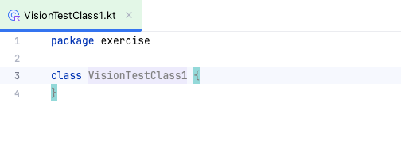

# テストクラスを作成する (Vision)

## VisionTest class

1. `src/test/kotlin/exercise`にパッケージディレクトリを作成します。

   <br><br>
   


2. kotlinのクラスファイルとして`VisionTestClass1`を作成します。

   

   

   


3. クラス名の後で`" : VisionTest()"`とタイプし、 マウスカーソルをその上に移動し、コンテキストメニューの`import`
   を選択します。 <br>
   ショートカット(option+Enter)を使用すると便利です。

   

```kotlin
package exercise

import shirates.core.vision.testcode.VisionTest

class VisionTestClass1: VisionTest() {
}
```

## @Testアノテーション

`testFunc1`という名前で関数を作成し **JUnit 5** (**org.junit.jupiter.api.Test**)の`@Test`アノテーションを付与します。

```kotlin
package exercise

import org.junit.jupiter.api.Test
import shirates.core.vision.testcode.VisionTest

class VisionTestClass1: VisionTest() {

    @Test
    fun testFunc1() {

    }
}
```

## Running test (as Android)

これで `testFunc1()` を実行できるようになりました。デフォルトのOSはAndroidです。<br>
`testFunc1()` を右クリックして`Debug`を選択します。 <br>


以下のようなエラーが出力された場合はVision-Serverが起動していません。

```
Could not connect to vision-server.
shirates.core.exception.TestEnvironmentException: Could not connect to vision-server.
```

この場合、[クイックスタート](../../../quick-start_ja.md)
の**shirates-vision-server のセットアップ**を参照してサーバーを起動してください。

正常に起動した場合はコンソールに以下のように出力されます。

#### コンソール出力

```
lineNo	[elapsedTime]	logDateTime	{testCaseId}	macroDepth	macroName	[logType]	timeDiff	mode	(group)	message
1	[00:00:00]	2025/02/03 02:35:31.055	{}	0	-	[-]	+0	C	()	----------------------------------------------------------------------------------------------------
2	[00:00:00]	2025/02/03 02:35:31.072	{}	0	-	[-]	+17	C	()	///
3	[00:00:00]	2025/02/03 02:35:31.072	{}	0	-	[-]	+0	C	()	/// shirates-core 8.0.6
4	[00:00:00]	2025/02/03 02:35:31.073	{}	0	-	[-]	+1	C	()	///
5	[00:00:00]	2025/02/03 02:35:31.074	{}	0	-	[-]	+1	C	()	powered by Appium (io.appium:java-client:9.4.0)
6	[00:00:00]	2025/02/03 02:35:31.074	{}	0	-	[-]	+0	C	()	----------------------------------------------------------------------------------------------------
7	[00:00:00]	2025/02/03 02:35:31.074	{}	0	-	[-]	+0	C	()	testClass: exercise.VisionTestClass1
8	[00:00:00]	2025/02/03 02:35:31.074	{}	0	-	[-]	+0	C	()	sheetName: VisionTestClass1
9	[00:00:00]	2025/02/03 02:35:31.075	{}	0	-	[-]	+1	C	()	logLanguage: 
10	[00:00:00]	2025/02/03 02:35:31.086	{}	0	-	[info]	+11	C	()	
11	[00:00:00]	2025/02/03 02:35:31.087	{}	0	-	[info]	+1	C	()	----------------------------------------------------------------------------------------------------
12	[00:00:00]	2025/02/03 02:35:31.087	{}	0	-	[info]	+0	C	()	Test function: testFunc1 [testFunc1()]
13	[00:00:00]	2025/02/03 02:35:31.088	{}	0	-	[info]	+1	C	()	----------------------------------------------------------------------------------------------------
14	[00:00:00]	2025/02/03 02:35:31.689	{}	0	-	[info]	+601	C	()	Initializing with testrun file.(testrun.global.properties)
15	[00:00:00]	2025/02/03 02:35:31.694	{}	0	-	[info]	+5	C	()	Logging to file:////Users/wave1008/Downloads/TestResults/testConfig@a/2025-02-03_023530/VisionTestClass1/
16	[00:00:00]	2025/02/03 02:35:31.793	{}	0	-	[info]	+99	C	()	Loading config.(configFile=/Users/wave1008/Downloads/Vision1/testConfig/android/testConfig@a.json, profileName=Pixel 8(Android 14))
17	[00:00:00]	2025/02/03 02:35:31.833	{}	0	-	[info]	+40	C	()	Scanning macro under '/Users/wave1008/Downloads/Vision1/src/test/kotlin'
Copying jar content createml/MLImageClassifier.swift to /Users/wave1008/Downloads/TestResults/testConfig@a/2025-02-03_023530/VisionTestClass1
Copying jar content createml/MLImageClassifier.swift to /Users/wave1008/Downloads/TestResults/testConfig@a/2025-02-03_023530/VisionTestClass1
18	[00:00:01]	2025/02/03 02:35:32.729	{}	0	-	[info]	+896	C	()	Starting leaning. [CheckStateClassifier]
19	[00:00:04]	2025/02/03 02:35:35.162	{}	0	-	[info]	+2433	C	()	Learning completed. (in 2.428 sec)
["/Users/wave1008/Downloads/Vision1/build/vision/classifiers/CheckStateClassifier/MLImageClassifier.swift", "/Users/wave1008/Downloads/Vision1/build/vision/classifiers/CheckStateClassifier", "-noise", "-blur"]
----------------------------------
dataSourceName: CheckStateClassifier
dataSourcePath: file:///Users/wave1008/Downloads/Vision1/build/vision/classifiers/CheckStateClassifier/
options: ["-noise", "-blur"]
featureExtractor: Image Feature Print V2
----------------------------------
Number of examples: 16
Number of classes: 2
Accuracy: 100.00%

******CONFUSION MATRIX******
----------------------------------
True\Pred [OFF] [ON]  
[OFF]     8     0     
[ON]      0     8     

******PRECISION RECALL******
----------------------------------
Class Precision(%) Recall(%)
[OFF] 100.00          100.00         
[ON]  100.00          100.00         


Model saved to /Users/wave1008/Downloads/Vision1/build/vision/classifiers/CheckStateClassifier/CheckStateClassifier.mlmodel
20	[00:00:04]	2025/02/03 02:35:35.179	{}	0	-	[info]	+17	C	()	[learning [CheckStateClassifier]] in 2.449 sec
21	[00:00:04]	2025/02/03 02:35:35.180	{}	0	-	[info]	+1	C	()	Starting leaning. [DefaultClassifier]
22	[00:00:08]	2025/02/03 02:35:38.939	{}	0	-	[info]	+3759	C	()	Learning completed. (in 3.758 sec)
["/Users/wave1008/Downloads/Vision1/build/vision/classifiers/DefaultClassifier/MLImageClassifier.swift", "/Users/wave1008/Downloads/Vision1/build/vision/classifiers/DefaultClassifier", "-noise", "-blur"]
----------------------------------
dataSourceName: DefaultClassifier
dataSourcePath: file:///Users/wave1008/Downloads/Vision1/build/vision/classifiers/DefaultClassifier/
options: ["-noise", "-blur"]
featureExtractor: Image Feature Print V2
----------------------------------
Number of examples: 33
Number of classes: 32
Accuracy: 100.00%

******CONFUSION MATRIX******
**** (upperleft 20-by-20) ****
----------------------------------
True\Pred                                                                      @a[Android Files App][Audio Button]                                            @a[Android Files App][Documents Button]                                        @a[Android Files App][Images Button]                                           @a[Android Files App][Large files Button]                                      @a[Android Files App][This week Button]                                        @a[Android Files App][Videos Button]                                           @a[Android Settings App][Android Settings Top Screen][Apps Icon]               @a[Android Settings App][Android Settings Top Screen][Battery Icon]            @a[Android Settings App][Android Settings Top Screen][Connected devices Icon]  @a[Android Settings App][Android Settings Top Screen][Display Icon]            @a[Android Settings App][Android Settings Top Screen][Location Icon]           @a[Android Settings App][Android Settings Top Screen][Network & internet Icon] @a[Android Settings App][Android Settings Top Screen][Sound & vibration Icon]  @a[Android Settings App][Android Settings Top Screen][Storage Icon]            @a[Android Settings App][Android Settings Top Screen][System Icon]             @a[Android Settings App][Network & internet Screen][Airplane mode Icon]        @a[Android Settings App][Network & internet Screen][Calls & SMS Icon]          @a[Android Settings App][Network & internet Screen][Data Saver Icon]           @a[Android Settings App][Network & internet Screen][Hotspot & tethering Icon]  @a[Android Settings App][Network & internet Screen][Internet Icon]             
@a[Android Files App][Audio Button]                                            1                                                                              0                                                                              0                                                                              0                                                                              0                                                                              0                                                                              0                                                                              0                                                                              0                                                                              0                                                                              0                                                                              0                                                                              0                                                                              0                                                                              0                                                                              0                                                                              0                                                                              0                                                                              0                                                                              0                                                                              
@a[Android Files App][Documents Button]                                        0                                                                              1                                                                              0                                                                              0                                                                              0                                                                              0                                                                              0                                                                              0                                                                              0                                                                              0                                                                              0                                                                              0                                                                              0                                                                              0                                                                              0                                                                              0                                                                              0                                                                              0                                                                              0                                                                              0                                                                              
@a[Android Files App][Images Button]                                           0                                                                              0                                                                              1                                                                              0                                                                              0                                                                              0                                                                              0                                                                              0                                                                              0                                                                              0                                                                              0                                                                              0                                                                              0                                                                              0                                                                              0                                                                              0                                                                              0                                                                              0                                                                              0                                                                              0                                                                              
@a[Android Files App][Large files Button]                                      0                                                                              0                                                                              0                                                                              1                                                                              0                                                                              0                                                                              0                                                                              0                                                                              0                                                                              0                                                                              0                                                                              0                                                                              0                                                                              0                                                                              0                                                                              0                                                                              0                                                                              0                                                                              0                                                                              0                                                                              
@a[Android Files App][This week Button]                                        0                                                                              0                                                                              0                                                                              0                                                                              1                                                                              0                                                                              0                                                                              0                                                                              0                                                                              0                                                                              0                                                                              0                                                                              0                                                                              0                                                                              0                                                                              0                                                                              0                                                                              0                                                                              0                                                                              0                                                                              
@a[Android Files App][Videos Button]                                           0                                                                              0                                                                              0                                                                              0                                                                              0                                                                              1                                                                              0                                                                              0                                                                              0                                                                              0                                                                              0                                                                              0                                                                              0                                                                              0                                                                              0                                                                              0                                                                              0                                                                              0                                                                              0                                                                              0                                                                              
@a[Android Settings App][Android Settings Top Screen][Apps Icon]               0                                                                              0                                                                              0                                                                              0                                                                              0                                                                              0                                                                              1                                                                              0                                                                              0                                                                              0                                                                              0                                                                              0                                                                              0                                                                              0                                                                              0                                                                              0                                                                              0                                                                              0                                                                              0                                                                              0                                                                              
@a[Android Settings App][Android Settings Top Screen][Battery Icon]            0                                                                              0                                                                              0                                                                              0                                                                              0                                                                              0                                                                              0                                                                              1                                                                              0                                                                              0                                                                              0                                                                              0                                                                              0                                                                              0                                                                              0                                                                              0                                                                              0                                                                              0                                                                              0                                                                              0                                                                              
@a[Android Settings App][Android Settings Top Screen][Connected devices Icon]  0                                                                              0                                                                              0                                                                              0                                                                              0                                                                              0                                                                              0                                                                              0                                                                              1                                                                              0                                                                              0                                                                              0                                                                              0                                                                              0                                                                              0                                                                              0                                                                              0                                                                              0                                                                              0                                                                              0                                                                              
@a[Android Settings App][Android Settings Top Screen][Display Icon]            0                                                                              0                                                                              0                                                                              0                                                                              0                                                                              0                                                                              0                                                                              0                                                                              0                                                                              1                                                                              0                                                                              0                                                                              0                                                                              0                                                                              0                                                                              0                                                                              0                                                                              0                                                                              0                                                                              0                                                                              
@a[Android Settings App][Android Settings Top Screen][Location Icon]           0                                                                              0                                                                              0                                                                              0                                                                              0                                                                              0                                                                              0                                                                              0                                                                              0                                                                              0                                                                              1                                                                              0                                                                              0                                                                              0                                                                              0                                                                              0                                                                              0                                                                              0                                                                              0                                                                              0                                                                              
@a[Android Settings App][Android Settings Top Screen][Network & internet Icon] 0                                                                              0                                                                              0                                                                              0                                                                              0                                                                              0                                                                              0                                                                              0                                                                              0                                                                              0                                                                              0                                                                              1                                                                              0                                                                              0                                                                              0                                                                              0                                                                              0                                                                              0                                                                              0                                                                              0                                                                              
@a[Android Settings App][Android Settings Top Screen][Sound & vibration Icon]  0                                                                              0                                                                              0                                                                              0                                                                              0                                                                              0                                                                              0                                                                              0                                                                              0                                                                              0                                                                              0                                                                              0                                                                              1                                                                              0                                                                              0                                                                              0                                                                              0                                                                              0                                                                              0                                                                              0                                                                              
@a[Android Settings App][Android Settings Top Screen][Storage Icon]            0                                                                              0                                                                              0                                                                              0                                                                              0                                                                              0                                                                              0                                                                              0                                                                              0                                                                              0                                                                              0                                                                              0                                                                              0                                                                              1                                                                              0                                                                              0                                                                              0                                                                              0                                                                              0                                                                              0                                                                              
@a[Android Settings App][Android Settings Top Screen][System Icon]             0                                                                              0                                                                              0                                                                              0                                                                              0                                                                              0                                                                              0                                                                              0                                                                              0                                                                              0                                                                              0                                                                              0                                                                              0                                                                              0                                                                              1                                                                              0                                                                              0                                                                              0                                                                              0                                                                              0                                                                              
@a[Android Settings App][Network & internet Screen][Airplane mode Icon]        0                                                                              0                                                                              0                                                                              0                                                                              0                                                                              0                                                                              0                                                                              0                                                                              0                                                                              0                                                                              0                                                                              0                                                                              0                                                                              0                                                                              0                                                                              1                                                                              0                                                                              0                                                                              0                                                                              0                                                                              
@a[Android Settings App][Network & internet Screen][Calls & SMS Icon]          0                                                                              0                                                                              0                                                                              0                                                                              0                                                                              0                                                                              0                                                                              0                                                                              0                                                                              0                                                                              0                                                                              0                                                                              0                                                                              0                                                                              0                                                                              0                                                                              1                                                                              0                                                                              0                                                                              0                                                                              
@a[Android Settings App][Network & internet Screen][Data Saver Icon]           0                                                                              0                                                                              0                                                                              0                                                                              0                                                                              0                                                                              0                                                                              0                                                                              0                                                                              0                                                                              0                                                                              0                                                                              0                                                                              0                                                                              0                                                                              0                                                                              0                                                                              1                                                                              0                                                                              0                                                                              
@a[Android Settings App][Network & internet Screen][Hotspot & tethering Icon]  0                                                                              0                                                                              0                                                                              0                                                                              0                                                                              0                                                                              0                                                                              0                                                                              0                                                                              0                                                                              0                                                                              0                                                                              0                                                                              0                                                                              0                                                                              0                                                                              0                                                                              0                                                                              1                                                                              0                                                                              
@a[Android Settings App][Network & internet Screen][Internet Icon]             0                                                                              0                                                                              0                                                                              0                                                                              0                                                                              0                                                                              0                                                                              0                                                                              0                                                                              0                                                                              0                                                                              0                                                                              0                                                                              0                                                                              0                                                                              0                                                                              0                                                                              0                                                                              0                                                                              1                                                                              

******PRECISION RECALL******
----------------------------------
Class                                                                          Precision(%) Recall(%)
@a[Android Files App][Audio Button]                                            100.00          100.00         
@a[Android Files App][Documents Button]                                        100.00          100.00         
@a[Android Files App][Images Button]                                           100.00          100.00         
@a[Android Files App][Large files Button]                                      100.00          100.00         
@a[Android Files App][This week Button]                                        100.00          100.00         
@a[Android Files App][Videos Button]                                           100.00          100.00         
@a[Android Settings App][Android Settings Top Screen][Apps Icon]               100.00          100.00         
@a[Android Settings App][Android Settings Top Screen][Battery Icon]            100.00          100.00         
@a[Android Settings App][Android Settings Top Screen][Connected devices Icon]  100.00          100.00         
@a[Android Settings App][Android Settings Top Screen][Display Icon]            100.00          100.00         
@a[Android Settings App][Android Settings Top Screen][Location Icon]           100.00          100.00         
@a[Android Settings App][Android Settings Top Screen][Network & internet Icon] 100.00          100.00         
@a[Android Settings App][Android Settings Top Screen][Sound & vibration Icon]  100.00          100.00         
@a[Android Settings App][Android Settings Top Screen][Storage Icon]            100.00          100.00         
@a[Android Settings App][Android Settings Top Screen][System Icon]             100.00          100.00         
@a[Android Settings App][Network & internet Screen][Airplane mode Icon]        100.00          100.00         
@a[Android Settings App][Network & internet Screen][Calls & SMS Icon]          100.00          100.00         
@a[Android Settings App][Network & internet Screen][Data Saver Icon]           100.00          100.00         
@a[Android Settings App][Network & internet Screen][Hotspot & tethering Icon]  100.00          100.00         
@a[Android Settings App][Network & internet Screen][Internet Icon]             100.00          100.00         
@a[Android Settings App][Network & internet Screen][SIMs Icon]                 100.00          100.00         
@a[Android Settings App][Network & internet Screen][VPN Icon]                  100.00          100.00         
@a[misc][RadioButton(OFF)]                                                     100.00          100.00         
@a[misc][RadioButton(ON)]                                                      100.00          100.00         
@a[misc][←]                                                                    100.00          100.00         
@i[iOS Settings App][Accessibility Icon]                                       100.00          100.00         
@i[iOS Settings App][Action Button Icon]                                       100.00          100.00         
@i[iOS Settings App][Apple Intelligence & Siri Icon]                           100.00          100.00         
@i[iOS Settings App][Camera Icon]                                              100.00          100.00         
@i[iOS Settings App][Developer Icon]                                           100.00          100.00         
@i[iOS Settings App][General Icon]                                             100.00          100.00         
@i[iOS Settings App][Screen Time Icon]                                         100.00          100.00         


Model saved to /Users/wave1008/Downloads/Vision1/build/vision/classifiers/DefaultClassifier/DefaultClassifier.mlmodel
23	[00:00:08]	2025/02/03 02:35:38.946	{}	0	-	[info]	+7	C	()	[learning [DefaultClassifier]] in 3.766 sec
24	[00:00:08]	2025/02/03 02:35:38.979	{}	0	-	[info]	+33	C	()	Classifier files loaded.(CheckStateClassifier, 2 labels, directory=/Users/wave1008/Downloads/Vision1/build/vision/classifiers/CheckStateClassifier)
25	[00:00:08]	2025/02/03 02:35:38.988	{}	0	-	[info]	+9	C	()	Classifier files loaded.(DefaultClassifier, 32 labels, directory=/Users/wave1008/Downloads/Vision1/build/vision/classifiers/DefaultClassifier)
26	[00:00:08]	2025/02/03 02:35:38.993	{}	0	-	[info]	+5	C	()	Initializing TestDriver.(profileName=Pixel 8(Android 14))
27	[00:00:08]	2025/02/03 02:35:38.994	{}	0	-	[info]	+1	C	()	noLoadRun: false
28	[00:00:08]	2025/02/03 02:35:38.995	{}	0	-	[info]	+1	C	()	boundsToRectRatio: 1
29	[00:00:08]	2025/02/03 02:35:38.995	{}	0	-	[info]	+0	C	()	reuseDriver: true
30	[00:00:08]	2025/02/03 02:35:38.996	{}	0	-	[info]	+1	C	()	autoScreenshot: true
31	[00:00:08]	2025/02/03 02:35:38.996	{}	0	-	[info]	+0	C	()	onChangedOnly: true
32	[00:00:08]	2025/02/03 02:35:38.997	{}	0	-	[info]	+1	C	()	onCondition: true
33	[00:00:08]	2025/02/03 02:35:38.997	{}	0	-	[info]	+0	C	()	onAction: true
34	[00:00:08]	2025/02/03 02:35:38.998	{}	0	-	[info]	+1	C	()	onExpectation: true
35	[00:00:08]	2025/02/03 02:35:38.998	{}	0	-	[info]	+0	C	()	onExecOperateCommand: true
36	[00:00:08]	2025/02/03 02:35:38.999	{}	0	-	[info]	+1	C	()	onCheckCommand: true
37	[00:00:08]	2025/02/03 02:35:39.006	{}	0	-	[info]	+7	C	()	onScrolling: true
38	[00:00:08]	2025/02/03 02:35:39.008	{}	0	-	[info]	+2	C	()	manualScreenshot: true
39	[00:00:08]	2025/02/03 02:35:39.009	{}	0	-	[info]	+1	C	()	retryMaxCount: 2
40	[00:00:08]	2025/02/03 02:35:39.011	{}	0	-	[info]	+2	C	()	retryIntervalSeconds: 2.0
41	[00:00:08]	2025/02/03 02:35:39.011	{}	0	-	[info]	+0	C	()	shortWaitSeconds: 1.5
42	[00:00:08]	2025/02/03 02:35:39.012	{}	0	-	[info]	+1	C	()	waitSecondsOnIsScreen: 15.0
43	[00:00:08]	2025/02/03 02:35:39.013	{}	0	-	[info]	+1	C	()	waitSecondsForLaunchAppComplete: 15.0
44	[00:00:08]	2025/02/03 02:35:39.013	{}	0	-	[info]	+0	C	()	waitSecondsForAnimationComplete: 0.5
45	[00:00:08]	2025/02/03 02:35:39.014	{}	0	-	[info]	+1	C	()	waitSecondsForConnectionEnabled: 8.0
46	[00:00:08]	2025/02/03 02:35:39.015	{}	0	-	[info]	+1	C	()	swipeDurationSeconds: 3.0
47	[00:00:08]	2025/02/03 02:35:39.015	{}	0	-	[info]	+0	C	()	flickDurationSeconds: 0.3
48	[00:00:08]	2025/02/03 02:35:39.016	{}	0	-	[info]	+1	C	()	swipeMarginRatio: 0.0
49	[00:00:08]	2025/02/03 02:35:39.016	{}	0	-	[info]	+0	C	()	scrollVerticalStartMarginRatio: 0.15
50	[00:00:08]	2025/02/03 02:35:39.017	{}	0	-	[info]	+1	C	()	scrollVerticalEndMarginRatio: 0.1
51	[00:00:08]	2025/02/03 02:35:39.017	{}	0	-	[info]	+0	C	()	scrollHorizontalStartMarginRatio: 0.2
52	[00:00:08]	2025/02/03 02:35:39.018	{}	0	-	[info]	+1	C	()	scrollHorizontalEndMarginRatio: 0.1
53	[00:00:08]	2025/02/03 02:35:39.018	{}	0	-	[info]	+0	C	()	tapHoldSeconds: 0.0
54	[00:00:08]	2025/02/03 02:35:39.019	{}	0	-	[info]	+1	C	()	tapAppIconMethod: auto
55	[00:00:08]	2025/02/03 02:35:39.020	{}	0	-	[info]	+1	C	()	tapAppIconMacro: 
56	[00:00:08]	2025/02/03 02:35:39.020	{}	0	-	[info]	+0	C	()	enableCache: true
57	[00:00:08]	2025/02/03 02:35:39.021	{}	0	-	[info]	+1	C	()	syncWaitSeconds: 1.8
58	[00:00:08]	2025/02/03 02:35:39.299	{}	0	-	[info]	+278	C	()	Running device found. (udid=emulator-5554, avd=Pixel_8_Android_14_)
59	[00:00:08]	2025/02/03 02:35:39.300	{}	0	-	[info]	+1	C	()	Connected device found. (Pixel_8_Android_14_:5554, Android 14, emulator-5554)
60	[00:00:08]	2025/02/03 02:35:39.417	{}	0	-	[info]	+117	C	()	Terminating Appium Server. (pid=28162, port=4720)
61	[00:00:08]	2025/02/03 02:35:39.431	{}	0	-	[info]	+14	C	()	Starting Appium Server.
62	[00:00:08]	2025/02/03 02:35:39.432	{}	0	-	[info]	+1	C	()	appium --session-override --relaxed-security --log /Users/wave1008/Downloads/TestResults/testConfig@a/2025-02-03_023530/VisionTestClass1/appium_2025-02-03_023539302.log --port 4720
63	[00:00:14]	2025/02/03 02:35:44.980	{}	0	-	[info]	+5548	C	()	Appium Server started. (pid=28319, port=4720)
64	[00:00:15]	2025/02/03 02:35:46.000	{}	0	-	[info]	+1020	C	()	Connecting to Appium Server.(http://127.0.0.1:4720/)
65	[00:00:18]	2025/02/03 02:35:49.540	{}	0	-	[info]	+3540	C	()	implicitlyWaitSeconds: 5.0
66	[00:00:18]	2025/02/03 02:35:49.662	{}	0	-	[info]	+122	C	()	(settings) always_finish_activities: 0
67	[00:00:18]	2025/02/03 02:35:49.704	{}	0	-	[info]	+42	C	(syncCache)	Syncing (1)
68	[00:00:19]	2025/02/03 02:35:50.671	{}	0	-	[info]	+967	C	(syncCache)	imageProfile: @a_1080x2268
69	[00:00:19]	2025/02/03 02:35:50.671	{}	0	-	[info]	+0	C	(syncCache)	Synced. (elapsed=0.967)
70	[00:00:19]	2025/02/03 02:35:50.673	{}	0	-	[info]	+2	C	()	[syncCache] in 0.972 sec
71	[00:00:20]	2025/02/03 02:35:51.463	{}	0	-	[info]	+790	C	()	Syncing screen.
72	[00:00:20]	2025/02/03 02:35:51.675	{}	0	-	[info]	+212	C	()	[syncScreenshot] in 0.499 sec
73	[00:00:20]	2025/02/03 02:35:51.778	{}	0	-	[screenshot]	+103	C	()	screenshot: 73.png
74	[00:00:21]	2025/02/03 02:35:51.885	{}	0	-	[info]	+107	C	()	AppiumDriver initialized.
75	[00:00:21]	2025/02/03 02:35:51.886	{}	0	-	[-]	+1	C	()	testrun: testrun.global.properties
76	[00:00:21]	2025/02/03 02:35:51.886	{}	0	-	[-]	+0	C	()	testConfigName: testConfig@a(/Users/wave1008/Downloads/Vision1/testConfig/android/testConfig@a.json)
77	[00:00:21]	2025/02/03 02:35:51.887	{}	0	-	[-]	+1	C	()	profileName: Pixel 8(Android 14)
78	[00:00:21]	2025/02/03 02:35:51.887	{}	0	-	[-]	+0	C	()	appIconName: Settings
79	[00:00:21]	2025/02/03 02:35:51.889	{}	0	-	[-]	+2	C	()	(capabilities)
80	[00:00:21]	2025/02/03 02:35:51.889	{}	0	-	[-]	+0	C	()	appium:newCommandTimeout: 300
81	[00:00:21]	2025/02/03 02:35:51.890	{}	0	-	[-]	+1	C	()	appium:takesScreenshot: true
82	[00:00:21]	2025/02/03 02:35:51.890	{}	0	-	[-]	+0	C	()	appium:warnings: {}
83	[00:00:21]	2025/02/03 02:35:51.891	{}	0	-	[-]	+1	C	()	appium:deviceApiLevel: 34
84	[00:00:21]	2025/02/03 02:35:51.891	{}	0	-	[-]	+0	C	()	appium:automationName: UiAutomator2
85	[00:00:21]	2025/02/03 02:35:51.892	{}	0	-	[-]	+1	C	()	appium:locationContextEnabled: false
86	[00:00:21]	2025/02/03 02:35:51.893	{}	0	-	[-]	+1	C	()	appium:deviceScreenSize: 1080x2400
87	[00:00:21]	2025/02/03 02:35:51.893	{}	0	-	[-]	+0	C	()	appium:deviceManufacturer: Google
88	[00:00:21]	2025/02/03 02:35:51.894	{}	0	-	[-]	+1	C	()	appium:enforceXPath1: true
89	[00:00:21]	2025/02/03 02:35:51.894	{}	0	-	[-]	+0	C	()	appium:udid: emulator-5554
90	[00:00:21]	2025/02/03 02:35:51.895	{}	0	-	[-]	+1	C	()	appium:pixelRatio: 2.625
91	[00:00:21]	2025/02/03 02:35:51.895	{}	0	-	[-]	+0	C	()	platformName: ANDROID
92	[00:00:21]	2025/02/03 02:35:51.896	{}	0	-	[-]	+1	C	()	appium:networkConnectionEnabled: true
93	[00:00:21]	2025/02/03 02:35:51.896	{}	0	-	[-]	+0	C	()	appium:locale: US
94	[00:00:21]	2025/02/03 02:35:51.897	{}	0	-	[-]	+1	C	()	appium:deviceScreenDensity: 420
95	[00:00:21]	2025/02/03 02:35:51.898	{}	0	-	[-]	+1	C	()	appium:viewportRect: {left=0, top=132, width=1080, height=2268}
96	[00:00:21]	2025/02/03 02:35:51.898	{}	0	-	[-]	+0	C	()	appium:language: en
97	[00:00:21]	2025/02/03 02:35:51.899	{}	0	-	[-]	+1	C	()	appium:avd: Pixel_8_Android_14_
98	[00:00:21]	2025/02/03 02:35:51.899	{}	0	-	[-]	+0	C	()	appium:deviceModel: sdk_gphone64_arm64
99	[00:00:21]	2025/02/03 02:35:51.900	{}	0	-	[-]	+1	C	()	appium:platformVersion: 14
100	[00:00:21]	2025/02/03 02:35:51.901	{}	0	-	[-]	+1	C	()	appium:databaseEnabled: false
101	[00:00:21]	2025/02/03 02:35:51.901	{}	0	-	[-]	+0	C	()	appium:deviceUDID: emulator-5554
102	[00:00:21]	2025/02/03 02:35:51.902	{}	0	-	[-]	+1	C	()	appium:statBarHeight: 132
103	[00:00:21]	2025/02/03 02:35:51.902	{}	0	-	[-]	+0	C	()	appium:webStorageEnabled: false
104	[00:00:21]	2025/02/03 02:35:51.903	{}	0	-	[-]	+1	C	()	appium:appActivity: com.android.settings.Settings
105	[00:00:21]	2025/02/03 02:35:51.903	{}	0	-	[-]	+0	C	()	appium:deviceName: emulator-5554
106	[00:00:21]	2025/02/03 02:35:51.904	{}	0	-	[-]	+1	C	()	appium:javascriptEnabled: true
107	[00:00:21]	2025/02/03 02:35:51.905	{}	0	-	[-]	+1	C	()	appium:appPackage: com.android.settings
108	[00:00:21]	2025/02/03 02:35:51.906	{}	0	-	[-]	+1	C	()	settings
109	[00:00:21]	2025/02/03 02:35:51.999	{}	0	-	[-]	+93	C	()	always_finish_activities: 0
110	[00:00:21]	2025/02/03 02:35:52.007	{}	0	-	[-]	+8	C	()	(others)
111	[00:00:21]	2025/02/03 02:35:52.008	{}	0	-	[-]	+1	C	()	isEmulator: true
112	[00:00:21]	2025/02/03 02:35:52.009	{}	0	-	[-]	+1	C	()	hasOsaifuKeitai: false
113	[00:00:21]	2025/02/03 02:35:52.576	{}	0	-	[info]	+567	C	()	[ImageFeaturePrintConfigurator/setupImageFeaturePrintConfig] in 0.565 sec
114	[00:00:21]	2025/02/03 02:35:52.581	{}	0	-	[info]	+5	C	()	disableCache
115	[00:00:23]	2025/02/03 02:35:54.800	{}	0	-	[info]	+2219	!	()	Syncing screen.
116	[00:00:25]	2025/02/03 02:35:56.309	{}	0	-	[info]	+1509	!	()	[syncScreenshot] in 3.222 sec
117	[00:00:25]	2025/02/03 02:35:56.394	{}	0	-	[screenshot]	+85	!	()	screenshot: 117.png
118	[00:00:25]	2025/02/03 02:35:56.396	{}	0	-	[info]	+2	!	()	Setup executed. (duration: 25.0 sec)
119	[00:00:25]	2025/02/03 02:35:56.401	{}	0	-	[info]	+5	C	()	Test function executed. (duration: 25.3 sec)
120	[00:00:25]	2025/02/03 02:35:56.401	{}	0	-	[info]	+0	C	()	End of Test function: testFunc1 [testFunc1()]
121	[00:00:25]	2025/02/03 02:35:56.402	{}	0	-	[WARN]	+1	C	()	scenario not implemented.
122	[00:00:26]	2025/02/03 02:35:57.408	{}	0	-	[info]	+1006	C	()	Logging to file:////Users/wave1008/Downloads/TestResults/testConfig@a/2025-02-03_023530/VisionTestClass1/
Copying jar content _ReportScript.js to /Users/wave1008/Downloads/TestResults/testConfig@a/2025-02-03_023530/VisionTestClass1
Copying jar content _ReportStyle.css to /Users/wave1008/Downloads/TestResults/testConfig@a/2025-02-03_023530/VisionTestClass1
No scenario found. Outputting Spec-Report skipped.
123	[00:00:26]	2025/02/03 02:35:57.782	{}	0	-	[info]	+374	C	()	Quitting TestDriver.
124	[00:00:30]	2025/02/03 02:36:01.476	{}	0	-	[info]	+3694	C	()	Test class executed. (duration: 30.6 sec)
> Task :test
The automatic loading of test framework implementation dependencies has been deprecated. This is scheduled to be removed in Gradle 9.0. Declare the desired test framework directly on the test suite or explicitly declare the test framework implementation dependencies on the test's runtime classpath. Consult the upgrading guide for further information: https://docs.gradle.org/8.10/userguide/upgrading_version_8.html#test_framework_implementation_dependencies
Disconnected from the target VM, address: 'localhost:58798', transport: 'socket'
BUILD SUCCESSFUL in 31s
3 actionable tasks: 1 executed, 2 up-to-date
2:36:01: Execution finished ':test --tests "exercise.VisionTestClass1.testFunc1"'.
```

## テストを実行する (iOS)

1. `testrun.global.properties`を開きます。
2. `os=ios`を指定します。 <br> 
3. `testFunc1()`を右クリックして`Debug`を選択します。

#### コンソール出力

```
...
54	[00:00:07]	2025/01/24 13:31:25.678	{}	0	-	[info]	+29	C	()	Starting Appium Server.
55	[00:00:07]	2025/01/24 13:31:25.679	{}	0	-	[info]	+1	C	()	appium --session-override --relaxed-security --log /Users/wave1008/Downloads/TestResults/testConfig/2025-01-24_133117/VisionTestClass1/appium_2025-01-24_133125523.log --port 4720
56	[00:00:15]	2025/01/24 13:31:33.504	{}	0	-	[info]	+7825	C	()	Appium Server started. (pid=73432, port=4720)
57	[00:00:16]	2025/01/24 13:31:34.510	{}	0	-	[info]	+1006	C	()	Optimizing installing WebDriverAgent.
58	[00:00:16]	2025/01/24 13:31:34.616	{}	0	-	[info]	+106	C	()	WebDriverAgentRunner-Runner.app not found. Optimization skipped.
59	[00:00:16]	2025/01/24 13:31:34.619	{}	0	-	[info]	+3	C	()	Connecting to Appium Server.(http://127.0.0.1:4720/)
60	[00:00:16]	2025/01/24 13:31:34.626	{}	0	-	[info]	+7	C	()	Note: Initializing IOSDriver may take a few minutes to build and install WebDriverAgent.
...
```

他のエラーが出る場合は [Error messages](../../../common/troubleshooting/error_warning_messages.md)を参照してください。

## @Orderアノテーション

JUnit 5の **@Order** アノテーションを使用することで実行順を指定できます。

## @DisplayNameアノテーション

JUnit 5の **@DisplayName** アノテーションを使用することでテストシナリオの説明を記載できます。

### Example

```kotlin
package exercise

import org.junit.jupiter.api.DisplayName
import org.junit.jupiter.api.Order
import org.junit.jupiter.api.Test
import shirates.core.vision.testcode.VisionTest

class VisionTestClass1 : VisionTest() {

    @Order(1)
    @DisplayName("Test scenario C")
    @Test
    fun testScenarioC() {

    }

    @Order(2)
    @DisplayName("Test scenario B")
    @Test
    fun testScenarioB() {

    }

    @Order(3)
    @DisplayName("Test scenario A")
    @Test
    fun testScenarioA() {

    }
}
```


## @Nestedのサポートについて

JUnit5の `@Nested`アノテーションは使用しないでください。 これはshirates-coreのソフトウェアデザインに伴う制限です。

### Link

- [index](../../../index_ja.md)

