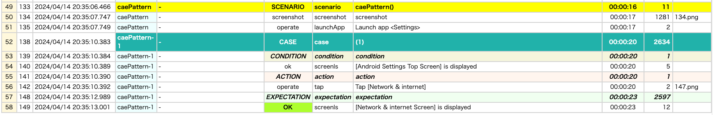

# Test code structure (Shirates/Vision)

## scenario and case

In Shirates, a JUnit 5 test method is an autotest session that includes a scenario and one or more test cases.

### TestScenarioAndTestCase1.kt

(`kotlin/tutorial_vision/basic/TestScenarioAndTestCase1.kt`)

```kotlin
package tutorial.basic

import org.junit.jupiter.api.Order
import org.junit.jupiter.api.Test
import shirates.core.configuration.Testrun
import shirates.core.driver.commandextension.screenIs
import shirates.core.driver.commandextension.tap
import shirates.core.testcode.UITest

@Testrun("testConfig/android/androidSettings/testrun.properties")
class TestScenarioAndTestCase1 : UITest() {

    @Test
    @Order(10)
    fun scenarioAndCase() {

        scenario {
            case(1) {
                // TODO: implement action and expectation
            }

            case(2) {
                // TODO: implement action and expectation
            }
        }
    }

    @Test
    @Order(20)
    fun caePattern() {

        scenario {
            case(1) {
                condition {
                    it.screenIs("[Android Settings Top Screen]")
                }.action {
                    it.tap("[Network & internet]")
                }.expectation {
                    it.screenIs("[Network & internet Screen]")
                }
            }
        }

    }
}
```

## condition-action-expectation (CAE)

A test case is a combination of these blocks.

- `condition`
- `action`
- `expectation`

### TestScenarioAndTestCase1.kt

```kotlin
    @Test
    @Order(20)
    fun caePattern() {

        scenario {
            case(1) {
                condition {
                    it.screenIs("[Android Settings Top Screen]")
                }.action {
                    it.tap("[Network & internet]")
                }.expectation {
                    it.screenIs("[Network & internet Screen]")
                }
            }
        }

    }
```

This pattern is Shirates's "**CAE pattern**", like well known unit testing practice "AAA pattern (Arrange-Act-Assert
pattern)".

### Test Report



### Link

- [index](../../vision-index.md)
