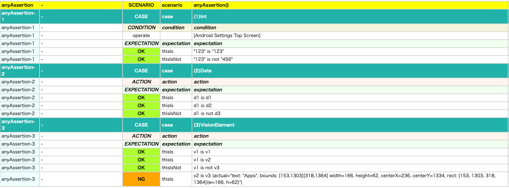

# Any value assertion (Vision)

You can assert any value using these functions.

## functions

| function    | description                                  |
|:------------|----------------------------------------------|
| thisIs      | Assert that this value is expected value     |
| thisIsNot   | Assert that this value is not expected value |
| thisIsTrue  | Assert that this value is true               |
| thisIsFalse | Assert that this value is false              |

## Sample code

[Getting samples](../../../getting_samples.md)

### AssertingAnyValue1.kt

(`src/test/kotlin/tutorial/basic/AssertingAnyValue1.kt`)

```kotlin
    @Test
    @Order(10)
    fun anyAssertion() {

        scenario {
            case(1, "Int") {
                condition {
                    it.macro("[Android Settings Top Screen]")
                }.expectation {
                    123.thisIs(123)
                    123.thisIsNot(456)
                }
            }
            case(2, "Date") {
                action {
                    d1 = "2025/1/1".toDate()
                    d2 = "2025/1/1".toDate()
                    d3 = "2025/1/2".toDate()
                }.expectation {
                    d1.thisIs(d1, "d1 is d1")
                    d1.thisIs(d2, "d1 is d2")
                    d1.thisIsNot(d3, "d1 is not d3")
                }
            }
            case(3, "VisionElement") {
                action {
                    v1 = detect("Apps")
                    v2 = detect("Apps")
                    v3 = detect("Notifications")
                }.expectation {
                    v1.thisIs(v1, "v1 is v1")   // OK
                    v1.thisIs(v2, "v1 is v2")   // OK
                    v1.thisIsNot(v3, "v1 is not v3") // OK
                    v2.thisIs(v3, "v2 is v3")   // NG
                }
            }
        }
    }
```



### Link

- [index](../../../../index.md)

