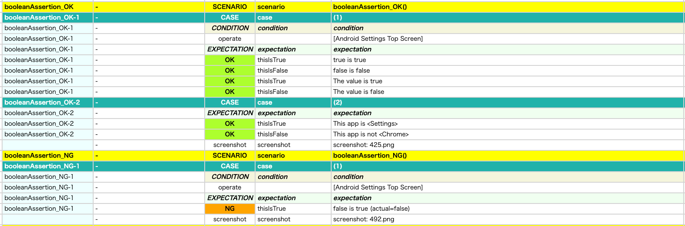

# 真偽値の検証 (Vision)

これらの関数を使用して真偽値の値を検証することができます。

## 関数

| 関数          | 説明               |
|:------------|------------------|
| thisIsTrue  | trueであることを検証します  |
| thisIsFalse | falseであることを検証します |

### サンプルコード

[サンプルの入手](../../../getting_samples_ja.md)

### AssertingAnyValue1.kt

(`src/test/kotlin/tutorial/basic/AssertingAnyValue1.kt`)

```kotlin
    @Test
    @Order(40)
    fun booleanAssertion_OK() {

        scenario {
            case(1) {
                condition {
                    it.macro("[Android Settings Top Screen]")
                }.expectation {
                    true.thisIsTrue()
                    false.thisIsFalse()

                    true.thisIsTrue("The value is true")
                    false.thisIsFalse("The value is false")
                }
            }
            case(2) {
                expectation {
                    it.isApp("Settings")
                        .thisIsTrue("This app is <Settings>")
                    it.isApp("Chrome")
                        .thisIsFalse("This app is not <Chrome>")
                }
            }
        }
    }

    @Test
    @Order(50)
    fun booleanAssertion_NG() {

        scenario {
            case(1) {
                condition {
                    it.macro("[Android Settings Top Screen]")
                }.expectation {
                    false.thisIsTrue()
                }
            }
        }
    }
```



### Link

- [index](../../../../index.md)

