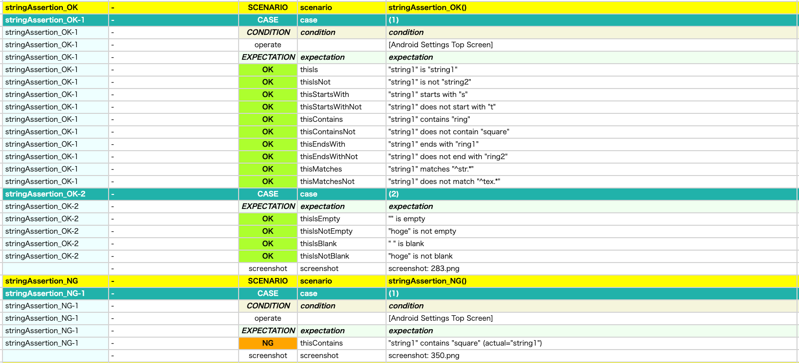

# string value assertion (Vision)

You can assert string value using these functions.

## functions

| function              | description                                           |
|:----------------------|-------------------------------------------------------|
| thisIs                | Assert that this is expected value                    |
| thisIsNot             | Assert that this is not expected value                |
| thisIsEmpty           | Assert that this is empty                             |
| thisIsNotEmpty        | Assert that this is no empty                          |
| thisIsBlank           | Assert that this is blank                             |
| thisIsNotBlank        | Assert that this is not blank                         |
| thisStartsWith        | Assert that this starts with expected value           |
| thisStartsWithNot     | Assert that this does not start with expected value   |
| thisContains          | Assert that this contains expected value              |
| thisContainsNot       | Assert that this does not contain expected value      |
| thisEndsWith          | Assert that this ends with expected value             |
| thisEndsWithNot       | Assert that this does not end with expected value     |
| thisMatches           | Assert that this matches expected pattern             |
| thisMatchesNot        | Assert that this does not match expected pattern      |
| thisMatchesDateFormat | Assert that this matches expected date format pattern |

## Sample code

[Getting samples](../../getting_samples.md)

### AssertingAnyValue1.kt

(`src/test/kotlin/tutorial/basic/AssertingAnyValue1.kt`)

```kotlin
    @Test
    @Order(20)
    fun stringAssertion_OK() {

        scenario {
            case(1) {
                condition {
                    it.macro("[Android Settings Top Screen]")
                }.expectation {
                    "string1"
                        .thisIs("string1")
                        .thisIsNot("string2")

                        .thisStartsWith("s")
                        .thisStartsWithNot("t")

                        .thisContains("ring")
                        .thisContainsNot("square")

                        .thisEndsWith("ring1")
                        .thisEndsWithNot("ring2")

                        .thisMatches("^str.*")
                        .thisMatchesNot("^tex.*")
                }
            }

            case(2) {
                expectation {
                    "".thisIsEmpty()
                    "hoge".thisIsNotEmpty()

                    " ".thisIsBlank()
                    "hoge".thisIsNotBlank()
                }
            }

        }
    }

    @Test
    @Order(30)
    fun stringAssertion_NG() {

        scenario {
            case(1) {
                condition {
                    it.macro("[Android Settings Top Screen]")
                }.expectation {
                    "string1"
                        .thisContains("square")
                }
            }
        }
    }
```



### Link

- [index](../../../../index.md)

