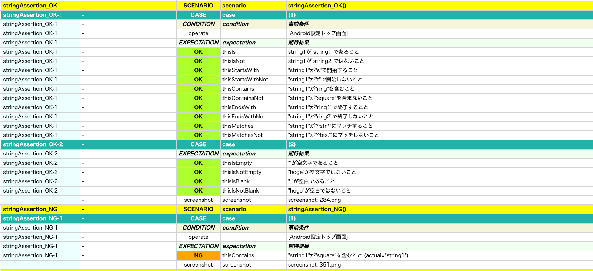

# 文字列の検証

これらの関数を使用して文字列の値を検証することができます。

## 関数

| 関数                    | 説明                         |
|:----------------------|----------------------------|
| thisIs                | 期待値であることを検証します             |
| thisIsNot             | 期待値ではないことを検証します            |
| thisIsEmpty           | 空文字であることを検証します             |
| thisIsNotEmpty        | 空文字ではないことを検証します            |
| thisIsBlank           | 空白文字であることを検証します            |
| thisIsNotBlank        | 空白文字ではないことを検証します           |
| thisStartsWith        | 指定した文字列から開始することを検証します      |
| thisStartsWithNot     | 指定した文字列から開始しないことを検証します     |
| thisContains          | 指定した文字列を含むことを検証します         |
| thisContainsNot       | 指定した文字列を含まないことを検証します       |
| thisEndsWith          | 指定した文字列で終了することを検証します       |
| thisEndsWithNot       | 指定した文字列で終了しないことを検証します      |
| thisMatches           | 指定したパターンにマッチすることを検証します     |
| thisMatchesNot        | 指定したパターンにマッチしないことを検証します    |
| thisMatchesDateFormat | 指定した日付書式パターンにマッチすることを検証します |

## サンプルコード

[サンプルの入手](../../../getting_samples_ja.md)

### AssertingAnyValue1.kt

(`src/test/kotlin/tutorial/basic/AssertingAnyValue1.kt`)

```kotlin
    @Test
    @Order(20)
    fun stringAssertion_OK() {

        scenario {
            case(1) {
                condition {
                    it.macro("[Android設定トップ画面]")
                }.expectation {
                    "string1"
                        .thisIs("string1")
                        .thisIsNot("string2")

                        .thisStartsWith("s")
                        .thisStartsWithNot("t")

                        .thisContains("ring")
                        .thisContainsNot("square")

                        .thisEndsWith("ring1")
                        .thisEndsWithNot("ring2")

                        .thisMatches("^str.*")
                        .thisMatchesNot("^tex.*")
                }
            }

            case(2) {
                expectation {
                    "".thisIsEmpty()
                    "hoge".thisIsNotEmpty()

                    " ".thisIsBlank()
                    "hoge".thisIsNotBlank()
                }
            }

        }
    }

    @Test
    @Order(30)
    fun stringAssertion_NG() {

        scenario {
            case(1) {
                condition {
                    it.macro("[Android設定トップ画面]")
                }.expectation {
                    "string1"
                        .thisContains("square")
                }
            }
        }
    }
```



### Link

- [index](../../../../index_ja.md)

