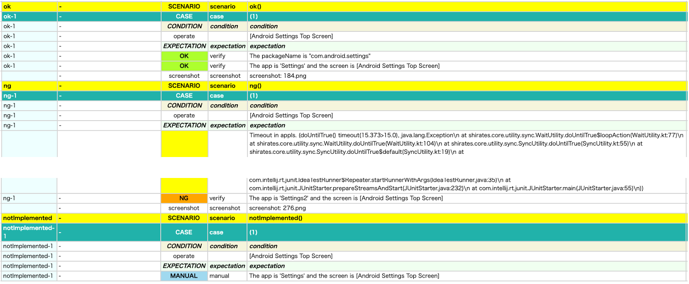

# Anything assertion(verify function) (Vision)

You can assert anything using `verify` function.

### Implementing verification logic for anything

```kotlin
it.verify("The packageName is \"com.android.settings\"") {
    if (packageName == "com.android.settings") {
        OK()
    } else {
        NG()
    }
}
```

You can implement verification logic for anything in `verify` function.
The result of the verification is notified to the verify function by calling OK function/NG function.

### Combination of existing validation functions

```kotlin
it.verify("The app is Settings and the screen is [Android Settings Top Screen]") {
    it.appIs("Settings")
    it.screenIs("[Android Settings Top Screen]")
}
```

Calling OK function/NG function are not necessary if existing verification function is used within the verify function.

### Example of output

```
128	[00:00:24]	2025/01/31 02:21:14.502	{ok-1}	0	-	[EXPECTATION]	+3650	!	()	expectation
129	[00:00:24]	2025/01/31 02:21:14.656	{ok-1}	0	-	[OK]	+154	!	(verify)	The packageName is "com.android.settings"
132	[00:00:26]	2025/01/31 02:21:16.720	{ok-1}	0	-	[OK]	+1261	!	(verify)	The app is 'Settings' and the screen is [Android Settings Top Screen]
```

## Sample code

[Getting samples](../../../getting_samples.md)

### AssertingAnything1.kt

(`src/test/kotlin/tutorial/basic/AssertingAnything1.kt`)

```kotlin
    @Test
    @Order(10)
    fun ok() {

        scenario {
            case(1) {
                condition {
                    it.macro("[Android Settings Top Screen]")
                }.expectation {
                    it.verify("The packageName is \"com.android.settings\"") {
                        if (packageName == "com.android.settings") {
                            OK()
                        } else {
                            NG()
                        }
                    }
                    it.verify("The app is 'Settings' and the screen is [Android Settings Top Screen]") {
                        it.appIs("Settings")
                        it.screenIs("[Android Settings Top Screen]")
                    }
                }
            }
        }
    }

    @Test
    @Order(20)
    fun ng() {

        scenario {
            case(1) {
                condition {
                    it.macro("[Android Settings Top Screen]")
                }.expectation {
                    it.verify("The app is 'Settings2' and the screen is [Android Settings Top Screen]") {
                        it.appIs("Settings2")
                        it.screenIs("[Android Settings Top Screen]")
                    }
                }
            }
        }
    }

    @Test
    @Order(30)
    fun notImplemented() {

        scenario {
            case(1) {
                condition {
                    it.macro("[Android Settings Top Screen]")
                }.expectation {
                    it.verify("The app is 'Settings' and the screen is [Android Settings Top Screen]") {
                    }
                }
            }
        }
    }
```



### Link

- [index](../../../../index.md)

