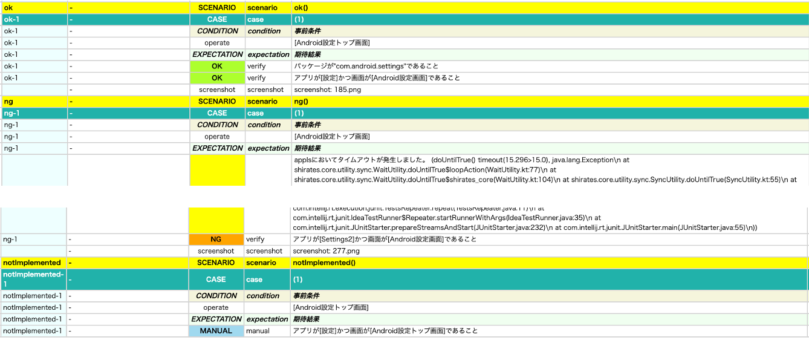

# 任意の内容の検証(verify関数)

verify関数を使用して任意の内容の検証を行うことができます。

### 任意の検証ロジックの実装

```kotlin
it.verify("パッケージ名が\"com.android.settings\"であること") {
    if (rootElement.packageName == "com.android.settings") {
        OK()
    } else {
        NG()
    }
}
```

verify関数内で任意の検証ロジックを実装します。
検証結果はOK関数またはNG関数を呼び出すことでverify関数に通知します。

### 既存の検証関数の組み合わせ

```kotlin
it.verify("アプリが[設定]で画面が[Android設定トップ画面]であること") {
    it.appIs("[設定]")
    it.screenIs("[Android設定トップ画面]")
}
```

verify関数内で既存の検証関数を使用する場合はOK関数、NG関数の呼び出しは不要です。

### 出力例

```
141	[00:00:18]	2024/04/12 02:46:17.832	{ok1-1}	0	-	[EXPECTATION]	+196	C	()	expectation
142	[00:00:18]	2024/04/12 02:46:17.835	{ok1-1}	0	-	[OK]	+3	C	(verify)	パッケージ名が"com.android.settings"であること
143	[00:00:18]	2024/04/12 02:46:17.840	{ok1-1}	0	-	[OK]	+5	C	(verify)	アプリが[設定]で画面が[Android設定トップ画面]であること
```

### サンプルコード

[サンプルの入手](../../../getting_samples_ja.md)

### AssertingAnything1.kt

(`src/test/kotlin/tutorial/basic/AssertingAnything1.kt`)

```kotlin
    @Test
    @Order(10)
    fun ok() {

        scenario {
            case(1) {
                condition {
                    it.macro("[Android設定トップ画面]")
                }.expectation {
                    it.verify("パッケージが\"com.android.settings\"であること") {
                        if (packageName == "com.android.settings") {
                            OK()
                        } else {
                            NG()
                        }
                    }
                    it.verify("アプリが[設定]かつ画面が[Android設定画面]であること") {
                        it.appIs("設定")
                        it.screenIs("[Android設定トップ画面]")
                    }
                }
            }
        }
    }

    @Test
    @Order(20)
    fun ng() {

        scenario {
            case(1) {
                condition {
                    it.macro("[Android設定トップ画面]")
                }.expectation {
                    it.verify("アプリが[Settings2]かつ画面が[Android設定画面]であること") {
                        it.appIs("Settings2")
                        it.screenIs("[Android設定画面]")
                    }
                }
            }
        }
    }

    @Test
    @Order(30)
    fun notImplemented() {

        scenario {
            case(1) {
                condition {
                    it.macro("[Android設定トップ画面]")
                }.expectation {
                    it.verify("アプリが[設定]かつ画面が[Android設定トップ画面]であること") {
                    }
                }
            }
        }
    }
```



### Link

- [index](../../../../index_ja.md)

