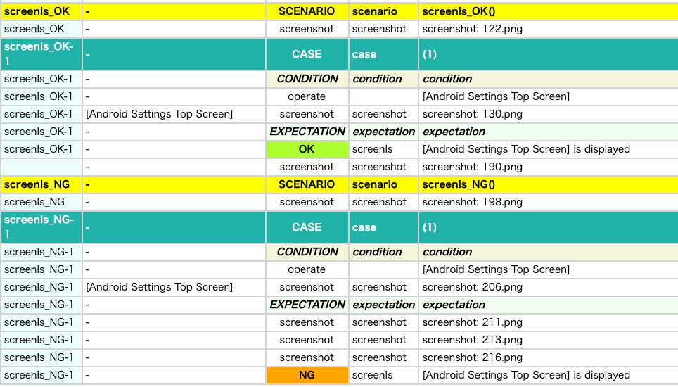

# Screen assertion (Vision)

You can assert screen using **screenIs** function.

You can use **isScreen** function to getting whether the screen is displayed or not.

## functions

| function   | description                                     |
|:-----------|-------------------------------------------------|
| screenIs   | Assert that the screen is displayed             |
| isScreen   | Returns true if the screen is displayed         |
| screenIsOf | Assert that any of the screens is displayed     |
| isScreenOf | Returns true if any of the screens is displayed |

## Screen image templates

Before using these functions, you have to prepare screen image templates.<br>


See [Using ScreenClassifier (Vision)](../../text_and_image_recognition/using_screen_classifier.md)

## Sample code

[Getting samples](../../../getting_samples.md)

### ScreenIsAndIsScreen1.kt

(`src/test/kotlin/tutorial/basic/ScreenIsAndIsScreen1.kt`)

Screen verification by image.

```kotlin
    @Test
    @Order(10)
    fun screenIs_OK() {

        scenario {
            case(1) {
                condition {
                    it.macro("[Android Settings Top Screen]")
                }.expectation {
                    it.screenIs("[Android Settings Top Screen]")
                }
            }
        }
    }

    @Test
    @Order(20)
    fun screenIs_NG() {

        scenario {
            case(1) {
                condition {
                    it.macro("[Android Settings Top Screen]")
                }.expectation {
                    it.screenIs("[System Screen]")
                }
            }
        }
    }

    @Test
    @Order(30)
    fun isScreen_ifTrue() {

        scenario {
            case(1) {
                condition {
                    it.macro("[Android Settings Top Screen]")
                }.expectation {
                    it.isScreen("[Android Settings Top Screen]")
                        .ifTrue("If screen is [Android Settings Top Screen]") {
                            OK("This is [Android Settings Top Screen]")
                        }
                }
            }
        }
    }

    @Test
    @Order(40)
    fun isScreen_ifFalse() {

        scenario {
            case(1) {
                condition {
                    it.macro("[Android Settings Top Screen]")
                }.expectation {
                    it.isScreen("[System Screen]")
                        .ifFalse("If screen is not [System Screen]") {
                            OK("This is not [System Screen]")
                        }
                }
            }
        }
    }
```

### ScreenIsAndIsScreen2.kt

(`src/test/kotlin/tutorial/basic/ScreenIsAndIsScreen2.kt`)

You can specify the validation logic (verifyFunc) to be called after the screen is determined.

```kotlin
    @Test
    @Order(10)
    fun screenIs_OK() {

        scenario {
            case(1) {
                condition {
                    it.macro("[Android Settings Top Screen]")
                }.expectation {
                    it.screenIs("[Android Settings Top Screen]") {  // OK
                        exist("Settings")           // OK (log is suppressed)
                        exist("Search settings")    // OK (log is suppressed)
                    }
                }
            }
        }
    }

    @Test
    @Order(20)
    fun screenIs_NG() {

        scenario {
            case(1) {
                condition {
                    it.macro("[Android Settings Top Screen]")
                }.expectation {
                    it.screenIs("[Android Settings Top Screen]") {    // OK
                        exist("System")     // NG (log is output)
                    }
                }
            }
        }
    }
```

OK log is suppressed if the validation result of verifyFunc is OK.<br>
NG is output if the validation result of verifyFunc is NG.



### ScreenIsOfAndIsScreenOf1.kt

(`src/test/kotlin/tutorial/basic/ScreenIsOfAndIsScreenOf1.kt`)

```kotlin
    @Test
    @Order(10)
    fun screenIsOf_OK() {

        scenario {
            case(1) {
                condition {
                    it.macro("[Android Settings Top Screen]")
                }.expectation {
                    it.screenIsOf("[Android Settings Top Screen]")
                        .screenIsOf("[Android Settings Top Screen]", "[Network & internet Screen]", "[System Screen]")
                }
            }
        }
    }

    @Test
    @Order(20)
    fun screenIsOf_NG() {

        scenario {
            case(1) {
                condition {
                    it.macro("[Android Settings Top Screen]")
                }.expectation {
                    it.screenIsOf("[Network & internet Screen]", "[System Screen]")
                }
            }
        }
    }

    @Test
    @Order(30)
    fun isScreenOf_true() {

        scenario {
            case(1) {
                condition {
                    it.macro("[Android Settings Top Screen]")
                }.expectation {
                    it.isScreenOf("[Android Settings Top Screen]")
                        .ifTrue {
                            OK("This is [Android Settings Top Screen]")
                        }
                    it.isScreenOf("[Android Settings Top Screen]", "[Network & internet Screen]", "[System Screen]")
                        .ifTrue {
                            OK("This is of [Android Settings Top Screen],[Network & internet Screen],[System Screen]")
                        }
                }
            }
        }
    }

    @Test
    @Order(40)
    fun isScreenOf_false() {

        scenario {
            case(1) {
                condition {
                    it.macro("[Android Settings Top Screen]")
                }.expectation {
                    it.isScreenOf("[Network & internet Screen]", "[System Screen]")
                        .ifFalse {
                            OK("This is not of [Network & internet Screen],[System Screen]")
                        }
                }
            }
        }
    }
```

### Link

- [index](../../../../index.md)

