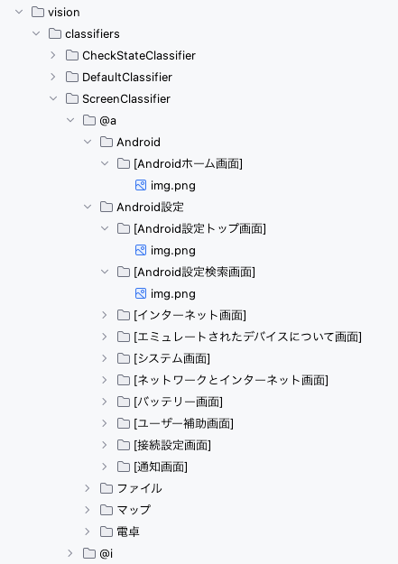

# 画面が表示されていることの検証

これらの関数を使用して画面が表示されていることを検証することができます。

## 関数

| 関数         | 説明                             |
|:-----------|--------------------------------|
| screenIs   | 指定した画面が表示されていることを検証します         |
| isScreen   | 指定した画面が表示されている場合にtrueを返します     |
| screenIsOf | 指定した画面の何れかが表示されていることを検証します     |
| isScreenOf | 指定した画面の何れかが表示されている場合にtrueを返します |

## 画面イメージテンプレート

これらの関数を使用する前に画面イメージテンプレートを準備してください。



参照: [画面イメージテンプレートのセットアップ](../../text_and_image_recognition/setting_up_screen_image_templates_ja.md)

## サンプルコード

[サンプルの入手](../../../getting_samples_ja.md)

### ScreenIsAndIsScreen1.kt

(`kotlin/tutorial/basic/ScreenIsAndIsScreen1.kt`)

画像による画面判定を行います。

```kotlin
    @Test
    @Order(10)
    fun screenIs_OK() {

        scenario {
            case(1) {
                condition {
                    it.macro("[Android設定トップ画面]")
                }.expectation {
                    it.screenIs("[Android設定トップ画面]")
                }
            }
        }
    }

    @Test
    @Order(20)
    fun screenIs_NG() {

        scenario {
            case(1) {
                condition {
                    it.macro("[Android設定トップ画面]")
                }.expectation {
                    it.screenIs("[システム画面]")
                }
            }
        }
    }

    @Test
    @Order(30)
    fun isScreen_ifTrue() {

        scenario {
            case(1) {
                condition {
                    it.macro("[Android設定トップ画面]")
                }.expectation {
                    it.isScreen("[Android設定トップ画面]")
                        .ifTrue("[Android設定トップ画面]の場合") {
                            OK("これは[Android設定トップ画面]です")
                        }
                }
            }
        }
    }

    @Test
    @Order(40)
    fun isScreen_ifFalse() {

        scenario {
            case(1) {
                condition {
                    it.macro("[Android設定トップ画面]")
                }.expectation {
                    it.isScreen("[システム画面]")
                        .ifFalse("[システム画面]ではない場合") {
                            OK("これは[システム画面]ではありません")
                        }
                }
            }
        }
    }
```

### ScreenIsAndIsScreen2.kt

(`src/test/kotlin/tutorial/basic/ScreenIsAndIsScreen2.kt`)

画面に表示されるテキストを使用して画面判定を行います。指定したテキストがすべて表示された場合にOKになります。<br>
画像による判定がうまくいかない場合の代替手段として利用できます。

```kotlin
    @Test
    @Order(10)
    fun screenIs_OK() {

        scenario {
            case(1) {
                condition {
                    it.macro("[Android設定トップ画面]")
                }.expectation {
                    it.screenIs("[Android設定トップ画面]", "設定", "設定を検索")
                }
            }
        }
    }

    @Test
    @Order(20)
    fun screenIs_NG() {

        scenario {
            case(1) {
                condition {
                    it.macro("[Android設定トップ画面]")
                }.expectation {
                    it.screenIs("[システム画面]", "システム", "言語")
                }
            }
        }
    }
```

### ScreenIsAndIsScreen3.kt

(`src/test/kotlin/tutorial/basic/ScreenIsAndIsScreen3.kt`)

検証ロジックを記述して画面判定を行います。<br>
画像による判定がうまくいかない場合の代替手段として利用できます。

```kotlin
    @Test
    @Order(10)
    fun screenIs_OK() {

        scenario {
            case(1) {
                condition {
                    it.macro("[Android設定トップ画面]")
                }.expectation {
                    it.screenIs("[Android設定トップ画面]") {
                        exist("設定")
                        exist("設定を検索")
                    }
                }
            }
        }
    }

    @Test
    @Order(20)
    fun screenIs_NG() {

        scenario {
            case(1) {
                condition {
                    it.macro("[Android設定トップ画面]")
                }.expectation {
                    it.screenIs("[システム画面]") {
                        exist("システム")
                        exist("言語")
                    }
                }
            }
        }
    }
```

### ScreenIsOfAndIsScreenOf1.kt

(`kotlin/tutorial/basic/ScreenIsOfAndIsScreenOf1.kt`)

画像による画面判定を行います。複数の画面名の候補を指定することができます。

```kotlin
    @Test
    @Order(10)
    fun screenIsOf_OK() {

        scenario {
            case(1) {
                condition {
                    it.macro("[Android設定トップ画面]")
                }.expectation {
                    it.screenIsOf("[Android設定トップ画面]")
                        .screenIsOf("[Android設定トップ画面]", "[ネットワークとインターネット画面]", "[システム画面]")
                }
            }
        }
    }

    @Test
    @Order(20)
    fun screenIsOf_NG() {

        scenario {
            case(1) {
                condition {
                    it.macro("[Android設定トップ画面]")
                }.expectation {
                    it.screenIsOf("[ネットワークとインターネット画面]", "[システム画面]")
                }
            }
        }
    }

    @Test
    @Order(30)
    fun isScreenOf_true() {

        scenario {
            case(1) {
                condition {
                    it.macro("[Android設定トップ画面]")
                }.expectation {
                    it.isScreenOf("[Android設定トップ画面]")
                        .ifTrue {
                            OK("This is [Android設定トップ画面]")
                        }
                    it.isScreenOf("[Android設定トップ画面]", "[ネットワークとインターネット画面]", "[システム画面]")
                        .ifTrue {
                            OK("これは[Android設定トップ画面],[ネットワークとインターネット画面],[システム画面]のいずれかです")
                        }
                }
            }
        }
    }

    @Test
    @Order(40)
    fun isScreenOf_false() {

        scenario {
            case(1) {
                condition {
                    it.macro("[Android設定トップ画面]")
                }.expectation {
                    it.isScreenOf("[ネットワークとインターネット画面]", "[システム画面]")
                        .ifFalse {
                            OK("これは[ネットワークとインターネット画面],[システム画面]のいずれでもありません")
                        }
                }
            }
        }
    }
```

### Link

- [index](../../../../index_ja.md)

