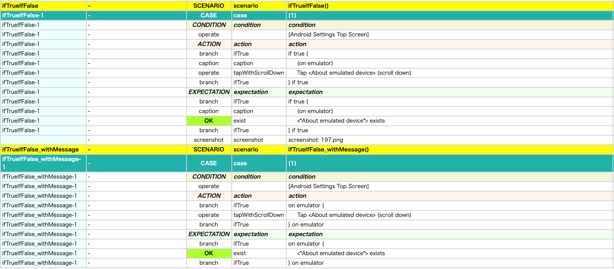

# Branch function (ifTrue, ifFalse) (Vision)

You can use branch functions instead of Kotlin if-else statement.

## functions

| function | description                         |
|:---------|:------------------------------------|
| ifTrue   | The code block is executed on true  |
| ifFalse  | The code block is executed on false |

## Sample code

[Getting samples](../../../getting_samples.md)

### IfTrueIfFalse1.kt

(`src/test/kotlin/tutorial/basic/IfTrueIfFalse1.kt`)

```kotlin
    @Test
    @Order(10)
    fun ifTrueIfFalse() {

        scenario {
            case(1) {
                condition {
                    it.macro("[Android Settings Top Screen]")
                }.action {
                    isEmulator
                        .ifTrue {
                            it.caption("on emulator")
                                .tapWithScrollDown("About emulated device")
                        }
                        .ifElse {
                            it.caption("on real device")
                                .tapWithScrollDown("About phone")
                        }
                }.expectation {
                    isEmulator
                        .ifTrue {
                            it.caption("on emulator")
                                .exist("*About emulated device*")
                        }
                        .ifElse {
                            it.caption("on real device")
                                .exist("About phone")
                        }
                }
            }
        }
    }

    @Test
    @Order(20)
    fun ifTrueIfFalse_withMessage() {

        scenario {
            case(1) {
                condition {
                    it.macro("[Android Settings Top Screen]")
                }.action {
                    isEmulator
                        .ifTrue("on emulator") {
                            it.tapWithScrollDown("About emulated device")
                        }
                        .ifElse("on real device") {
                            it.tapWithScrollDown("About phone")
                        }
                }.expectation {
                    isEmulator
                        .ifTrue("on emulator") {
                            it.exist("About emulated device")
                        }
                        .ifElse("on real device") {
                            it.exist("About phone")
                        }
                }
            }
        }
    }
```

#### html-report



#### spec-report


## Why use branch function, instead of if-else statements?

It's because of realizing [No-Load-Run(NLR) mode](../../report/no_load_run_mode.md) to get test specification
report([Spec-Report](../../report/spec_report.md)). Branch function executes both true block and false block on
No-Load-Run mode, without executing actual tests, and outputs logs just for describing test specification. You
should use branch functions instead of if-else statements to get well-formed Spec-Report.

### Link

- [index](../../../../index.md)

