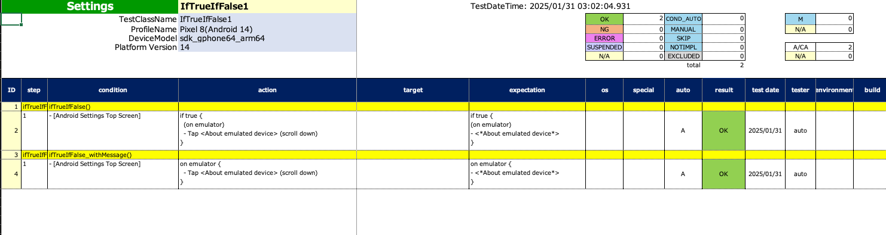

# 分岐関数 (ifTrue, ifFalse) (Vision)

Kotlinのif-elseステートメントの代わりにこれらの関数を使用することができます。

## 関数

| 関数      | 説明                      |
|:--------|:------------------------|
| ifTrue  | trueの場合にコードブロックが実行されます  |
| ifFalse | falseの場合にコードブロックが実行されます |

### サンプルコード

[サンプルの入手](../../../getting_samples_ja.md)

### IfTrueIfFalse1.kt

(`src/test/kotlin/tutorial/basic/IfTrueIfFalse1.kt`)

```kotlin
    @Test
    @Order(10)
    fun ifTrueIfFalse() {

        scenario {
            case(1) {
                condition {
                    it.macro("[Android設定トップ画面]")
                }.action {
                    isEmulator
                        .ifTrue {
                            it.caption("on emulator")
                                .tapWithScrollDown("エミュレートされた")
                        }
                        .ifElse {
                            it.caption("on real device")
                                .tapWithScrollDown("デバイス情報")
                        }
                }.expectation {
                    isEmulator
                        .ifTrue {
                            it.caption("on emulator")
                                .exist("*エミュレートされたデバイスについて*")
                        }
                        .ifElse {
                            it.caption("on real device")
                                .exist("デバイス情報")
                        }
                }
            }
        }
    }

    @Test
    @Order(20)
    fun ifTrueIfFalse_withMessage() {

        scenario {
            case(1) {
                condition {
                    it.macro("[Android設定トップ画面]")
                }.action {
                    isEmulator
                        .ifTrue("on emulator") {
                            it.tapWithScrollDown("エミュレートされた")
                        }
                        .ifElse("on real device") {
                            it.tapWithScrollDown("デバイス情報")
                        }
                }.expectation {
                    isEmulator
                        .ifTrue("on emulator") {
                            it.exist("*エミュレートされたデバイスについて*")
                        }
                        .ifElse("on real device") {
                            it.exist("デバイス情報")
                        }
                }
            }
        }
    }
```

#### html-report


#### spec-report



## なぜ if-else ステートメントの代わりに分岐関数を使用するのか？

[無負荷実行モード(NLR)](../../report/no_load_run_mode_ja.md)を実現してテスト仕様書のレポートを取得するためです。
無負荷実行モードでは分岐関数はtrueのブロックとfalseのブロックを両方実行し、実際のテストを実行することなく、テスト仕様を説明するためのログを出力します。
if-elseステートメントの代わりに分岐関数を使用してSpec-Reportを取得できるようにしてください。

### Link

- [index](../../../../index_ja.md)

