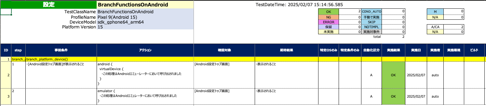
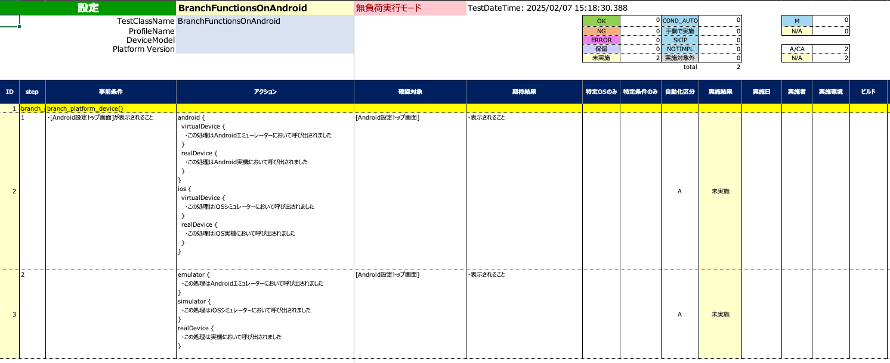

# プラットフォーム関数 (Vision)

テストにおける特定の状況下では条件分岐が必要となります。
これらのプラットフォーム関数を使用することができます。

## 関数

| 関数            | 説明                               |
|:--------------|:---------------------------------|
| android       | Androidの場合にコードブロックが実行されます        |
| ios           | iOSの場合にコードブロックが実行されます            |
| emulator      | Androidエミュレーターの場合にコードブロックが実行されます |
| simulator     | iOSシミュレーターの場合にコードブロックが実行されます     |
| virtualDevice | 仮想デバイスの場合にコードブロックが実行されます         |
| realDevice    | 実デバイスの場合にコードブロックが実行されます          |

## サンプルコード

[サンプルの入手](../../../getting_samples_ja.md)

### BranchFunctionsOnAndroid.kt

(`src/test/kotlin/tutorial/basic/BranchFunctionsOnAndroid.kt`)

```kotlin
    @Test
    @Order(10)
    fun branch_platform_device() {

        scenario {
            case(1) {
                condition {
                    it.screenIs("[Android設定トップ画面]")
                }.action {
                    android {
                        virtualDevice {
                            describe("この処理はAndroidエミューレーターにおいて呼び出されました")
                        }
                        realDevice {
                            describe("この処理はAndroid実機において呼び出されました")
                        }
                    }
                    ios {
                        virtualDevice {
                            describe("この処理はiOSシミュレーターにおいて呼び出されました")
                        }
                        realDevice {
                            describe("この処理はiOS実機において呼び出されました")
                        }
                    }
                }.expectation {
                    it.screenIs("[Android設定トップ画面]")
                }
            }
            case(2) {
                action {
                    emulator {
                        describe("この処理はAndroidエミュレーターにおいて呼び出されました")
                    }
                    simulator {
                        describe("この処理はiOSシミュレーターにおいて呼び出されました")
                    }
                    realDevice {
                        describe("この処理は実機において呼び出されました")
                    }
                }.expectation {
                    it.screenIs("[Android設定トップ画面]")
                }
            }
        }
    }
```

### Spec-Report(通常モード)



### Spec-Report(無負荷実行モード)



### Link

- [index](../../../../index_ja.md)

