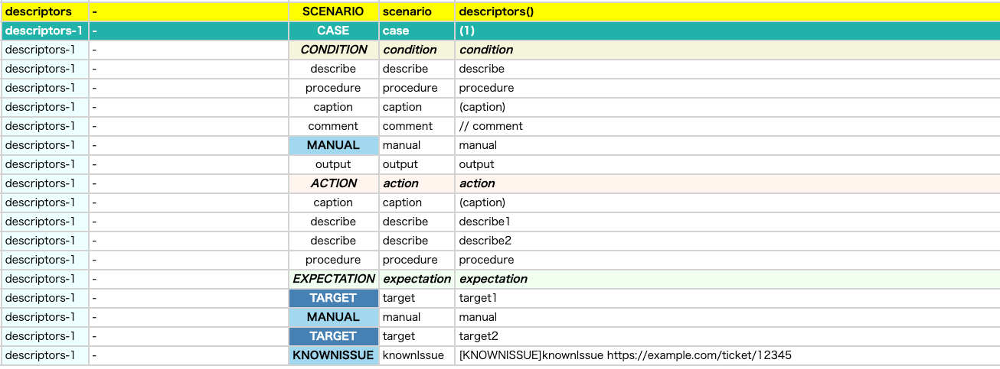
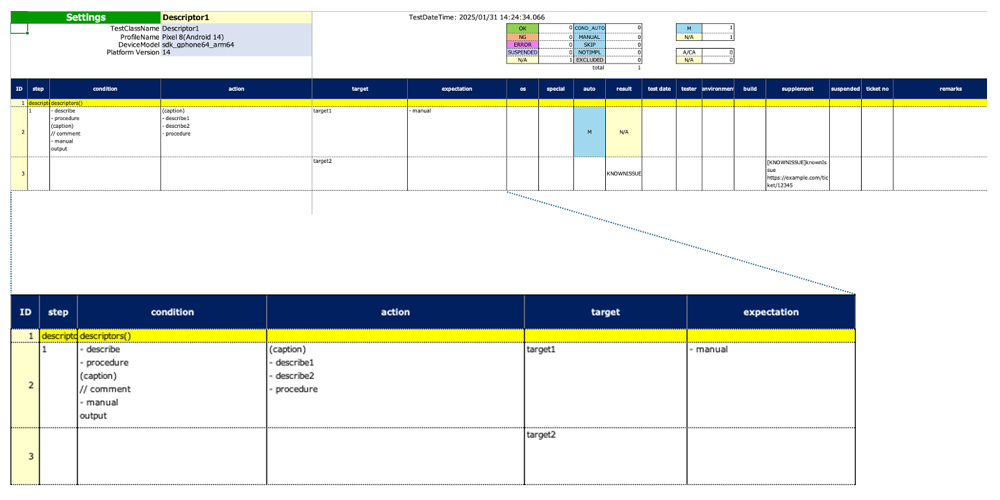

# Descriptors (Vision)

You can describe your test procedure using these functions. These are for readable documentation in Spec-Report.

## functions

| function   | description                         | example                   | example(ja)             |
|:-----------|:------------------------------------|:--------------------------|:------------------------|
| describe   | Any description with bullet         | - message                 | ・メッセージ                  |
| procedure  | Description for a set of operations | - message                 | ・メッセージ                  |
| caption    | Caption with decoration             | (message)                 | 【メッセージ】                 |
| comment    | Comment with prefix                 | // message                | // メッセージ                |
| manual     | Manual operation                    | - message                 | ・メッセージ                  |
| knownIssue | Known issue                         | [KNOWNISSUE]message (url) | [KNOWNISSUE]メッセージ (url) |
| target     | Target to check                     | message                   | メッセージ                   |
| output     | Any text                            | message                   | メッセージ                   |

**Note:** bullet, caption and comment can be customized in `spec.properties` resource file.

## Sample code

[Getting samples](../../../getting_samples.md)

### Descriptor1.kt

(`src/test/kotlin/tutorial/basic/Descriptor1.kt`)

```kotlin
    @Test
    @Order(10)
    fun descriptors() {

        scenario {
            case(1) {
                condition {
                    describe("describe")
                    procedure("procedure") {
                        manual("manual")
                    }
                    caption("caption")
                    comment("comment")
                    manual("manual")
                    output("output")
                }.action {
                    caption("caption")
                        .describe("describe1")
                        .describe("describe2")
                    procedure("procedure") {
                        manual("manual")
                    }
                }.expectation {
                    target("target1")
                        .manual("manual")
                    target("target2")
                        .knownIssue("knownIssue", ticketUrl = "https://example.com/ticket/12345")
                }
            }
        }
    }
```

### Html-Report



### Spec-Report



### Link

- [index](../../../../index.md)
