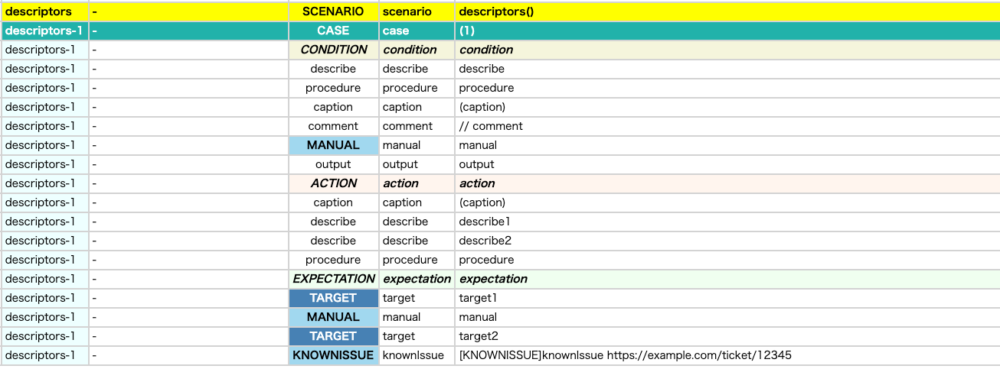
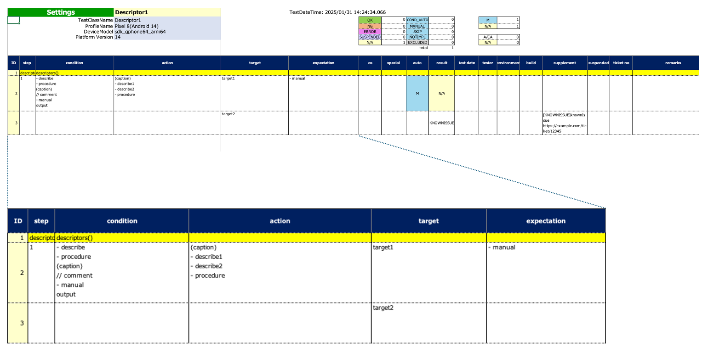

# ディスクリプター (Vision)

これらの関数を使用してテストの手続きを説明することができます。これはSpec-Reportを読みやすいドキュメントにするために使用します。

### 関数

| 関数         | 説明          | 出力例                       | 出力例(日本語)                |
|:-----------|:------------|:--------------------------|:------------------------|
| describe   | 行頭文字を伴う説明   | - message                 | ・メッセージ                  |
| procedure  | 複数の操作に関する説明 | - message                 | ・メッセージ                  |
| caption    | 装飾を伴う見出し    | (message)                 | 【メッセージ】                 |
| comment    | コメント        | // message                | // メッセージ                |
| manual     | 手動による操作     | - message                 | ・メッセージ                  |
| knownIssue | 既知の問題       | [KNOWNISSUE]message (url) | [KNOWNISSUE]メッセージ (url) |
| target     | 確認対象        | message                   | メッセージ                   |
| output     | 任意のテキスト     | message                   | メッセージ                   |

**注意:** 行頭文字(bullet), 見出し(caption), コメントのプレフィックス(comment)は リソースファイルの`spec.properties`
でカスタマイズすることができます。

### サンプルコード

[サンプルの入手](../../../getting_samples_ja.md)

### Descriptor1.kt

(`src/test/kotlin/tutorial/basic/Descriptor1.kt`)

```kotlin
    @Test
    @Order(10)
    fun descriptors() {

        scenario {
            case(1) {
                condition {
                    describe("describe")
                    procedure("procedure") {
                        manual("manual")
                    }
                    caption("caption")
                    comment("comment")
                    manual("manual")
                    output("output")
                }.action {
                    caption("caption")
                        .describe("describe1")
                        .describe("describe2")
                    procedure("procedure") {
                        manual("manual")
                    }
                }.expectation {
                    target("target1")
                        .manual("manual")
                    target("target2")
                        .knownIssue("knownIssue", ticketUrl = "https://example.com/ticket/12345")
                }
            }
        }
    }
```

### Html-Report



### Spec-Report



### Link

- [index](../../../../index_ja.md)
