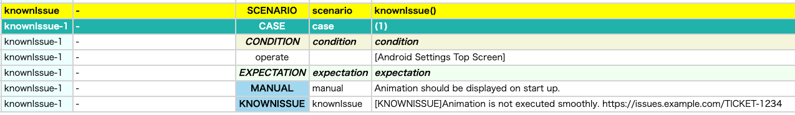
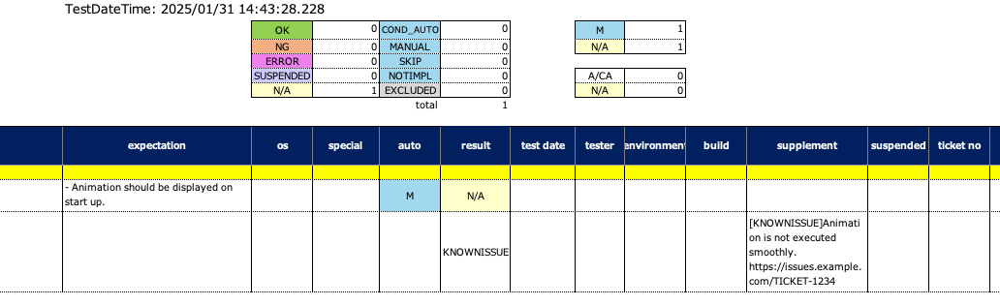

# knownIssue (Vision)

You can describe known issue using **knownIssue** function.

## Sample code

[Getting samples](../../../getting_samples.md)

### KnownIssues1.kt

(`src/test/kotlin/tutorial/basic/KnownIssues1.kt`)

```kotlin
    @Test
    @Order(10)
    fun knownIssue() {

        scenario {
            case(1) {
                condition {
                    it.macro("[Android Settings Top Screen]")
                }.expectation {
                    it.manual("Animation should be displayed on start up.")
                        .knownIssue(
                            message = "Animation is not executed smoothly.",
                            ticketUrl = "https://issues.example.com/TICKET-1234"
                        )
                }
            }
        }

    }
```

### HTML-Report



### Spec-Report



**message** and **ticketUrl** is required. Set `ticketUrl = ""` if you don't need it.

### Link

- [index](../../../../index.md)
