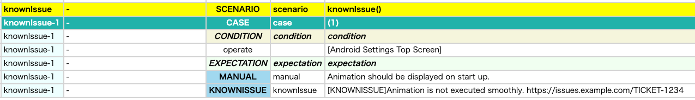

# knownIssue (Vision)

**knownIssue**関数を使用して既知の問題を説明することができます。

### サンプルコード

[サンプルの入手](../../../getting_samples_ja.md)

### KnownIssues1.kt

(`src/test/kotlin/tutorial/basic/KnownIssues1.kt`)

```kotlin
    @Test
    @Order(10)
    fun knownIssue() {

        scenario {
            case(1) {
                condition {
                    it.macro("[Android Settings Top Screen]")
                }.expectation {
                    it.manual("Animation should be displayed on start up.")
                        .knownIssue(
                            message = "Animation is not executed smoothly.",
                            ticketUrl = "https://issues.example.com/TICKET-1234"
                        )
                }
            }
        }

    }
```

### HTML-Report



### Spec-Report


**message** and **ticketUrl** は必須指定です。 ticketUrlが不要な場合は`ticketUrl = ""`を設定してください。

### Link

- [index](../../../../index_ja.md)
