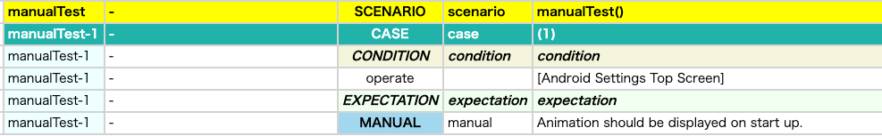
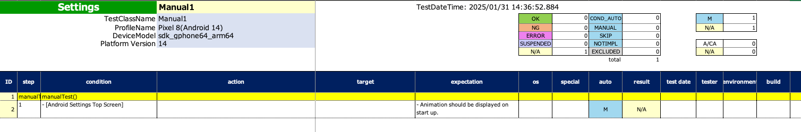

# manual (Vision)

In general, you can not automate all of your manual test cases because of reasons. Instead, you can describe manual
procedure using **manual** function.

## Sample code

[Getting samples](../../../getting_samples.md)

### Manual1.kt

(`src/test/kotlin/tutorial/basic/Manual1.kt`)

```kotlin
    @Test
    @Order(10)
    fun manualTest() {

        scenario {
            case(1) {
                condition {
                    it.macro("[Android Settings Top Screen]")
                }.expectation {
                    it.manual("Animation should be displayed on start up.")
                }
            }
        }

    }
```

### Html-Report



### Spec-Report



### Link

- [index](../../../../index.md)

