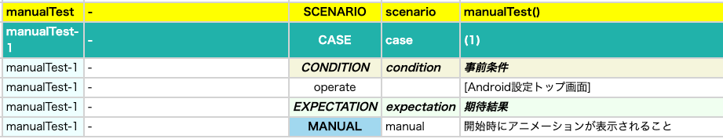
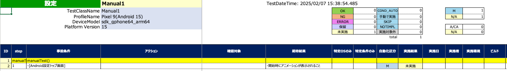

# manual (Vision)

一般的には何らかの理由により手動テストケースの全てを自動化することはできません。

**manual**関数を使用すると手動による手続きを記述することができます。

### サンプルコード

[サンプルの入手](../../../getting_samples_ja.md)

### Manual1.kt

(`src/test/kotlin/tutorial/basic/Manual1.kt`)

```kotlin
    @Test
    @Order(10)
    fun manualTest() {

        scenario {
            case(1) {
                condition {
                    it.macro("[Android設定トップ画面]")
                }.expectation {
                    it.manual("開始時にアニメーションが表示されること")
                }
            }
        }

    }
```

### Html-Report



### Spec-Report



### Link

- [index](../../../../index_ja.md)

