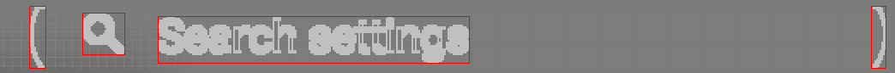

# Considerations for text detection (Vision)

**Shirates/Vision** uses **AI-OCR** for text detection, but AI-OCR has accuracy issues that must be taken into account.

## False Text Detection

Patterns of false text detection include the following

1. Text detected as different from the original or missing parts
2. Images (e.g. icons) are detected as text
3. Bounding boxes of the text are not detected

## 1. Text detected as different from the original or missing parts

AI-OCR may be prone to false positives for certain characters.

### Solution

Use eratta(correction table).<br>
See [Text Recognition by AI-OCR](../../text_and_image_recognition/text_recognition_by_ai_ocr.md)

## 2. Images (e.g. icons) are detected as text

### Example of miss recognition


| original        | miss recognition  | miss recognized part |
|:----------------|:------------------|:---------------------|
| Search settings | Q Search settings | `Q`                  |

### Solution

In shirates 8.6.0 and later, the text shaping feature automatically readjusts the text bounding box to obtain the
intended text and bounding box.



If you cannot get the intended text even with text shaping, consider using **loose matching**.

Loose matching attempts to match strings by trimming both ends of the string to a maximum of 3 characters to the left
and 2 characters to the right.

```kotlin
it.detect("the text that you want to get", looseMatch = true)
```

Loose matching parameter (visionLooseMatch) is false by default. (shirates 8.6.0+)

## 2. Bounding boxes of the text are not detected

If the contrast of the text color is low in relation to the background color, the text bounding box may not be
detected. <br>

This may be improved by applying an **auto image filter**.

```kotlin
it.exist("The text of low contrast", autoImageFilter = true)
```

### Link

- [index](../../../../index.md)
