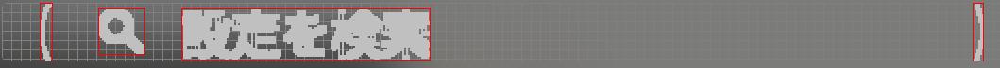

# テキスト検出に関する考慮事項 (Vision)

**Shirates/Vision** ではテキスト検出に **AI-OCR** を使用しますが、AI-OCRは精度の問題があるため、これを考慮する必要があります。

## テキストの誤検出

テキストの誤検出のパターンとしては以下のものがあります。

1. 本来と異なる文字として検出されたり一部が欠けたりする
2. 文字ではない画像（アイコンなど）が文字として検出される
3. テキストのバウンディングボックスが検出されない

## 1.本来と異なる文字として検出されたり一部が欠けたりする

AI-OCRは特定の文字に対して誤検出しやすい場合があります。

### 誤検出の例

| 本来の文字   | 誤検出の例  | 誤検出された文字 |
|:--------|:-------|:---------|
| 送信      | 送言     | `信`      |
| 電気通信事業法 | 電気通事業法 | `信`      |
| 配偶者     | 配者     | `偶`      |
| チラシ     | チラン    | `シ`      |
| 生ガ      | 生が     | `ガ`      |
| 軽減税率    | 経減税率   | `軽`      |
| 末尾      | 未尾     | `末`      |
| 数量      | 数豆     | `量`      |
| 数量      | 数亜     | `量`      |

### 対策

エラッタ（訂正表）を使用します。<br>
参照 [AI-OCRによるテキスト認識](../../text_and_image_recognition/text_recognition_by_ai_ocr_ja.md)

## 2. 文字ではない画像（アイコンなど）が文字として検出される

### 誤検出の例


| 本来の文字      | 誤検出の例         | アイコン画像部分の文字 |
|:-----------|:--------------|:------------|
| 設定を検索      | Q 設定を検索       | `Q`         |
| 音とバイブレーション | 4) 音とバイブレーション | `4)`        |

### 対策

shirates 8.6.0以降ではテキストシェーピング機能によりテキストのバウンディングボックスが自動的に再調整され、意図したテキストとバウンディングボックスを取得することができます。



テキストシェーピングでも意図したテキストを取得することができない場合は **ルースマッチング(loose matching)**
の使用を検討してください。

ルースマッチングは文字列の両端を左最大3文字、右最大2文字までトリムして文字列のマッチングを試行します。

```kotlin
it.detect("取得したい文字列", looseMatch = true)
```

ルースマッチングのパラメーター（visionLooseMatch）はデフォルトでfalseです。(shirates 8.6.0+)<br>

## 3. テキストのバウンディングボックスが検出されない

背景色に対して文字色のコントラストが低い場合はテキストのバウンディングボックスが検出されない場合があります。<br>

**オートイメージフィルター** を適用することで改善する場合があります。

```kotlin
it.detect("コントラストの低いテキスト", autoImageFilter = true)
```

### Link

- [index](../../../../index_ja.md)
