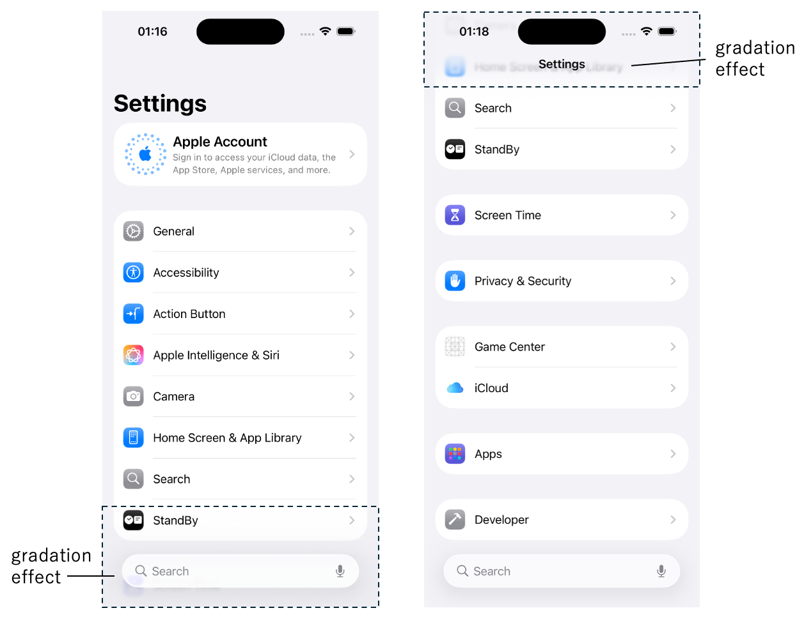
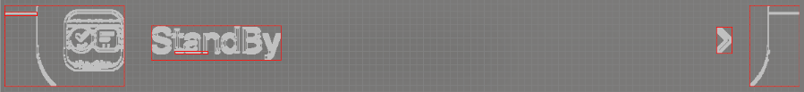
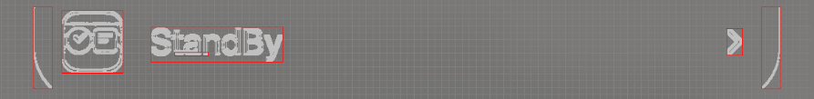

# Considerations for relative image detection (Vision)

**Shirates/Vision** uses image processing to acquire a relative image, but depending on the condition of the image (
e.g., contrast), the intended image may not be acquired.

## In the case where the background image has a gradient

In most cases, if the background image is flat, the relative image can be acquired as intended, but if the background
image has a gradient, it may not work.

For example, Liquid Glass, introduced in iOS 26 and later, applies a translucent effect and adds a gradient in some
areas of the screen.



```kotlin
it.detect("StandBy").leftItem()
```

If you run the above code, edge detection will fail because the default color scale used for image processing (
GRAY_32) includes a gradient.



### Solution

Try changing the color scale to see if it works.

In the above example, if you change the color scale to GRAY_16, it will succeed.



## Sample code

[Getting samples](../../../getting_samples.md)

### ColorScale1Ios.kt

(`src/test/kotlin/tutorial/basic/ColorScale1Ios.kt`)

```kotlin
    @Test
    fun colorScale_GRAY_32() {

        // default colorScale is GRAY_32
        printInfo("${testContext.visionColorScale}")

        scenario {
            case(1) {
                condition {
                    it.screenIs("[iOS Settings Top Screen]")
                }.action {
                    v1 = detect("StandBy").leftItem()
                }.expectation {
                    v1.imageIs("[StandBy Icon]")    // NG (on iOS 26 Liquid Glass), OK (on iOS 18 or older)
                }
            }
        }
    }

    @Test
    fun colorScale_GRAY_16() {

        // change colorScale to GRAY_16
        colorScaleGray16()
        printInfo("${testContext.visionColorScale}")

        scenario {
            case(1) {
                condition {
                    it.screenIs("[iOS Settings Top Screen]")
                }.action {
                    v1 = detect("StandBy").leftItem()
                }.expectation {
                    v1.imageIs("[StandBy Icon]")    // OK
                }
            }
        }
    }
```

### Link

- [index](../../../../index.md)
