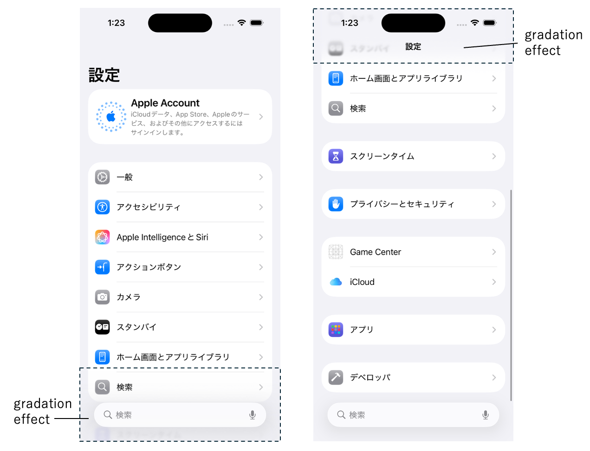
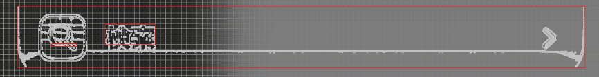
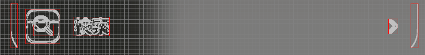

# 相対的な画像検出に関する考慮事項 (Vision)

**Shirates/Vision** では画像処理によって相対的な画像を取得しますが、画像の状態（コントラストなど）によっては意図した画像を取得できない場合があります。

## 背景画像にグラデーションがある場合

背景画像がフラットな場合は相対的な画像を意図した通りに取得することができる場合が多いですが、背景画像にグラデーションがある場合はうまく行かない場合があります。

例えば、iOS 26以降で導入されたLiquid Glassでは半透明の効果が適用され、画面の一部の領域においてグラデーションが追加されます。



```kotlin
it.detect("検索").leftItem()
```

を実行した場合、画像処理に使用するカラースケールのデフォルト(GRAY_32)だとグラデーションがあるためエッジの抽出に失敗します。



### 対策

カラースケールを変更してうまく行くかどうかを試してください。

上記の例ではカラースケールをGRAY_16に変更した場合は成功します。



## サンプルコード

[サンプルの入手](../../../getting_samples_ja.md)

### ColorScale1Ios.kt

(`src/test/kotlin/tutorial/basic/ColorScale1Ios.kt`)

```kotlin
    @Test
    @Order(10)
    fun colorScale_GRAY32() {

        // default colorScale is GRAY_32
        printInfo("${testContext.visionColorScale}")

        scenario {
            case(1) {
                condition {
                    it.macro("[iOS設定トップ画面]")
                }.action {
                    v1 = detect("検索").leftItem()
                }.expectation {
                    it.imageIs("[検索アイコン]")  // NG (on iOS 26 Liquid Glass), OK (on iOS 18 or older)
                }
            }
        }
    }

    @Test
    @Order(20)
    fun colorScale_GRAY16() {

        // change colorScale to GRAY_16
        colorScaleGray16()
        printInfo("${testContext.visionColorScale}")

        scenario {
            case(1) {
                condition {
                    it.macro("[iOS設定トップ画面]")
                }.action {
                    v1 = detect("検索").leftItem()
                }.expectation {
                    it.imageIs("[検索アイコン]")  // OK
                }
            }
        }
    }
```

### Link

- [index](../../../../index_ja.md)
