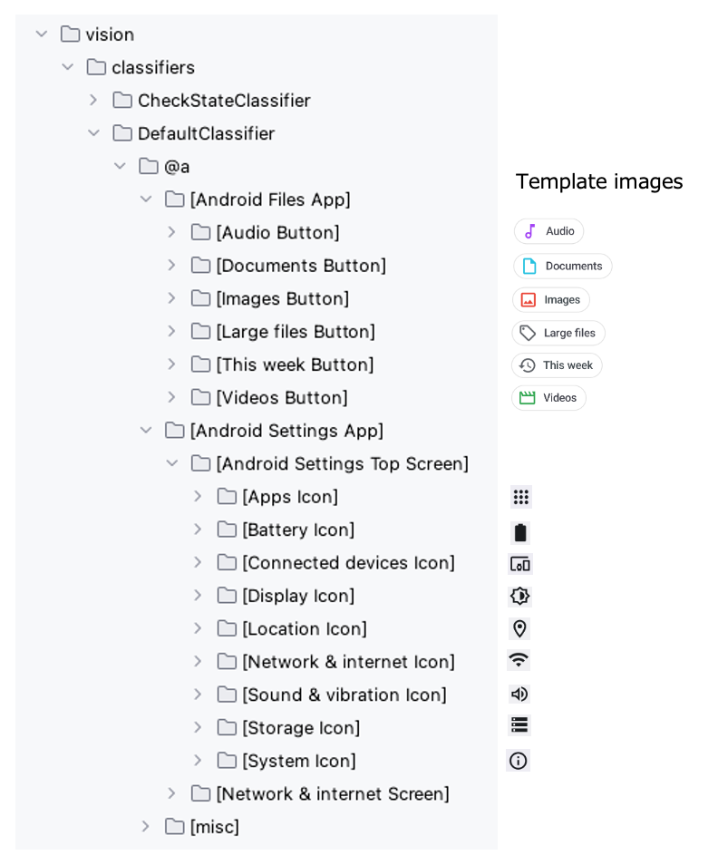

# findImage (Vision)

You can find an image using these functions.

## Functions

| function                 | description                                                          |
|:-------------------------|:---------------------------------------------------------------------|
| findImage                | Finds an image that matches the template image in current screen.    |
| findImageWithScrollDown  | Finds an image that matches the template image with scrolling down.  |
| findImageWithScrollUp    | Finds an image that matches the template image with scrolling up.    |
| findImageWithScrollRight | Finds an image that matches the template image with scrolling right. |
| findImageWithScrollLeft  | Finds an image that matches the template image with scrolling left.  |

## Sample code

[Getting samples](../../getting_samples.md)

### Template images



### FindImage1.kt

(`src/test/kotlin/tutorial/basic/FindImage1.kt`)

```kotlin
    @Test
    @Order(10)
    fun findImage() {

        scenario {
            case(1) {
                condition {
                    it.macro("[Android Settings Top Screen]")
                }.action {
                    withScrollDown {
                        v1 = it.findImage("[Network & internet Icon]")
                        v2 = it.findImage("[Display Icon]")
                    }
                }.expectation {
                    v1.isFound.thisIsTrue("[Network & internet Icon] is found.")
                    v2.isFound.thisIsTrue("[Display Icon] is found.")
                }
            }
        }
    }

    @Test
    @Order(20)
    fun findImageWithScrollDown_findImageWithScrollUp() {

        scenario {
            case(1) {
                condition {
                    it.macro("[Android Settings Top Screen]")
                }.action {
                    v1 = findImageWithScrollDown("[Location Icon]")
                }.expectation {
                    v1.imageLabelIs("[Location Icon]")
                }
            }
            case(2) {
                action {
                    v1 = findImageWithScrollUp("[Connected devices Icon]")
                }.expectation {
                    v1.imageLabelIs("[Connected devices Icon]")
                }
            }
        }
    }

    @Test
    @Order(30)
    fun findImageWithScrollRight_findImageWithScrollLeft() {

        scenario {
            case(1) {
                condition {
                    it.macro("[Files Top Screen]")
                }.action {
                    it.onLineOf("Images", verticalMargin = 40) {
                        v1 = findImageWithScrollRight("[This week Button]")
                    }
                }.expectation {
                    v1.imageLabelIs("[This week Button]")
                }
            }
            case(2) {
                action {
                    v1.onLine(verticalMargin = 40) {
                        v2 = findImageWithScrollLeft("[Audio Button]")
                    }
                }.expectation {
                    v2.imageLabelIs("[Audio Button]")
                }
            }
        }
    }
```

### Link

- [index](../../../../index.md)
