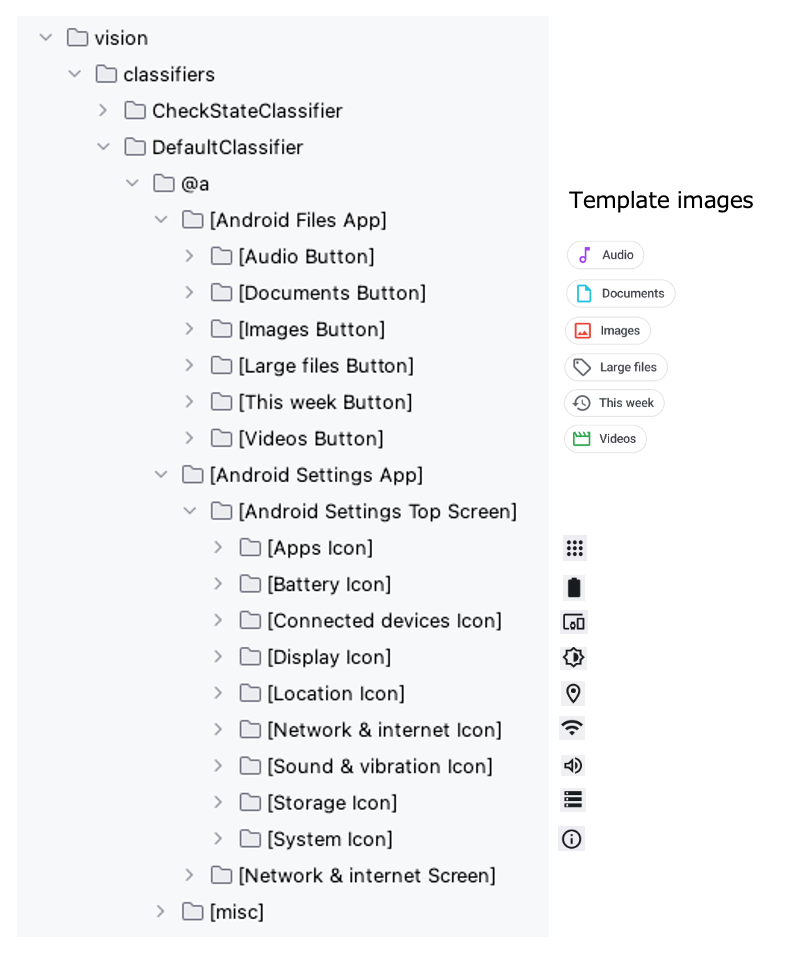

# findImage (Vision)

これらの関数を使用すると画像を検索することができます。

## 関数

| 関数                       | 説明                                 |
|:-------------------------|:-----------------------------------|
| findImage                | 現在の画面内でテンプレート画像にマッチする画像を見つけます      |
| findImageWithScrollDown  | テンプレート画像にマッチする画像を見つけます（下方向スクロールあり） |
| findImageWithScrollUp    | テンプレート画像にマッチする画像を見つけます（上方向スクロールあり） |
| findImageWithScrollRight | テンプレート画像にマッチする画像を見つけます（右方向スクロールあり） |
| findImageWithScrollLeft  | テンプレート画像にマッチする画像を見つけます（左方向スクロールあり） |

### しきい値の調整

実際には画像が存在しているにもかかわらずエラーが発生する場合があり、以下のようなメッセージが表示されます。

```
[info]	+1727	!	()	findImage("[Location Icon]") not found. (distance:0.40028667 > threshold:0.1)
```

この場合、`threshold`引数を明示的に指定します。

```
findImageWithScrollDown("[Location Icon]", threshold = 0.5)
```

### サンプルコード

[サンプルの入手](../../../getting_samples_ja.md)

### テンプレート画像



### FindImage1.kt

(`src/test/kotlin/tutorial/basic/FindImage1.kt`)

```kotlin
    @Test
    @Order(10)
    fun findImage() {

        scenario {
            case(1) {
                condition {
                    it.macro("[Android Settings Top Screen]")
                }.action {
                    withScrollDown {
                        v1 = it.findImage("[Network & internet Icon]")
                        v2 = it.findImage("[Display Icon]")
                    }
                }.expectation {
                    v1.isFound.thisIsTrue("[Network & internet Icon] is found.")
                    v2.isFound.thisIsTrue("[Display Icon] is found.")
                }
            }
        }
    }

    @Test
    @Order(20)
    fun findImageWithScrollDown_findImageWithScrollUp() {

        scenario {
            case(1) {
                condition {
                    it.macro("[Android Settings Top Screen]")
                }.action {
                    v1 = findImageWithScrollDown("[Location Icon]", threshold = 0.5)
                }.expectation {
                    v1.imageIs("[Location Icon]")
                }
            }
            case(2) {
                action {
                    v1 = findImageWithScrollUp("[Connected devices Icon]")
                }.expectation {
                    v1.imageIs("[Connected devices Icon]")
                }
            }
        }
    }

    @Test
    @Order(30)
    fun findImageWithScrollRight_findImageWithScrollLeft() {

        scenario {
            case(1) {
                condition {
                    it.macro("[Files Top Screen]")
                }.action {
                    it.onLineOf("Images") {
                        v1 = findImageWithScrollRight("[This week Button]")
                    }
                }.expectation {
                    v1.imageIs("[This week Button]")
                }
            }
            case(2) {
                action {
                    v1.onLine {
                        v2 = findImageWithScrollLeft("[Audio Button]")
                    }
                }.expectation {
                    v2.imageIs("[Audio Button]")
                }
            }
        }
    }
```

### Link

- [index](../../../../index_ja.md)
