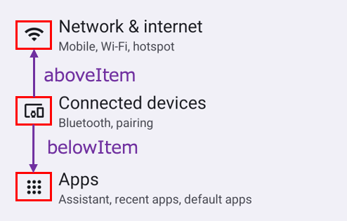
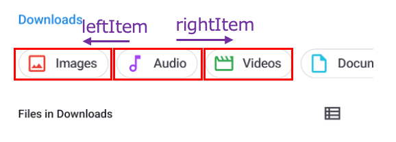

# Relative image (Vision)

You can find a text relatively using these functions.

## Functions

| function  | description                        |
|:----------|:-----------------------------------|
| rightItem | Finds a item right of the element. |
| leftItem  | Finds a item left of the element.  |
| belowItem | Finds a item below of the element. |
| aboveItem | Finds a item above of the element. |

## Sample code

[Getting samples](../../getting_samples.md)

### RelativeItem1.kt

(`src/test/kotlin/tutorial/basic/RelativeItem1.kt`)

```kotlin
    @Test
    @Order(10)
    fun belowItem_aboveItem() {

        scenario {
            case(1) {
                condition {
                    it.macro("[Android Settings Top Screen]")
                }.action {
                    v1 = findImage("[Connected devices Icon]")
                }.expectation {
                    v1.belowItem().imageLabelIs("[Apps Icon]")
                    v1.aboveItem().imageLabelIs("[Network & internet Icon]")
                }
            }
        }

    }
```



```kotlin
    @Test
    @Order(20)
    fun rightItem_leftItem() {

        scenario {
            case(1) {
                condition {
                    it.macro("[Files Top Screen]")
                }.action {
                    v1 = findImage("[Audio Button]")
                }.expectation {
                    v1.rightItem(include = true).imageLabelIs("[Videos Button]")
                    v1.leftItem(include = true).imageLabelIs("[Images Button]")
                }
            }
        }
    }
```

**Note:**<br>
`include = true` combines image pieces that are overlapped into a group. `include = false` is default.



### Link

- [index](../../../../index.md)
