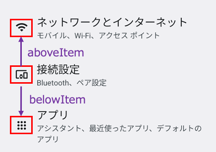
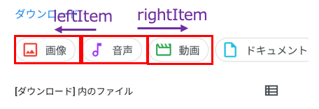

# 相対画像 (Vision)

これらの関数を使用して画像を相対的に取得することができます。

## 関数

| 関数        | 説明             |
|:----------|:---------------|
| rightItem | 要素の右側の画像を取得します |
| leftItem  | 要素の左側の画像を取得します |
| belowItem | 要素の上側の画像を取得します |
| aboveItem | 要素の下側の画像を取得します |

### サンプルコード

[サンプルの入手](../../../getting_samples_ja.md)

### RelativeItem1.kt

(`src/test/kotlin/tutorial/basic/RelativeItem1.kt`)

```kotlin
    @Test
    @Order(10)
    fun belowItem_aboveItem() {

        scenario {
            case(1) {
                condition {
                    it.macro("[Android設定トップ画面]")
                }.action {
                    v1 = findImage("[接続設定アイコン]")
                }.expectation {
                    v1.belowItem().imageIs("[アプリアイコン]")
                    v1.aboveItem().imageIs("[ネットワークとインターネットアイコン]")
                }
            }
        }

    }
```



```kotlin
    @Test
    @Order(20)
    fun rightItem_leftItem() {

        scenario {
            case(1) {
                condition {
                    it.macro("[ファイルトップ画面]")
                }.action {
                    v1 = findImage("[音声ボタン]")
                }.expectation {
                    v1.rightItem(include = true).imageIs("[動画ボタン]")
                    v1.leftItem(include = true).imageIs("[画像ボタン]")
                }
            }
        }
    }
```

**メモ:**<br>
`include = true` を指定すると重なっている画像の断片をグルーピングします。 `include = false` がデフォルトです。



### Link

- [index](../../../../index_ja.md)
