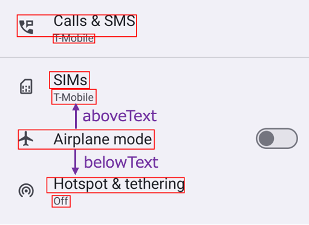

# Relative text (Vision)

You can find a text relatively using these functions.

## Functions

| function  | description                        |
|:----------|:-----------------------------------|
| rightText | Finds a text right of the element. |
| leftText  | Finds a text left of the element.  |
| belowText | Finds a text below of the element. |
| aboveText | Finds a text above of the element. |

## Sample code

[Getting samples](../../../getting_samples.md)

### RelativeText1.kt

(`src/test/kotlin/tutorial/basic/RelativeText1.kt`)

```kotlin
    @Test
    @Order(10)
    fun belowText_aboveText() {

        scenario {
            case(1) {
                condition {
                    it.macro("[Network & internet Screen]")
                }.action {
                    v1 = detect("Airplane mode")
                }.expectation {
                    v1.belowText().textIs("Hotspot & tethering")
                    v1.aboveText().textIs("T-Mobile")
                }
            }
        }

    }
```



```kotlin
    @Test
    @Order(20)
    fun rightText_leftText() {

        scenario {
            case(1) {
                condition {
                    it.macro("[Maps Top Screen]")
                }.action {
                    v1 = detect("You")
                }.expectation {
                    v1.rightText().textIs("Contribute")
                    v1.leftText().textIs("Explore")
                }
            }
        }
    }
```


### Link

- [index](../../../../index.md)
