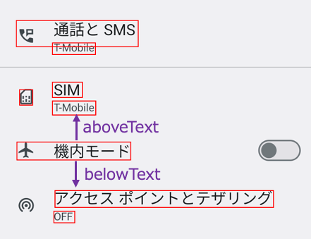

# 相対テキスト (Vision)

これらの関数を使用してテキストを相対的に取得することができます。

## 関数

| 関数        | 説明               |
|:----------|:-----------------|
| rightText | 要素の右側のテキストを取得します |
| leftText  | 要素の左側のテキストを取得します |
| belowText | 要素の下側のテキストを取得します |
| aboveText | 要素の上側のテキストを取得します |

### サンプルコード

[サンプルの入手](../../../getting_samples_ja.md)

### RelativeText1.kt

(`src/test/kotlin/tutorial/basic/RelativeText1.kt`)

```kotlin
    @Test
    @Order(10)
    fun belowText_aboveText() {

        scenario {
            case(1) {
                condition {
                    it.macro("[ネットワークとインターネット画面]")
                }.action {
                    v1 = detect("機内モード")
                }.expectation {
                    v1.belowText().textIs("アクセスポイントとテザリング")
                    v1.aboveText().textIs("T-Mobile")
                }
            }
        }

    }
```



```kotlin
    @Test
    @Order(20)
    fun rightText_leftText() {

        scenario {
            case(1) {
                condition {
                    it.macro("[マップトップ画面]")
                }.action {
                    v1 = detect("保存済み")
                }.expectation {
                    v1.rightText().textIs("投稿")
                    v1.leftText().textIs("経路")
                }
            }
        }
    }
```


### Link

- [index](../../../../index_ja.md)
